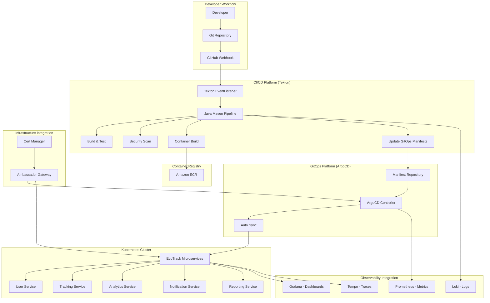
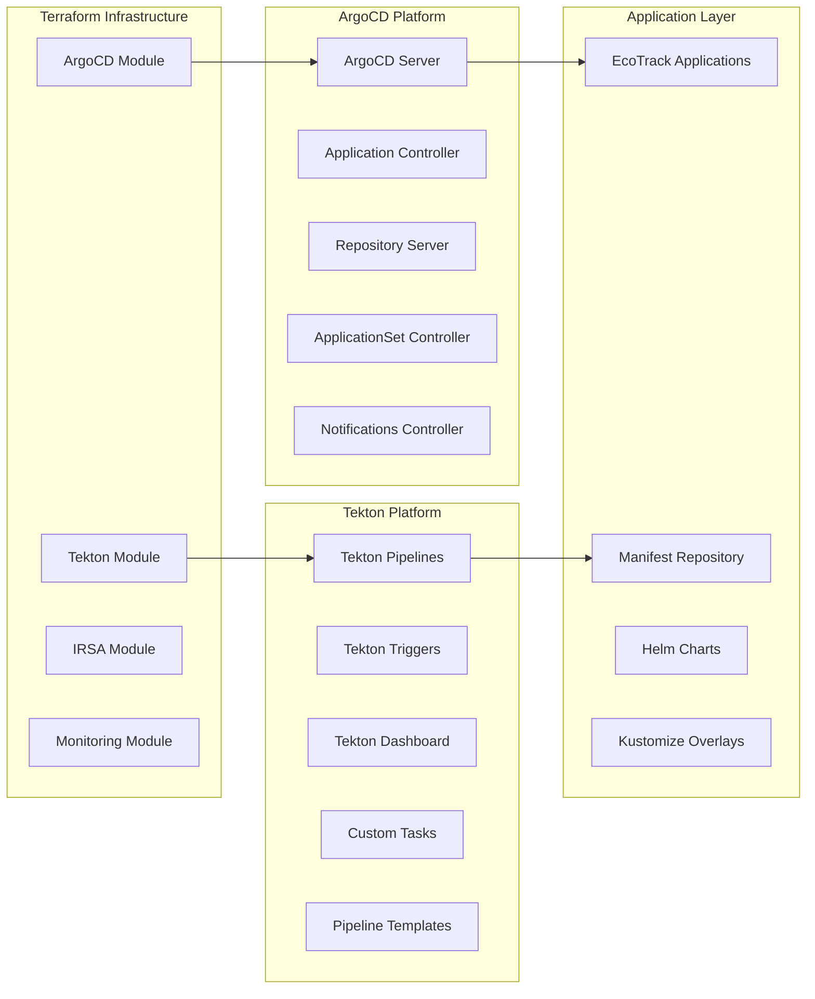

# Design Document

## Overview

The GitOps Deployment Automation platform will provide a complete, production-ready continuous integration and continuous deployment (CI/CD) solution using ArgoCD and Tekton. This design addresses the current implementation gaps by creating a systematic, modular approach that follows the same patterns as the other three workflows in the EKS infrastructure project.

The platform will transform the existing documentation-heavy approach into a fully functional, code-driven implementation with proper Terraform modules, automated setup scripts, comprehensive testing, and seamless integration with existing infrastructure components.

## Architecture

### High-Level Architecture



### Component Architecture



## Components and Interfaces

### 1. Terraform Infrastructure Modules

#### ArgoCD Terraform Module
- **Purpose**: Deploy and configure ArgoCD platform with production-ready settings
- **Location**: `terraform/modules/argocd/`
- **Interfaces**:
  - Input: Cluster configuration, domain settings, RBAC configuration
  - Output: ArgoCD endpoints, service accounts, IRSA roles
- **Dependencies**: EKS cluster, Ambassador ingress, cert-manager

#### Tekton Terraform Module
- **Purpose**: Deploy and configure Tekton CI/CD platform
- **Location**: `terraform/modules/tekton/`
- **Interfaces**:
  - Input: Container registry configuration, GitHub integration settings
  - Output: Tekton endpoints, service accounts, webhook URLs
- **Dependencies**: EKS cluster, container registry access

#### IRSA Integration Module
- **Purpose**: Configure IAM roles for service accounts for secure AWS integration
- **Location**: `terraform/modules/iam-irsa/` (extends existing module)
- **Interfaces**:
  - Input: Service account names, required AWS permissions
  - Output: IAM role ARNs, service account annotations
- **Dependencies**: EKS cluster, AWS IAM

#### Monitoring Integration Module
- **Purpose**: Configure ServiceMonitors and PrometheusRules for LGTM stack integration
- **Location**: `terraform/modules/lgtm-observability/` (extends existing module)
- **Interfaces**:
  - Input: ArgoCD and Tekton service configurations
  - Output: Monitoring configurations, dashboard definitions
- **Dependencies**: LGTM observability stack

### 2. ArgoCD Platform Components

#### ArgoCD Server
- **Purpose**: Web UI and API server for GitOps operations
- **Configuration**: Production-ready with HA, metrics, and Ambassador integration
- **Security**: RBAC, TLS termination, secure defaults

#### Application Controller
- **Purpose**: Manages application lifecycle and synchronization
- **Configuration**: Optimized for performance with proper resource limits
- **Monitoring**: Comprehensive metrics for sync status and performance

#### Repository Server
- **Purpose**: Handles Git repository operations and manifest generation
- **Configuration**: Caching enabled, multi-replica for HA
- **Security**: Secure Git credential management

#### ApplicationSet Controller
- **Purpose**: Manages multiple applications using templates and generators
- **Use Case**: Multi-environment deployments for EcoTrack microservices

#### Notifications Controller
- **Purpose**: Sends notifications for deployment events
- **Integration**: Slack, email, and webhook notifications

### 3. Tekton CI/CD Platform

#### Tekton Pipelines
- **Purpose**: Core pipeline execution engine
- **Configuration**: Custom resource definitions for Java microservices
- **Features**: Parallel execution, workspace management, result propagation

#### Tekton Triggers
- **Purpose**: Event-driven pipeline execution
- **Integration**: GitHub webhooks, EventListeners, TriggerBindings
- **Security**: Webhook authentication and authorization

#### Tekton Dashboard
- **Purpose**: Web UI for pipeline monitoring and management
- **Integration**: Ambassador ingress for secure access
- **Features**: Real-time pipeline status, log viewing, manual triggers

#### Custom Tasks
- **Components**:
  - Maven Build Task: Java compilation with caching
  - Container Build Task: Kaniko-based secure container builds
  - Security Scan Task: Trivy vulnerability scanning
  - GitOps Update Task: Automated manifest updates

### 4. Application Templates and Manifests

#### EcoTrack Microservice Templates
- **Services**: user-service, tracking-service, analytics-service, notification-service, reporting-service
- **Structure**: Standardized Kubernetes manifests with environment overlays
- **Configuration**: Kustomize-based configuration management

#### Manifest Repository Structure
```
ecotrack-manifests/
├── environments/
│   ├── dev/
│   ├── staging/
│   └── prod/
├── base/
│   ├── user-service/
│   ├── tracking-service/
│   ├── analytics-service/
│   ├── notification-service/
│   └── reporting-service/
└── shared/
    ├── configmaps/
    ├── secrets/
    └── policies/
```

### 5. Integration Interfaces

#### GitHub Integration
- **Webhook Endpoints**: Secure webhook receivers for repository events
- **Authentication**: Token-based authentication with proper secret management
- **Event Processing**: Push, pull request, and release event handling

#### Container Registry Integration
- **Supported Registries**: Amazon ECR, Docker Hub, Harbor, private registries
- **Authentication**: IRSA-based authentication for ECR, secret-based for others
- **Image Management**: Automated tagging, vulnerability scanning integration

#### Observability Integration
- **Metrics Collection**: Prometheus metrics from all components
- **Log Aggregation**: Structured logging to Loki
- **Distributed Tracing**: OpenTelemetry integration with Tempo
- **Dashboards**: Pre-built Grafana dashboards for GitOps metrics

## Data Models

### 1. Pipeline Configuration Model

```yaml
apiVersion: tekton.dev/v1beta1
kind: Pipeline
metadata:
  name: java-microservice-pipeline
spec:
  params:
    - name: service-name
      type: string
    - name: source-repo
      type: string
    - name: target-environment
      type: string
    - name: java-version
      type: string
      default: "17"
  workspaces:
    - name: source-workspace
    - name: cache-workspace
    - name: gitops-workspace
  tasks:
    - name: build
    - name: test
    - name: security-scan
    - name: container-build
    - name: gitops-update
```

### 2. ArgoCD Application Model

```yaml
apiVersion: argoproj.io/v1alpha1
kind: Application
metadata:
  name: ecotrack-user-service-dev
  namespace: argocd
spec:
  project: ecotrack
  source:
    repoURL: https://github.com/org/ecotrack-manifests
    path: environments/dev/user-service
    targetRevision: main
  destination:
    server: https://kubernetes.default.svc
    namespace: ecotrack-dev
  syncPolicy:
    automated:
      prune: true
      selfHeal: true
```

### 3. Environment Configuration Model

```yaml
apiVersion: v1
kind: ConfigMap
metadata:
  name: environment-config
data:
  environment: "dev"
  auto-sync: "true"
  notification-channels: "slack-dev"
  security-policy: "baseline"
  resource-quotas: "dev-limits"
```

### 4. Service Configuration Model

```yaml
apiVersion: v1
kind: ConfigMap
metadata:
  name: service-config
data:
  service-name: "user-service"
  container-registry: "123456789.dkr.ecr.us-east-1.amazonaws.com"
  java-version: "17"
  enable-native-build: "false"
  security-scan-severity: "HIGH,CRITICAL"
```

## Error Handling

### 1. Pipeline Error Handling

#### Build Failures
- **Detection**: Maven build exit codes, compilation errors
- **Response**: Immediate pipeline termination, notification to developers
- **Recovery**: Automatic retry for transient failures, manual intervention for code issues
- **Logging**: Detailed build logs stored in Loki for analysis

#### Security Scan Failures
- **Detection**: Trivy scan results exceeding severity thresholds
- **Response**: Configurable - warning or pipeline failure
- **Recovery**: Developer notification with vulnerability details
- **Tracking**: Security metrics tracked in Prometheus

#### Container Build Failures
- **Detection**: Kaniko build failures, registry push errors
- **Response**: Pipeline termination with detailed error messages
- **Recovery**: Automatic retry for registry connectivity issues
- **Monitoring**: Build success/failure rates tracked

### 2. GitOps Error Handling

#### Sync Failures
- **Detection**: ArgoCD sync status monitoring
- **Response**: Automatic retry with exponential backoff
- **Recovery**: Manual intervention for persistent failures
- **Alerting**: Immediate notifications for production sync failures

#### Manifest Validation Errors
- **Detection**: Kubernetes API validation, ArgoCD pre-sync hooks
- **Response**: Sync prevention, detailed error reporting
- **Recovery**: Automated rollback to last known good state
- **Prevention**: Pre-commit hooks for manifest validation

#### Repository Access Errors
- **Detection**: Git clone failures, authentication errors
- **Response**: Credential refresh, fallback mechanisms
- **Recovery**: Automatic retry with fresh credentials
- **Monitoring**: Repository access metrics and alerting

### 3. Infrastructure Error Handling

#### Component Health Monitoring
- **ArgoCD**: Health checks, readiness probes, liveness probes
- **Tekton**: Pipeline controller health, webhook availability
- **Dependencies**: Database connectivity, storage availability

#### Resource Exhaustion
- **Detection**: Resource usage monitoring, Kubernetes events
- **Response**: Auto-scaling, resource limit enforcement
- **Recovery**: Automatic pod eviction and rescheduling
- **Prevention**: Resource quotas and limits

#### Network Connectivity Issues
- **Detection**: Service mesh monitoring, network policy validation
- **Response**: Circuit breaker patterns, retry mechanisms
- **Recovery**: Automatic failover, traffic rerouting
- **Monitoring**: Network latency and error rate tracking

## Testing Strategy

### 1. Unit Testing

#### Terraform Module Testing
- **Framework**: Terratest for infrastructure testing
- **Scope**: Module validation, resource creation, configuration correctness
- **Automation**: Automated testing in CI/CD pipeline
- **Coverage**: All input/output combinations, error conditions

#### Pipeline Task Testing
- **Framework**: Tekton task testing framework
- **Scope**: Individual task functionality, parameter validation
- **Automation**: Automated testing on task changes
- **Coverage**: Success paths, error conditions, edge cases

### 2. Integration Testing

#### End-to-End Pipeline Testing
- **Scope**: Complete pipeline execution from Git push to deployment
- **Environment**: Dedicated testing environment
- **Automation**: Scheduled testing and on-demand execution
- **Validation**: Application deployment, health checks, rollback scenarios

#### GitOps Workflow Testing
- **Scope**: ArgoCD sync operations, multi-environment promotion
- **Environment**: Isolated test clusters
- **Automation**: Automated testing of sync policies and RBAC
- **Validation**: Application state consistency, security policies

### 3. Performance Testing

#### Pipeline Performance
- **Metrics**: Build time, resource utilization, throughput
- **Benchmarking**: Performance baselines and regression testing
- **Optimization**: Caching strategies, parallel execution
- **Monitoring**: Continuous performance monitoring

#### ArgoCD Performance
- **Metrics**: Sync time, resource consumption, API response times
- **Load Testing**: Multiple application sync scenarios
- **Optimization**: Controller tuning, resource allocation
- **Monitoring**: Performance dashboards and alerting

### 4. Security Testing

#### Vulnerability Scanning
- **Container Images**: Automated Trivy scanning in pipelines
- **Infrastructure**: Terraform security scanning
- **Dependencies**: Software composition analysis
- **Compliance**: Security policy validation

#### Access Control Testing
- **RBAC**: Role-based access control validation
- **Authentication**: Token-based authentication testing
- **Authorization**: Permission boundary testing
- **Audit**: Security event logging and monitoring

### 5. Disaster Recovery Testing

#### Backup and Restore
- **ArgoCD**: Configuration backup and restore procedures
- **Tekton**: Pipeline definition backup and recovery
- **Data**: Persistent volume backup and restore
- **Automation**: Automated backup testing and validation

#### Failover Testing
- **Component Failures**: Individual component failure scenarios
- **Network Partitions**: Split-brain scenario testing
- **Data Center Failures**: Multi-AZ failover testing
- **Recovery**: Automated recovery procedure validation

## Security Considerations

### 1. Authentication and Authorization

#### Identity Management
- **ArgoCD**: Integration with existing identity providers (OIDC, SAML)
- **Tekton**: Service account-based authentication
- **GitHub**: Token-based authentication with proper scoping
- **Container Registry**: IRSA-based authentication for ECR

#### Role-Based Access Control
- **ArgoCD Projects**: Fine-grained project-based access control
- **Kubernetes RBAC**: Namespace-based isolation and permissions
- **Pipeline Access**: Role-based pipeline execution permissions
- **Resource Access**: Least privilege principle enforcement

### 2. Secret Management

#### Credential Storage
- **Kubernetes Secrets**: Encrypted at rest, proper RBAC
- **AWS Secrets Manager**: Integration for sensitive credentials
- **External Secrets**: Support for external secret management systems
- **Rotation**: Automated credential rotation procedures

#### Secret Distribution
- **Service Accounts**: IRSA for AWS service access
- **Pipeline Secrets**: Secure injection into pipeline tasks
- **Application Secrets**: Secure delivery to applications
- **Audit**: Secret access logging and monitoring

### 3. Network Security

#### Network Policies
- **Namespace Isolation**: Traffic segmentation between environments
- **Service Communication**: Controlled inter-service communication
- **External Access**: Restricted external network access
- **Monitoring**: Network traffic monitoring and alerting

#### TLS and Encryption
- **In-Transit**: TLS encryption for all communications
- **At-Rest**: Encrypted storage for sensitive data
- **Certificate Management**: Automated certificate lifecycle
- **Compliance**: Security standard compliance validation

### 4. Container Security

#### Image Security
- **Base Images**: Minimal, regularly updated base images
- **Vulnerability Scanning**: Automated scanning in CI/CD pipeline
- **Image Signing**: Container image signing and verification
- **Registry Security**: Secure container registry configuration

#### Runtime Security
- **Pod Security Standards**: Enforced security contexts
- **Resource Limits**: CPU and memory limits enforcement
- **Privilege Escalation**: Prevention of privilege escalation
- **Monitoring**: Runtime security monitoring and alerting

### 5. Compliance and Auditing

#### Audit Logging
- **ArgoCD Operations**: Comprehensive operation logging
- **Pipeline Execution**: Detailed pipeline audit trails
- **Access Logs**: User and service access logging
- **Retention**: Log retention and archival policies

#### Compliance Frameworks
- **SOC 2**: Security control implementation
- **PCI DSS**: Payment card industry compliance
- **GDPR**: Data protection regulation compliance
- **Custom**: Organization-specific compliance requirements

## Performance Optimization

### 1. Pipeline Performance

#### Build Optimization
- **Caching**: Maven dependency caching, Docker layer caching
- **Parallelization**: Parallel task execution where possible
- **Resource Allocation**: Optimized CPU and memory allocation
- **Workspace Management**: Efficient workspace sharing and cleanup

#### Container Build Optimization
- **Multi-stage Builds**: Optimized Dockerfile structure
- **Build Context**: Minimized build context size
- **Registry Caching**: Layer caching in container registry
- **Compression**: Optimized image compression and transfer

### 2. ArgoCD Performance

#### Sync Optimization
- **Batch Operations**: Batched resource updates
- **Selective Sync**: Targeted resource synchronization
- **Parallel Sync**: Parallel application synchronization
- **Resource Filtering**: Optimized resource discovery and filtering

#### Repository Performance
- **Git Optimization**: Shallow clones, sparse checkouts
- **Caching**: Repository content caching
- **Compression**: Git repository compression
- **Bandwidth**: Optimized network utilization

### 3. Resource Optimization

#### Cluster Resources
- **Auto-scaling**: Horizontal and vertical pod auto-scaling
- **Resource Requests**: Optimized resource requests and limits
- **Node Utilization**: Efficient node resource utilization
- **Storage**: Optimized storage allocation and performance

#### Network Performance
- **Service Mesh**: Optimized service-to-service communication
- **Load Balancing**: Efficient traffic distribution
- **Caching**: Strategic caching implementation
- **CDN**: Content delivery network integration where applicable

## Monitoring and Observability

### 1. Metrics Collection

#### Pipeline Metrics
- **Execution Time**: Build, test, and deployment duration
- **Success Rate**: Pipeline success and failure rates
- **Resource Usage**: CPU, memory, and storage utilization
- **Queue Time**: Pipeline queue and execution delays

#### GitOps Metrics
- **Sync Status**: Application synchronization status and health
- **Drift Detection**: Configuration drift monitoring
- **Deployment Frequency**: Deployment frequency and lead time
- **Rollback Rate**: Rollback frequency and success rate

### 2. Logging Strategy

#### Structured Logging
- **Format**: JSON-structured logs for all components
- **Correlation**: Request correlation across services
- **Levels**: Appropriate log levels for different environments
- **Sampling**: Log sampling for high-volume scenarios

#### Log Aggregation
- **Loki Integration**: Centralized log collection and storage
- **Retention**: Appropriate log retention policies
- **Search**: Efficient log search and filtering
- **Alerting**: Log-based alerting and notification

### 3. Distributed Tracing

#### Trace Collection
- **OpenTelemetry**: Standardized tracing instrumentation
- **Tempo Integration**: Distributed trace storage and analysis
- **Sampling**: Intelligent trace sampling strategies
- **Correlation**: Trace correlation with logs and metrics

#### Performance Analysis
- **Latency Analysis**: End-to-end latency breakdown
- **Bottleneck Identification**: Performance bottleneck detection
- **Dependency Mapping**: Service dependency visualization
- **Optimization**: Performance optimization recommendations

### 4. Alerting and Notification

#### Alert Rules
- **SLI/SLO**: Service level indicator and objective monitoring
- **Threshold Alerts**: Metric threshold-based alerting
- **Anomaly Detection**: Machine learning-based anomaly detection
- **Escalation**: Alert escalation and notification policies

#### Notification Channels
- **Slack Integration**: Real-time Slack notifications
- **Email Alerts**: Email-based alert delivery
- **PagerDuty**: Critical alert escalation
- **Webhooks**: Custom webhook integrations

## Deployment Strategy

### 1. Infrastructure Deployment

#### Terraform Deployment
- **State Management**: Remote state storage and locking
- **Environment Isolation**: Separate state files per environment
- **Module Versioning**: Semantic versioning for Terraform modules
- **Validation**: Automated validation and testing

#### Progressive Rollout
- **Blue-Green**: Blue-green deployment for infrastructure changes
- **Canary**: Canary deployments for gradual rollout
- **Feature Flags**: Feature flag-based deployment control
- **Rollback**: Automated rollback procedures

### 2. Application Deployment

#### GitOps Deployment
- **Declarative**: Declarative application configuration
- **Automated Sync**: Automated synchronization with Git state
- **Health Checks**: Application health validation
- **Self-Healing**: Automated drift correction

#### Multi-Environment Strategy
- **Development**: Continuous deployment with automated testing
- **Staging**: Controlled deployment with manual approval
- **Production**: Scheduled deployment with comprehensive validation
- **Rollback**: Quick rollback capabilities for all environments

### 3. Configuration Management

#### Environment Configuration
- **Kustomize**: Environment-specific configuration overlays
- **Helm**: Parameterized application templates
- **ConfigMaps**: Runtime configuration management
- **Secrets**: Secure configuration parameter handling

#### Version Control
- **Git Flow**: Structured branching and merging strategy
- **Semantic Versioning**: Application and configuration versioning
- **Change Tracking**: Comprehensive change audit trail
- **Approval Process**: Code review and approval workflows