# Kiro Infrastructure Platform Management Design

## Overview

This design document outlines the comprehensive configuration of Kiro as the primary AI assistant for managing the EKS Foundation Platform. The design leverages all of Kiro's capabilities - steering documents, specs, hooks, MCP integrations, and autonomous modes - to provide intelligent infrastructure management across all 7 workflows.

## Architecture

### High-Level Architecture

```mermaid
graph TB
    subgraph "Kiro AI Assistant"
        A[Steering Documents] --> B[Context Engine]
        C[Specs Management] --> B
        D[Agent Hooks] --> B
        E[MCP Integrations] --> B
        B --> F[Autonomous Operations]
    end
    
    subgraph "Infrastructure Platform"
        G[🏗️ Workflow 1: Foundation]
        H[🌐 Workflow 2: Ingress + API Gateway]
        I[📈 Workflow 3: Observability]
        J[🔄 Workflow 4: GitOps]
        K[🔐 Workflow 5: Security]
        L[🛡️ Workflow 6: Service Mesh]
        M[📊 Workflow 7: Data Services]
    end
    
    F --> G
    F --> H
    F --> I
    F --> J
    F --> K
    F --> L
    F --> M
    
    subgraph "External Integrations"
        N[AWS CLI/APIs]
        O[Kubernetes APIs]
        P[Terraform State]
        Q[GitHub Actions]
        R[Monitoring Systems]
    end
    
    E --> N
    E --> O
    E --> P
    E --> Q
    E --> R
```



### Component Integration Flow

1. **Context Awareness**: Steering documents provide deep platform knowledge
2. **Workflow Management**: Specs guide implementation and enhancement
3. **Automation**: Hooks trigger automated responses to events
4. **External Integration**: MCP connects to AWS, Kubernetes, and monitoring tools
5. **Autonomous Operations**: AI-driven infrastructure management with human oversight

## Components and Interfaces

### 1. Enhanced Steering Documents

#### Current Steering Documents
- `product.md` - Platform overview and philosophy ✅
- `tech.md` - Technology stack and commands ✅  
- `structure.md` - Project organization ✅

#### Additional Steering Documents Needed

**`workflows.md`** - Workflow-specific guidance
```markdown
# Workflow Management

## Workflow Dependencies
- Workflow 1 (Foundation) → Required for all others
- Workflow 2 (Ingress) → Required for external access
- Workflow 3 (Observability) → Recommended before Workflow 4+
- Workflows 4-7 → Can be deployed in parallel after 1-3

## Resource Planning
- Total platform capacity: ~6-8 CPU cores, ~12-16GB memory
- Microservices capacity: ~5 services × 3 replicas × 512Mi = ~7.5GB
- Auto-scaling: 3-10 nodes based on load

## Integration Points
- All workflows use shared VPC and EKS cluster
- Observability monitors all components
- GitOps manages all application deployments
- Service mesh secures all inter-service communication
```

**`microservices.md`** - Microservices integration patterns
```markdown
# Microservices Integration

## EcoTrack Application Architecture
- 5 planned services: user, product, order, payment, notification
- Spring Boot with Actuator endpoints
- OpenTelemetry instrumentation
- Database-backed with persistent storage

## Platform Integration Requirements
- Prometheus metrics: /actuator/prometheus
- Health checks: /actuator/health
- Distributed tracing: OpenTelemetry → Tempo
- Log aggregation: Automatic via Promtail → Loki
- Service mesh: Istio sidecar injection
```

**`operations.md`** - Operational procedures and troubleshooting
```markdown
# Operational Procedures

## Deployment Sequence
1. Foundation Platform (Workflow 1)
2. Ingress + API Gateway (Workflow 2)  
3. Observability Stack (Workflow 3)
4. GitOps & Deployment (Workflow 4)
5. Security Foundation (Workflow 5)
6. Service Mesh (Workflow 6)
7. Data Services (Workflow 7)

## Common Troubleshooting
- Resource constraints: Check node capacity and HPA settings
- Network issues: Verify security groups and CNI configuration
- Storage problems: Check EBS CSI driver and PVC status
- Observability gaps: Validate service discovery and scrape configs
```

### 2. Spec-Driven Development Framework

#### Workflow Enhancement Specs
Each workflow should have its own spec for continuous improvement:

- `workflow-1-foundation-enhancement/` - EKS cluster optimizations
- `workflow-2-ingress-enhancement/` - API Gateway advanced features  
- `workflow-3-observability-enhancement/` - Advanced monitoring and alerting
- `workflow-4-gitops-implementation/` - Complete GitOps setup
- `workflow-5-security-implementation/` - Security foundation deployment
- `workflow-6-service-mesh-implementation/` - Istio service mesh setup
- `workflow-7-data-services-implementation/` - Database and messaging services

#### Platform Integration Specs
- `microservices-platform-integration/` - EcoTrack application integration
- `cost-optimization/` - Platform cost reduction strategies
- `disaster-recovery/` - Backup and recovery procedures
- `multi-environment-management/` - Dev/staging/prod consistency

### 3. Intelligent Agent Hooks

#### Infrastructure Monitoring Hooks
```yaml
# .kiro/hooks/infrastructure-monitoring.yaml
name: "Infrastructure Health Check"
trigger: "manual" # Can be expanded to scheduled
description: "Monitor cluster health and resource usage"
actions:
  - check_node_capacity
  - validate_pod_health  
  - review_resource_usage
  - suggest_optimizations
```

#### Deployment Automation Hooks
```yaml
# .kiro/hooks/deployment-validation.yaml
name: "Pre-Deployment Validation"
trigger: "file_change"
file_patterns: ["terraform/**/*.tf", ".github/workflows/*.yml"]
actions:
  - validate_terraform_syntax
  - check_workflow_dependencies
  - verify_resource_limits
  - suggest_deployment_order
```

#### Security Compliance Hooks
```yaml
# .kiro/hooks/security-compliance.yaml
name: "Security Configuration Review"
trigger: "manual"
description: "Review security configurations across all workflows"
actions:
  - audit_iam_policies
  - check_network_security
  - validate_encryption_settings
  - review_access_patterns
```

### 4. MCP Integration Strategy

#### AWS Integration
```json
{
  "mcpServers": {
    "aws-infrastructure": {
      "command": "uvx",
      "args": ["awslabs.aws-infrastructure-mcp-server@latest"],
      "env": {
        "AWS_REGION": "us-east-1"
      },
      "autoApprove": ["describe-*", "list-*", "get-*"]
    }
  }
}
```

#### Kubernetes Integration  
```json
{
  "mcpServers": {
    "kubernetes-management": {
      "command": "uvx", 
      "args": ["kubernetes-mcp-server@latest"],
      "autoApprove": ["get", "describe", "logs"]
    }
  }
}
```

#### Monitoring Integration
```json
{
  "mcpServers": {
    "prometheus-metrics": {
      "command": "uvx",
      "args": ["prometheus-mcp-server@latest"],
      "env": {
        "PROMETHEUS_URL": "http://localhost:9090"
      },
      "autoApprove": ["query", "query_range"]
    }
  }
}
```

### 5. Autonomous Operation Framework

#### Supervised Mode Operations
- Terraform plan/apply with human approval
- Configuration changes with impact analysis
- Resource scaling recommendations
- Security policy updates

#### Autopilot Mode Operations  
- Routine monitoring and alerting
- Log analysis and pattern detection
- Performance optimization suggestions
- Documentation updates
- Compliance reporting

## Data Models

### Platform State Model
```yaml
PlatformState:
  workflows:
    - id: "workflow-1"
      name: "🏗️ Foundation Platform"
      status: "deployed" | "pending" | "failed"
      dependencies: []
      resources:
        cpu_usage: "2.5 cores"
        memory_usage: "4.2 GB"
        cost_monthly: "$150"
    - id: "workflow-2"
      name: "🌐 Ingress + API Gateway Stack"
      status: "deployed"
      dependencies: ["workflow-1"]
      resources:
        cpu_usage: "0.5 cores"
        memory_usage: "768 MB"
        cost_monthly: "$25"
  
  environments:
    - name: "dev"
      cluster_name: "eks-learning-lab-dev-cluster"
      node_count: 3
      capacity_remaining: "60%"
    - name: "staging"  
      cluster_name: "eks-learning-lab-staging-cluster"
      node_count: 5
      capacity_remaining: "40%"
    - name: "prod"
      cluster_name: "eks-learning-lab-prod-cluster" 
      node_count: 8
      capacity_remaining: "30%"
```

### Microservices Integration Model
```yaml
MicroservicesState:
  applications:
    - name: "user-service"
      namespace: "ecotrack"
      replicas: 3
      health_status: "healthy"
      metrics_endpoint: "/actuator/prometheus"
      observability:
        prometheus_scraping: true
        loki_logging: true
        tempo_tracing: true
    - name: "product-service"
      namespace: "ecotrack"
      replicas: 3
      health_status: "healthy"
      metrics_endpoint: "/actuator/prometheus"
      observability:
        prometheus_scraping: true
        loki_logging: true
        tempo_tracing: true
```

### Operations Model
```yaml
OperationsState:
  alerts:
    - severity: "warning"
      component: "prometheus"
      message: "High memory usage detected"
      suggested_action: "Scale prometheus resources"
    - severity: "info"
      component: "cluster"
      message: "Node auto-scaling triggered"
      suggested_action: "Monitor resource usage"
  
  maintenance_tasks:
    - task: "Update Helm charts"
      frequency: "monthly"
      last_executed: "2024-01-15"
      next_due: "2024-02-15"
    - task: "Security audit"
      frequency: "quarterly"
      last_executed: "2024-01-01"
      next_due: "2024-04-01"
```

## Error Handling

### Infrastructure Failures
1. **Detection**: Continuous monitoring via observability stack
2. **Analysis**: Kiro analyzes logs, metrics, and traces
3. **Response**: Automated remediation for known issues
4. **Escalation**: Human notification for critical failures
5. **Recovery**: Guided recovery procedures with rollback options

### Deployment Failures
1. **Pre-deployment**: Validation hooks prevent common issues
2. **During deployment**: Real-time monitoring and rollback triggers
3. **Post-deployment**: Health checks and integration testing
4. **Failure recovery**: Automated rollback and incident documentation

### Configuration Drift
1. **Detection**: Regular state comparison against desired configuration
2. **Analysis**: Impact assessment and change recommendations
3. **Correction**: Automated fixes for low-risk drift
4. **Approval**: Human approval for significant changes

## Testing Strategy

### Infrastructure Testing
- **Terraform validation**: Syntax and resource validation
- **Security testing**: Policy compliance and vulnerability scanning
- **Performance testing**: Load testing and capacity planning
- **Disaster recovery**: Backup and restore procedures

### Integration Testing
- **Workflow dependencies**: Verify proper deployment sequence
- **Service mesh**: Test mTLS and traffic policies
- **Observability**: Validate metrics, logs, and traces collection
- **GitOps**: Test automated deployment and rollback

### Kiro Capability Testing
- **Steering document effectiveness**: Validate context understanding
- **Spec execution**: Test requirements → design → implementation flow
- **Hook automation**: Verify trigger conditions and actions
- **MCP integration**: Test external tool connectivity
- **Autonomous operations**: Validate decision-making and safety controls

## Security Considerations

### Access Control
- **RBAC**: Kubernetes role-based access control
- **IRSA**: IAM roles for service accounts (no long-lived credentials)
- **Network policies**: Micro-segmentation with Cilium/Istio
- **Secret management**: OpenBao with ExternalSecret operator

### Data Protection
- **Encryption at rest**: EBS volumes, S3 buckets, etcd
- **Encryption in transit**: TLS for all communications
- **Secret rotation**: Automated credential rotation
- **Audit logging**: Comprehensive audit trail

### Compliance
- **Policy enforcement**: OPA Gatekeeper policies
- **Runtime security**: Falco monitoring
- **Vulnerability scanning**: Container and infrastructure scanning
- **Compliance reporting**: Automated compliance dashboards

## Performance Optimization

### Resource Management
- **Right-sizing**: Continuous resource usage analysis
- **Auto-scaling**: HPA and VPA for applications, cluster auto-scaling for nodes
- **Spot instances**: Cost optimization with fault tolerance
- **Resource quotas**: Prevent resource exhaustion

### Observability Optimization
- **Metrics cardinality**: Control high-cardinality metrics
- **Log sampling**: Intelligent log sampling for high-volume services
- **Trace sampling**: Distributed tracing sampling strategies
- **Storage lifecycle**: S3 lifecycle policies for cost optimization

### Network Performance
- **CNI optimization**: Cilium with eBPF for high performance
- **Service mesh**: Istio with optimized proxy configurations
- **Load balancing**: Intelligent traffic distribution
- **CDN integration**: Cloudflare for static content delivery