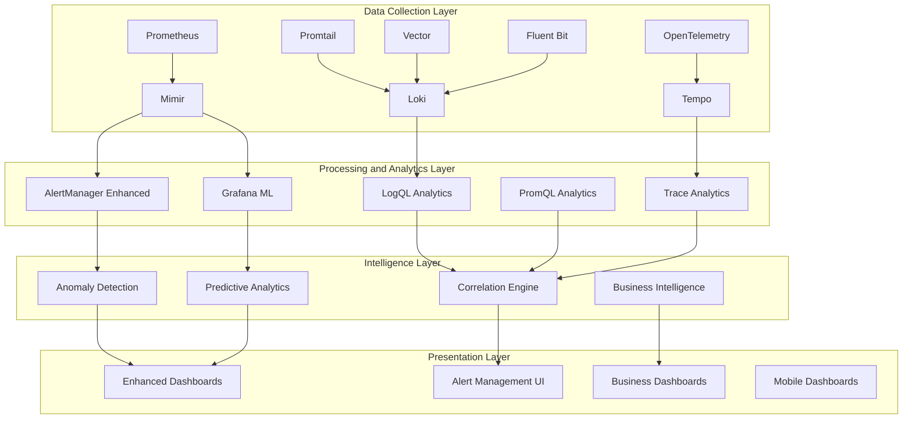

# LGTM Observability Enhancement Design

## Overview

This design document outlines the enhancement of the existing LGTM observability stack with advanced monitoring, alerting, and analytics capabilities. The design builds upon the current Prometheus, Mimir, Loki, Tempo, and Grafana deployment to provide intelligent observability, proactive monitoring, and business intelligence capabilities.

## Architecture

### Enhanced Observability Architecture



## Components and Interfaces

### 1. Enhanced Metrics Collection

#### Advanced Prometheus Configuration
```yaml
Prometheus Enhancements:
  recording_rules:
    - SLI/SLO calculations
    - Business metric aggregations
    - Performance percentile calculations
    - Resource efficiency metrics
    
  federation:
    - Multi-cluster metrics aggregation
    - Cross-environment correlation
    - Global service mesh metrics
    
  custom_metrics:
    - Business KPI metrics
    - User experience metrics
    - Cost allocation metrics
    - Security posture metrics
```

#### Mimir Long-term Storage Optimization
```yaml
Mimir Configuration:
  retention_policies:
    high_resolution: "7d"
    medium_resolution: "30d"
    low_resolution: "1y"
    
  compaction:
    intelligent_downsampling: true
    cost_optimized_storage: true
    query_performance_optimization: true
    
  multi_tenancy:
    environment_isolation: true
    team_based_access: true
    cost_allocation_tracking: true
```

### 2. Intelligent Alerting System

#### Enhanced AlertManager
```yaml
AlertManager Enhancements:
  machine_learning:
    anomaly_detection: true
    alert_correlation: true
    noise_reduction: true
    
  intelligent_routing:
    severity_based_escalation: true
    business_impact_weighting: true
    context_aware_notifications: true
    
  integration:
    slack_enhanced: true
    pagerduty_intelligent: true
    jira_automation: true
    teams_integration: true
```

#### Anomaly Detection Engine
```yaml
Anomaly Detection:
  algorithms:
    - statistical_analysis
    - machine_learning_models
    - time_series_forecasting
    - pattern_recognition
    
  data_sources:
    - prometheus_metrics
    - loki_logs
    - tempo_traces
    - business_metrics
    
  output:
    - anomaly_alerts
    - trend_predictions
    - capacity_recommendations
    - performance_insights
```

### 3. Advanced Log Analytics

#### Enhanced Loki Configuration
```yaml
Loki Enhancements:
  query_optimization:
    parallel_processing: true
    intelligent_indexing: true
    query_caching: true
    
  analytics:
    log_pattern_detection: true
    anomaly_identification: true
    correlation_analysis: true
    
  retention:
    intelligent_lifecycle: true
    cost_optimized_storage: true
    compliance_retention: true
```

#### Log Analytics Engine
```yaml
Log Analytics:
  natural_language_processing:
    error_classification: true
    sentiment_analysis: true
    intent_recognition: true
    
  pattern_recognition:
    recurring_issues: true
    performance_patterns: true
    security_patterns: true
    
  correlation:
    cross_service_correlation: true
    metric_log_correlation: true
    trace_log_correlation: true
```

### 4. Enhanced Distributed Tracing

#### Tempo Optimization
```yaml
Tempo Enhancements:
  intelligent_sampling:
    adaptive_sampling: true
    error_biased_sampling: true
    business_critical_sampling: true
    
  analytics:
    service_dependency_mapping: true
    performance_bottleneck_detection: true
    error_propagation_analysis: true
    
  storage:
    cost_optimized_retention: true
    query_performance_optimization: true
    compression_optimization: true
```

#### Trace Analytics
```yaml
Trace Analytics:
  performance_analysis:
    latency_breakdown: true
    bottleneck_identification: true
    optimization_recommendations: true
    
  dependency_analysis:
    service_map_generation: true
    critical_path_analysis: true
    failure_impact_assessment: true
    
  business_correlation:
    user_journey_tracking: true
    business_transaction_analysis: true
    revenue_impact_correlation: true
```

### 5. Business Intelligence Layer

#### Enhanced Grafana Configuration
```yaml
Grafana Enhancements:
  machine_learning:
    predictive_dashboards: true
    anomaly_visualization: true
    trend_forecasting: true
    
  business_intelligence:
    executive_dashboards: true
    cost_analysis_dashboards: true
    performance_roi_dashboards: true
    
  mobile_optimization:
    responsive_dashboards: true
    mobile_alerts: true
    offline_capabilities: true
```

#### Business Metrics Integration
```yaml
Business Intelligence:
  kpi_tracking:
    technical_business_correlation: true
    sli_slo_business_impact: true
    cost_efficiency_metrics: true
    
  reporting:
    automated_reports: true
    executive_summaries: true
    trend_analysis: true
    
  forecasting:
    capacity_planning: true
    cost_forecasting: true
    performance_predictions: true
```

## Data Models

### Enhanced Metrics Model
```yaml
MetricsModel:
  technical_metrics:
    - infrastructure_performance
    - application_performance
    - security_metrics
    - cost_metrics
    
  business_metrics:
    - user_experience_metrics
    - business_kpi_correlation
    - revenue_impact_metrics
    - customer_satisfaction_metrics
    
  derived_metrics:
    - sli_slo_calculations
    - efficiency_ratios
    - optimization_opportunities
    - predictive_indicators
```

### Log Analytics Model
```yaml
LogAnalyticsModel:
  structured_logs:
    - application_logs
    - infrastructure_logs
    - security_logs
    - audit_logs
    
  analytics_results:
    - pattern_detection_results
    - anomaly_detection_results
    - correlation_analysis_results
    - trend_analysis_results
    
  insights:
    - performance_insights
    - security_insights
    - business_insights
    - optimization_recommendations
```

### Trace Analytics Model
```yaml
TraceAnalyticsModel:
  trace_data:
    - service_traces
    - user_journey_traces
    - business_transaction_traces
    - error_traces
    
  analytics_results:
    - dependency_maps
    - performance_bottlenecks
    - error_propagation_paths
    - optimization_opportunities
    
  business_correlation:
    - user_experience_impact
    - business_transaction_success
    - revenue_correlation
    - customer_journey_analysis
```

## Error Handling

### Enhanced Error Detection
```yaml
Error Detection:
  multi_source_correlation:
    - metrics_based_detection
    - log_based_detection
    - trace_based_detection
    - business_impact_detection
    
  intelligent_classification:
    - severity_assessment
    - business_impact_analysis
    - root_cause_identification
    - remediation_suggestions
    
  proactive_detection:
    - predictive_failure_detection
    - capacity_exhaustion_prediction
    - performance_degradation_prediction
    - security_threat_detection
```

### Automated Response
```yaml
Automated Response:
  self_healing:
    - automatic_scaling_responses
    - circuit_breaker_activation
    - traffic_rerouting
    - resource_optimization
    
  escalation:
    - intelligent_alert_routing
    - severity_based_escalation
    - business_impact_escalation
    - automated_incident_creation
    
  documentation:
    - automated_runbook_generation
    - incident_timeline_creation
    - root_cause_documentation
    - lessons_learned_capture
```

## Testing Strategy

### Observability Testing
```yaml
Testing Framework:
  data_quality_testing:
    - metrics_accuracy_validation
    - log_completeness_verification
    - trace_correlation_testing
    - business_metric_validation
    
  performance_testing:
    - query_performance_benchmarking
    - dashboard_load_testing
    - alert_response_time_testing
    - storage_performance_validation
    
  intelligence_testing:
    - anomaly_detection_accuracy
    - prediction_model_validation
    - correlation_engine_testing
    - business_intelligence_accuracy
```

### Integration Testing
```yaml
Integration Testing:
  cross_component_testing:
    - metrics_to_alerts_flow
    - logs_to_insights_pipeline
    - traces_to_analytics_flow
    - business_intelligence_integration
    
  external_integration_testing:
    - notification_system_testing
    - ticketing_system_integration
    - business_system_integration
    - mobile_application_testing
```

## Security Considerations

### Data Security
```yaml
Security Measures:
  data_encryption:
    - encryption_at_rest
    - encryption_in_transit
    - key_management_integration
    - compliance_requirements
    
  access_control:
    - role_based_access_control
    - multi_tenant_isolation
    - audit_trail_maintenance
    - privacy_protection
    
  compliance:
    - gdpr_compliance
    - sox_compliance
    - hipaa_compliance
    - industry_specific_requirements
```

### Operational Security
```yaml
Operational Security:
  monitoring_security:
    - security_event_correlation
    - threat_detection_integration
    - vulnerability_monitoring
    - compliance_monitoring
    
  incident_response:
    - security_incident_detection
    - automated_response_procedures
    - forensic_data_collection
    - compliance_reporting
```

## Performance Optimization

### Query Optimization
```yaml
Query Performance:
  intelligent_caching:
    - query_result_caching
    - dashboard_caching
    - metric_pre_aggregation
    - intelligent_prefetching
    
  resource_optimization:
    - query_parallelization
    - resource_allocation_optimization
    - storage_optimization
    - network_optimization
```

### Scalability
```yaml
Scalability Design:
  horizontal_scaling:
    - component_auto_scaling
    - load_balancing_optimization
    - resource_distribution
    - performance_monitoring
    
  vertical_scaling:
    - resource_right_sizing
    - performance_tuning
    - capacity_planning
    - cost_optimization
```