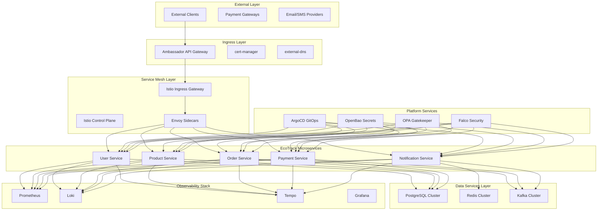

# Microservices Platform Integration Design

## Overview

This design document outlines the comprehensive integration of the EcoTrack microservices application with the complete EKS Foundation Platform stack. The design demonstrates how to leverage all platform capabilities including observability, security, service mesh, data services, and GitOps to create a production-ready microservices deployment pattern.

## Architecture

### High-Level Integration Architecture



### Integration Patterns

1. **API Gateway Integration**: External traffic routing through Ambassador
2. **Service Mesh Integration**: mTLS and traffic management through Istio
3. **Data Layer Integration**: Comprehensive data services integration
4. **Security Integration**: End-to-end security with OpenBao, OPA, and Falco
5. **Observability Integration**: Complete LGTM stack integration
6. **GitOps Integration**: Automated deployment and configuration management

## Components and Interfaces

### 1. EcoTrack Application Architecture Integration

#### Service Deployment Configuration
```yaml
EcoTrack Services Configuration:
  user_service:
    namespace: ecotrack
    replicas: 3
    image: user-service:v1.2.0
    
    resources:
      requests:
        cpu: 200m
        memory: 512Mi
      limits:
        cpu: 500m
        memory: 1Gi
    
    environment:
      SPRING_PROFILES_ACTIVE: kubernetes
      SPRING_DATASOURCE_URL: jdbc:postgresql://postgres-cluster-rw:5432/ecotrack
      SPRING_REDIS_HOST: redis-cluster
      SPRING_KAFKA_BOOTSTRAP_SERVERS: kafka-cluster-kafka-bootstrap:9092
      OTEL_SERVICE_NAME: user-service
      OTEL_EXPORTER_OTLP_ENDPOINT: http://tempo-distributor:4317
    
    service_account: user-service-sa
    
    health_checks:
      liveness_probe:
        http_get:
          path: /actuator/health/liveness
          port: 8080
        initial_delay_seconds: 60
        period_seconds: 30
      readiness_probe:
        http_get:
          path: /actuator/health/readiness
          port: 8080
        initial_delay_seconds: 30
        period_seconds: 10
    
    annotations:
      sidecar.istio.io/inject: "true"
      prometheus.io/scrape: "true"
      prometheus.io/port: "8080"
      prometheus.io/path: "/actuator/prometheus"

Service Dependencies:
  user_service:
    dependencies: [postgres-cluster, redis-cluster]
    startup_order: 1
    
  product_service:
    dependencies: [postgres-cluster, redis-cluster]
    startup_order: 1
    
  order_service:
    dependencies: [postgres-cluster, user-service, product-service, kafka-cluster]
    startup_order: 2
    
  payment_service:
    dependencies: [postgres-cluster, order-service, kafka-cluster]
    startup_order: 3
    
  notification_service:
    dependencies: [redis-cluster, kafka-cluster]
    startup_order: 2
```

#### Auto-Scaling Configuration
```yaml
Horizontal Pod Autoscaler:
  user_service_hpa:
    min_replicas: 3
    max_replicas: 10
    target_cpu_utilization: 70
    target_memory_utilization: 80
    scale_up_stabilization: 60s
    scale_down_stabilization: 300s
    
  order_service_hpa:
    min_replicas: 3
    max_replicas: 15
    target_cpu_utilization: 70
    target_memory_utilization: 80
    custom_metrics:
      - type: Pods
        pods:
          metric:
            name: http_requests_per_second
          target:
            type: AverageValue
            averageValue: "100"

Vertical Pod Autoscaler:
  enabled: true
  update_mode: "Auto"
  resource_policy:
    container_policies:
      - container_name: "*"
        max_allowed:
          cpu: "2"
          memory: "4Gi"
        min_allowed:
          cpu: "100m"
          memory: "256Mi"
```

### 2. Comprehensive Observability Integration

#### Prometheus Metrics Integration
```yaml
Metrics Configuration:
  spring_boot_metrics:
    management:
      endpoints:
        web:
          exposure:
            include: health,info,metrics,prometheus
      endpoint:
        health:
          show-details: always
        metrics:
          enabled: true
        prometheus:
          enabled: true
      metrics:
        export:
          prometheus:
            enabled: true
        distribution:
          percentiles-histogram:
            http.server.requests: true
          percentiles:
            http.server.requests: 0.5,0.95,0.99
        tags:
          application: ${spring.application.name}
          environment: ${ENVIRONMENT:dev}

Custom Business Metrics:
  user_service_metrics:
    - name: user_registrations_total
      type: counter
      description: Total number of user registrations
      tags: [registration_type, source]
    - name: user_login_duration_seconds
      type: timer
      description: User login processing time
      tags: [authentication_method, success]
      
  order_service_metrics:
    - name: orders_total
      type: counter
      description: Total number of orders processed
      tags: [order_status, payment_method]
    - name: order_value_dollars
      type: gauge
      description: Current order value in dollars
      tags: [currency, region]
    - name: order_processing_duration_seconds
      type: timer
      description: Order processing time
      tags: [order_type, complexity]

ServiceMonitor Configuration:
  apiVersion: monitoring.coreos.com/v1
  kind: ServiceMonitor
  metadata:
    name: ecotrack-services
    namespace: ecotrack
    labels:
      app.kubernetes.io/name: ecotrack
  spec:
    selector:
      matchLabels:
        app.kubernetes.io/part-of: ecotrack
    endpoints:
      - port: http
        path: /actuator/prometheus
        interval: 30s
        scrapeTimeout: 10s
```

#### Distributed Tracing Integration
```yaml
OpenTelemetry Configuration:
  spring_boot_tracing:
    management:
      tracing:
        sampling:
          probability: 0.1  # 10% sampling in production
        baggage:
          correlation:
            enabled: true
          remote-fields: [user-id, correlation-id, business-context]
    
    otel:
      service:
        name: ${spring.application.name}
      resource:
        attributes:
          service.version: ${app.version}
          deployment.environment: ${ENVIRONMENT}
      exporter:
        otlp:
          endpoint: http://tempo-distributor:4317
      traces:
        exporter: otlp
      metrics:
        exporter: prometheus

Custom Tracing:
  business_spans:
    - name: user-authentication
      attributes: [user_id, authentication_method, ip_address]
    - name: order-processing
      attributes: [order_id, user_id, total_amount, payment_method]
    - name: payment-processing
      attributes: [payment_id, order_id, amount, gateway, status]
    - name: notification-delivery
      attributes: [notification_id, user_id, channel, template]

Trace Correlation:
  http_headers:
    - x-trace-id
    - x-span-id
    - x-user-id
    - x-correlation-id
    - x-business-context
  
  mdc_fields:
    - traceId
    - spanId
    - userId
    - correlationId
    - businessContext
```

#### Structured Logging Integration
```yaml
Logging Configuration:
  logback_spring_xml:
    appenders:
      - name: STDOUT
        encoder:
          pattern: "%d{ISO8601} [%thread] %-5level [%X{traceId:-},%X{spanId:-}] %logger{36} - %msg%n"
      - name: JSON
        encoder:
          class: net.logstash.logback.encoder.LoggingEventCompositeJsonEncoder
          providers:
            - timestamp
            - logLevel
            - loggerName
            - message
            - mdc
            - arguments
            - stackTrace
    
    root_level: INFO
    logger_levels:
      com.ecotrack: DEBUG
      org.springframework.web: INFO
      org.hibernate.SQL: DEBUG
      org.hibernate.type.descriptor.sql.BasicBinder: TRACE

Log Correlation:
  mdc_fields:
    - traceId: OpenTelemetry trace ID
    - spanId: OpenTelemetry span ID
    - userId: Authenticated user ID
    - correlationId: Request correlation ID
    - businessContext: Business operation context
    - sessionId: User session ID
    - requestId: Unique request identifier

Loki Integration:
  promtail_config:
    scrape_configs:
      - job_name: ecotrack-services
        kubernetes_sd_configs:
          - role: pod
            namespaces:
              names: [ecotrack]
        relabel_configs:
          - source_labels: [__meta_kubernetes_pod_label_app]
            target_label: app
          - source_labels: [__meta_kubernetes_pod_label_version]
            target_label: version
          - source_labels: [__meta_kubernetes_namespace]
            target_label: namespace
        pipeline_stages:
          - json:
              expressions:
                timestamp: timestamp
                level: level
                logger: logger
                message: message
                trace_id: mdc.traceId
                user_id: mdc.userId
```

### 3. Service Mesh Integration for Secure Communication

#### Istio Configuration for EcoTrack Services
```yaml
Service Mesh Configuration:
  namespace_injection:
    apiVersion: v1
    kind: Namespace
    metadata:
      name: ecotrack
      labels:
        istio-injection: enabled
        app.kubernetes.io/name: ecotrack

VirtualService Configuration:
  user_service_vs:
    apiVersion: networking.istio.io/v1beta1
    kind: VirtualService
    metadata:
      name: user-service
      namespace: ecotrack
    spec:
      hosts:
        - user-service
      http:
        - match:
            - headers:
                canary:
                  exact: "true"
          route:
            - destination:
                host: user-service
                subset: canary
              weight: 100
          fault:
            delay:
              percentage:
                value: 0.1
              fixedDelay: 100ms
        - route:
            - destination:
                host: user-service
                subset: stable
              weight: 100
          timeout: 30s
          retries:
            attempts: 3
            perTryTimeout: 10s
            retryOn: 5xx,reset,connect-failure,refused-stream

DestinationRule Configuration:
  user_service_dr:
    apiVersion: networking.istio.io/v1beta1
    kind: DestinationRule
    metadata:
      name: user-service
      namespace: ecotrack
    spec:
      host: user-service
      trafficPolicy:
        connectionPool:
          tcp:
            maxConnections: 100
          http:
            http1MaxPendingRequests: 50
            http2MaxRequests: 100
            maxRequestsPerConnection: 10
        loadBalancer:
          simple: LEAST_CONN
        outlierDetection:
          consecutiveErrors: 5
          interval: 30s
          baseEjectionTime: 30s
          maxEjectionPercent: 50
      subsets:
        - name: stable
          labels:
            version: stable
        - name: canary
          labels:
            version: canary
```

#### mTLS and Security Policies
```yaml
PeerAuthentication:
  apiVersion: security.istio.io/v1beta1
  kind: PeerAuthentication
  metadata:
    name: default
    namespace: ecotrack
  spec:
    mtls:
      mode: STRICT

AuthorizationPolicy:
  service_to_service_authz:
    apiVersion: security.istio.io/v1beta1
    kind: AuthorizationPolicy
    metadata:
      name: ecotrack-service-authz
      namespace: ecotrack
    spec:
      rules:
        - from:
            - source:
                principals: ["cluster.local/ns/ecotrack/sa/order-service"]
          to:
            - operation:
                methods: ["GET", "POST"]
                paths: ["/api/users/*"]
          when:
            - key: source.labels[app]
              values: ["order-service"]
        - from:
            - source:
                principals: ["cluster.local/ns/ecotrack/sa/payment-service"]
          to:
            - operation:
                methods: ["POST"]
                paths: ["/api/orders/*/payment"]
          when:
            - key: source.labels[app]
              values: ["payment-service"]

External Access Policy:
  apiVersion: security.istio.io/v1beta1
  kind: AuthorizationPolicy
  metadata:
    name: external-api-access
    namespace: ecotrack
  spec:
    selector:
      matchLabels:
        app: user-service
    rules:
      - from:
          - source:
              notPrincipals: ["*"]
        to:
          - operation:
              methods: ["GET", "POST", "PUT", "DELETE"]
              paths: ["/api/*"]
        when:
          - key: request.headers[authorization]
            values: ["Bearer *"]
```

### 4. Database Integration with Data Services

#### PostgreSQL Integration
```yaml
Database Configuration:
  spring_datasource:
    url: jdbc:postgresql://postgres-cluster-rw:5432/ecotrack
    username: ${DB_USERNAME}
    password: ${DB_PASSWORD}
    driver-class-name: org.postgresql.Driver
    
  hikari:
    maximum-pool-size: 20
    minimum-idle: 5
    connection-timeout: 30000
    idle-timeout: 600000
    max-lifetime: 1800000
    leak-detection-threshold: 60000
    
  jpa:
    hibernate:
      ddl-auto: validate
      naming:
        physical-strategy: org.hibernate.boot.model.naming.PhysicalNamingStrategyStandardImpl
    show-sql: false
    properties:
      hibernate:
        dialect: org.hibernate.dialect.PostgreSQLDialect
        format_sql: true
        use_sql_comments: true
        jdbc:
          batch_size: 20
        order_inserts: true
        order_updates: true
        connection:
          provider_disables_autocommit: true

Service-Specific Database Schemas:
  user_service_schema:
    tables:
      - users (id, email, password_hash, first_name, last_name, created_at, updated_at)
      - user_profiles (user_id, bio, avatar_url, preferences)
      - user_sessions (id, user_id, session_token, expires_at)
    
  product_service_schema:
    tables:
      - products (id, name, description, price, category_id, sustainability_score)
      - categories (id, name, description, parent_id)
      - product_images (id, product_id, image_url, alt_text)
    
  order_service_schema:
    tables:
      - orders (id, user_id, status, total_amount, created_at, updated_at)
      - order_items (id, order_id, product_id, quantity, unit_price)
      - order_history (id, order_id, status, changed_at, notes)
```

#### Redis Integration
```yaml
Redis Configuration:
  spring_redis:
    host: redis-cluster
    port: 6379
    password: ${REDIS_PASSWORD}
    ssl: true
    timeout: 2000ms
    
    jedis:
      pool:
        max-active: 20
        max-idle: 10
        min-idle: 2
        max-wait: 2000ms
    
    cache:
      type: redis
      redis:
        time-to-live: 600000  # 10 minutes
        cache-null-values: false
        key-prefix: "ecotrack:cache:"

Cache Configuration:
  user_service_cache:
    user_profile_cache:
      ttl: 300000  # 5 minutes
      max_entries: 10000
      key_pattern: "user:profile:{userId}"
    
    user_session_cache:
      ttl: 1800000  # 30 minutes
      max_entries: 50000
      key_pattern: "user:session:{sessionId}"
  
  product_service_cache:
    product_cache:
      ttl: 600000  # 10 minutes
      max_entries: 100000
      key_pattern: "product:{productId}"
    
    category_cache:
      ttl: 3600000  # 1 hour
      max_entries: 1000
      key_pattern: "category:{categoryId}"
    
    search_results_cache:
      ttl: 300000  # 5 minutes
      max_entries: 10000
      key_pattern: "search:{query}:{filters}"
```

#### Kafka Integration
```yaml
Kafka Configuration:
  spring_kafka:
    bootstrap_servers: kafka-cluster-kafka-bootstrap:9092
    security:
      protocol: SASL_SSL
    sasl:
      mechanism: SCRAM-SHA-512
      jaas:
        config: org.apache.kafka.common.security.scram.ScramLoginModule required username="${KAFKA_USERNAME}" password="${KAFKA_PASSWORD}";
    
    producer:
      key_serializer: org.apache.kafka.common.serialization.StringSerializer
      value_serializer: org.springframework.kafka.support.serializer.JsonSerializer
      acks: all
      retries: 3
      batch_size: 16384
      linger_ms: 5
      buffer_memory: 33554432
      
    consumer:
      key_deserializer: org.apache.kafka.common.serialization.StringDeserializer
      value_deserializer: org.springframework.kafka.support.serializer.JsonDeserializer
      group_id: ${spring.application.name}
      auto_offset_reset: earliest
      enable_auto_commit: false
      max_poll_records: 500

Event Publishing Configuration:
  user_events:
    topic: user-events
    events:
      - UserRegisteredEvent
      - UserUpdatedEvent
      - UserDeletedEvent
      - UserLoginEvent
      - UserLogoutEvent
    
  order_events:
    topic: order-events
    events:
      - OrderCreatedEvent
      - OrderUpdatedEvent
      - OrderCancelledEvent
      - OrderCompletedEvent
      - OrderPaymentProcessedEvent
    
  payment_events:
    topic: payment-events
    events:
      - PaymentInitiatedEvent
      - PaymentProcessedEvent
      - PaymentFailedEvent
      - PaymentRefundedEvent
    
  notification_events:
    topic: notification-events
    events:
      - NotificationSentEvent
      - NotificationDeliveredEvent
      - NotificationFailedEvent
```

### 5. Secrets Management Integration

#### OpenBao Integration
```yaml
ExternalSecret Configuration:
  database_credentials:
    apiVersion: external-secrets.io/v1beta1
    kind: ExternalSecret
    metadata:
      name: ecotrack-db-credentials
      namespace: ecotrack
    spec:
      refreshInterval: 300s
      secretStoreRef:
        name: openbao-secret-store
        kind: SecretStore
      target:
        name: ecotrack-db-credentials
        creationPolicy: Owner
      data:
        - secretKey: username
          remoteRef:
            key: database/creds/ecotrack-app
            property: username
        - secretKey: password
          remoteRef:
            key: database/creds/ecotrack-app
            property: password

Application Secrets:
  user_service_secrets:
    - name: jwt-signing-key
      path: secret/data/ecotrack/user-service
      key: jwt-signing-key
    - name: oauth-client-secret
      path: secret/data/ecotrack/user-service
      key: oauth-client-secret
    
  payment_service_secrets:
    - name: stripe-api-key
      path: secret/data/ecotrack/payment-service
      key: stripe-api-key
    - name: paypal-client-secret
      path: secret/data/ecotrack/payment-service
      key: paypal-client-secret
    
  notification_service_secrets:
    - name: sendgrid-api-key
      path: secret/data/ecotrack/notification-service
      key: sendgrid-api-key
    - name: twilio-auth-token
      path: secret/data/ecotrack/notification-service
      key: twilio-auth-token

Secret Rotation:
  database_credentials:
    rotation_period: 24h
    grace_period: 1h
    notification: true
    
  api_keys:
    rotation_period: 30d
    grace_period: 7d
    notification: true
    
  certificates:
    rotation_period: 90d
    grace_period: 30d
    notification: true
```

### 6. GitOps-Based Deployment and Configuration

#### ArgoCD Application Configuration
```yaml
ArgoCD Applications:
  user_service_app:
    apiVersion: argoproj.io/v1alpha1
    kind: Application
    metadata:
      name: ecotrack-user-service
      namespace: argocd
    spec:
      project: ecotrack
      source:
        repoURL: https://github.com/company/ecotrack-gitops
        targetRevision: HEAD
        path: applications/user-service
        helm:
          valueFiles:
            - values.yaml
            - values-prod.yaml
      destination:
        server: https://kubernetes.default.svc
        namespace: ecotrack
      syncPolicy:
        automated:
          prune: true
          selfHeal: true
        syncOptions:
          - CreateNamespace=true
          - PrunePropagationPolicy=foreground
        retry:
          limit: 5
          backoff:
            duration: 5s
            factor: 2
            maxDuration: 3m

Helm Chart Structure:
  ecotrack_service_chart:
    Chart.yaml:
      apiVersion: v2
      name: ecotrack-service
      version: 1.0.0
      appVersion: 1.2.0
      
    values.yaml:
      image:
        repository: ecotrack/user-service
        tag: v1.2.0
        pullPolicy: IfNotPresent
      
      replicaCount: 3
      
      service:
        type: ClusterIP
        port: 80
        targetPort: 8080
      
      ingress:
        enabled: true
        className: ambassador
        annotations:
          cert-manager.io/cluster-issuer: letsencrypt-prod
        hosts:
          - host: api.ecotrack.platform.dev
            paths:
              - path: /api/users
                pathType: Prefix
        tls:
          - secretName: ecotrack-api-tls
            hosts:
              - api.ecotrack.platform.dev
      
      resources:
        requests:
          cpu: 200m
          memory: 512Mi
        limits:
          cpu: 500m
          memory: 1Gi
      
      autoscaling:
        enabled: true
        minReplicas: 3
        maxReplicas: 10
        targetCPUUtilizationPercentage: 70
        targetMemoryUtilizationPercentage: 80

Environment-Specific Values:
  values_dev.yaml:
    replicaCount: 1
    resources:
      requests:
        cpu: 100m
        memory: 256Mi
      limits:
        cpu: 200m
        memory: 512Mi
    
  values_staging.yaml:
    replicaCount: 2
    resources:
      requests:
        cpu: 150m
        memory: 384Mi
      limits:
        cpu: 300m
        memory: 768Mi
    
  values_prod.yaml:
    replicaCount: 3
    resources:
      requests:
        cpu: 200m
        memory: 512Mi
      limits:
        cpu: 500m
        memory: 1Gi
```

## Data Models

### Application Integration Model
```yaml
EcoTrackApplication:
  metadata:
    name: ecotrack
    version: v1.2.0
    environment: production
  
  services:
    - name: user-service
      version: v1.2.0
      replicas: 3
      health_status: healthy
      dependencies: [postgres-cluster, redis-cluster]
      integrations:
        observability: [prometheus, loki, tempo]
        security: [openbao, opa-gatekeeper, falco]
        service_mesh: [istio]
        data: [postgresql, redis]
    
    - name: order-service
      version: v1.2.0
      replicas: 5
      health_status: healthy
      dependencies: [postgres-cluster, user-service, product-service, kafka-cluster]
      integrations:
        observability: [prometheus, loki, tempo]
        security: [openbao, opa-gatekeeper, falco]
        service_mesh: [istio]
        data: [postgresql, kafka]
        external: [payment-gateways]

Platform Integration Status:
  observability:
    prometheus_metrics: enabled
    loki_logging: enabled
    tempo_tracing: enabled
    grafana_dashboards: configured
    
  security:
    openbao_secrets: enabled
    opa_policies: enforced
    falco_monitoring: enabled
    network_policies: configured
    
  service_mesh:
    istio_injection: enabled
    mtls: strict
    traffic_policies: configured
    authorization_policies: enforced
    
  data_services:
    postgresql: connected
    redis: connected
    kafka: connected
    backup_configured: true
```

### Business Metrics Model
```yaml
BusinessMetrics:
  user_metrics:
    - name: active_users_total
      value: 15420
      labels: {period: "24h", region: "us-east-1"}
    - name: user_registration_rate
      value: 45.2
      labels: {period: "1h", source: "web"}
    - name: user_session_duration_avg
      value: 1847.5
      labels: {period: "24h", device_type: "mobile"}
  
  order_metrics:
    - name: orders_total
      value: 2847
      labels: {period: "24h", status: "completed"}
    - name: order_value_avg
      value: 127.45
      labels: {period: "24h", currency: "USD"}
    - name: order_processing_time_p95
      value: 2.3
      labels: {period: "1h", complexity: "standard"}
  
  payment_metrics:
    - name: payment_success_rate
      value: 0.987
      labels: {period: "24h", gateway: "stripe"}
    - name: payment_processing_time_avg
      value: 1.2
      labels: {period: "1h", method: "credit_card"}
```

## Error Handling

### Application-Level Error Handling
```yaml
Error Handling Strategies:
  circuit_breaker:
    user_service:
      failure_threshold: 5
      recovery_timeout: 30s
      half_open_max_calls: 3
    
    payment_service:
      failure_threshold: 3
      recovery_timeout: 60s
      half_open_max_calls: 1
  
  retry_policies:
    database_operations:
      max_attempts: 3
      backoff_multiplier: 2
      max_delay: 5s
    
    external_api_calls:
      max_attempts: 5
      backoff_multiplier: 1.5
      max_delay: 30s
  
  fallback_mechanisms:
    user_profile_service:
      fallback: cached_profile
      cache_ttl: 300s
    
    product_recommendation:
      fallback: popular_products
      refresh_interval: 3600s

Platform-Level Error Recovery:
  service_mesh_failures:
    detection: envoy_proxy_errors
    response: automatic_retry_with_backoff
    escalation: circuit_breaker_activation
    
  database_failures:
    detection: connection_pool_exhaustion
    response: connection_pool_scaling
    escalation: read_replica_failover
    
  cache_failures:
    detection: redis_connection_errors
    response: cache_bypass_mode
    escalation: redis_cluster_failover
```

### Monitoring and Alerting
```yaml
Alert Configuration:
  application_alerts:
    high_error_rate:
      condition: error_rate > 5%
      duration: 5m
      severity: warning
      notification: slack
    
    high_response_time:
      condition: response_time_p95 > 2s
      duration: 5m
      severity: warning
      notification: slack
    
    service_unavailable:
      condition: availability < 99%
      duration: 1m
      severity: critical
      notification: pagerduty
  
  business_alerts:
    low_conversion_rate:
      condition: conversion_rate < 2%
      duration: 15m
      severity: warning
      notification: business_team
    
    payment_failure_spike:
      condition: payment_failure_rate > 10%
      duration: 5m
      severity: critical
      notification: finance_team
```

## Testing Strategy

### Integration Testing Framework
```yaml
Testing Approach:
  unit_tests:
    coverage_threshold: 80%
    frameworks: [JUnit 5, Mockito, TestContainers]
    execution_time: < 5 minutes
    
  integration_tests:
    database_tests:
      framework: TestContainers
      containers: [PostgreSQL, Redis]
      test_data: anonymized_production_subset
    
    service_integration_tests:
      framework: Spring Boot Test
      test_slices: [WebMvcTest, DataJpaTest, JsonTest]
      mock_external_services: true
    
    contract_tests:
      framework: Spring Cloud Contract
      consumer_driven: true
      contract_verification: automated
  
  end_to_end_tests:
    user_journey_tests:
      scenarios: [registration, login, order_placement, payment]
      environment: staging
      data_isolation: true
    
    performance_tests:
      load_testing: JMeter
      stress_testing: Gatling
      endurance_testing: 24h_continuous
    
    chaos_engineering:
      framework: Chaos Monkey
      scenarios: [service_failure, network_partition, resource_exhaustion]
      frequency: weekly
```

### Platform Integration Testing
```yaml
Platform Testing:
  observability_testing:
    metrics_validation:
      - Verify metrics are exported to Prometheus
      - Validate custom business metrics
      - Test alerting rule effectiveness
    
    logging_validation:
      - Verify structured logs in Loki
      - Test log correlation and search
      - Validate log retention policies
    
    tracing_validation:
      - Verify distributed traces in Tempo
      - Test trace correlation across services
      - Validate sampling configuration
  
  security_testing:
    secrets_management:
      - Test secret rotation without downtime
      - Verify secret access permissions
      - Test secret injection mechanisms
    
    policy_enforcement:
      - Test OPA Gatekeeper policy violations
      - Verify network policy enforcement
      - Test service mesh authorization
    
    runtime_security:
      - Test Falco security event detection
      - Verify security incident response
      - Test container security scanning
  
  service_mesh_testing:
    traffic_management:
      - Test canary deployments
      - Verify circuit breaker functionality
      - Test load balancing algorithms
    
    security_policies:
      - Test mTLS enforcement
      - Verify authorization policies
      - Test external access controls
```

## Performance Optimization

### Application Performance Tuning
```yaml
JVM Optimization:
  heap_settings:
    initial_heap: 512m
    max_heap: 1g
    new_ratio: 3
    survivor_ratio: 8
    
  garbage_collection:
    collector: G1GC
    max_gc_pause: 200ms
    gc_threads: 4
    
  jit_compilation:
    compiler_threads: 2
    compilation_threshold: 10000

Database Performance:
  connection_pool_tuning:
    maximum_pool_size: 20
    minimum_idle: 5
    connection_timeout: 30s
    idle_timeout: 10m
    max_lifetime: 30m
    
  query_optimization:
    prepared_statement_cache: 250
    batch_size: 20
    fetch_size: 100
    
  caching_strategy:
    l1_cache: hibernate_session
    l2_cache: redis_distributed
    query_cache: enabled

Service Mesh Performance:
  envoy_optimization:
    worker_threads: 2
    connection_buffer_size: 32KB
    stats_flush_interval: 5s
    
  traffic_optimization:
    connection_pooling: enabled
    http2: enabled
    compression: gzip
    keep_alive: enabled
```

### Resource Optimization
```yaml
Resource Right-Sizing:
  cpu_optimization:
    requests: based_on_p95_usage
    limits: 2x_requests
    monitoring: continuous
    
  memory_optimization:
    requests: based_on_average_usage
    limits: 1.5x_requests
    monitoring: heap_and_non_heap
    
  storage_optimization:
    volume_size: based_on_growth_projections
    storage_class: gp3_optimized
    backup_retention: 30_days

Auto-Scaling Configuration:
  horizontal_scaling:
    cpu_threshold: 70%
    memory_threshold: 80%
    custom_metrics: requests_per_second
    scale_up_stabilization: 60s
    scale_down_stabilization: 300s
    
  vertical_scaling:
    enabled: true
    update_mode: auto
    resource_policy: conservative
```

## Integration Points

### Platform Integration Summary
```yaml
Integration Matrix:
  observability_integration:
    prometheus: ✓ Metrics export configured
    loki: ✓ Structured logging enabled
    tempo: ✓ Distributed tracing active
    grafana: ✓ Dashboards deployed
    
  security_integration:
    openbao: ✓ Secret management active
    opa_gatekeeper: ✓ Policies enforced
    falco: ✓ Runtime monitoring enabled
    network_policies: ✓ Zero-trust configured
    
  service_mesh_integration:
    istio: ✓ Sidecar injection enabled
    mtls: ✓ Strict mode enforced
    traffic_management: ✓ Policies configured
    authorization: ✓ RBAC implemented
    
  data_services_integration:
    postgresql: ✓ Connection pooling optimized
    redis: ✓ Caching and sessions configured
    kafka: ✓ Event streaming enabled
    backup: ✓ Automated backup configured
    
  gitops_integration:
    argocd: ✓ Automated deployment active
    helm: ✓ Chart-based deployment
    configuration: ✓ Environment-specific values
    rollback: ✓ Automated rollback enabled

External Integrations:
  payment_gateways:
    stripe: ✓ Credit card processing
    paypal: ✓ Digital wallet integration
    
  notification_services:
    sendgrid: ✓ Email delivery
    twilio: ✓ SMS notifications
    
  monitoring_services:
    datadog: ✓ External monitoring
    pagerduty: ✓ Incident management
```