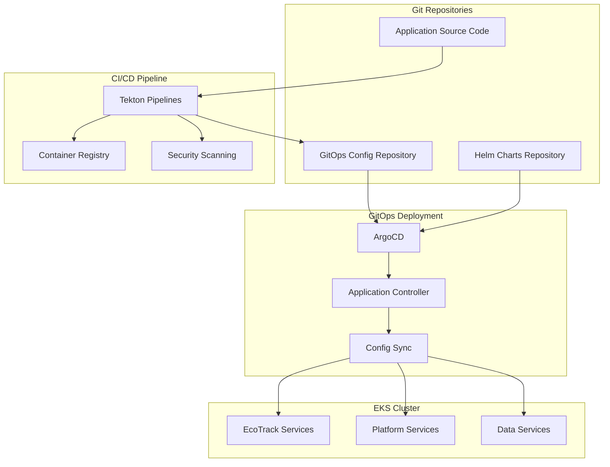

# GitOps Implementation Design

## Overview

This design document outlines the implementation of Workflow 4: GitOps & Deployment Automation for the EKS Foundation Platform. The design leverages ArgoCD for continuous deployment and Tekton for CI/CD pipelines, providing a complete GitOps workflow for managing application lifecycle through Git-based operations.

## Architecture

### High-Level Architecture



### Component Integration

1. **Source Code Management**: Git repositories for application code and configuration
2. **CI/CD Pipeline**: Tekton pipelines for build, test, and image creation
3. **GitOps Controller**: ArgoCD for automated deployment and configuration management
4. **Target Environment**: EKS cluster with comprehensive platform services

## Components and Interfaces

### 1. ArgoCD Deployment and Configuration

#### ArgoCD Installation
```yaml
ArgoCD Configuration:
  namespace: argocd
  deployment_mode: high_availability
  components:
    - argocd-server
    - argocd-application-controller
    - argocd-repo-server
    - argocd-redis
    - argocd-dex-server
  
  resource_allocation:
    server:
      requests: { cpu: "250m", memory: "512Mi" }
      limits: { cpu: "500m", memory: "1Gi" }
    controller:
      requests: { cpu: "500m", memory: "1Gi" }
      limits: { cpu: "1", memory: "2Gi" }
    repo_server:
      requests: { cpu: "250m", memory: "512Mi" }
      limits: { cpu: "500m", memory: "1Gi" }
```

#### RBAC and Security Configuration
```yaml
RBAC Configuration:
  service_accounts:
    - argocd-server
    - argocd-application-controller
    - argocd-repo-server
  
  cluster_roles:
    - argocd-server
    - argocd-application-controller
  
  authentication:
    method: OIDC
    providers:
      - name: corporate-sso
        issuer: https://sso.company.com
        client_id: argocd
  
  authorization:
    policy: |
      p, role:admin, applications, *, */*, allow
      p, role:developer, applications, get, */*, allow
      p, role:developer, applications, sync, dev/*, allow
      g, company:platform-team, role:admin
      g, company:developers, role:developer
```

#### Ingress and External Access
```yaml
Ingress Configuration:
  host: argocd.platform.dev
  tls:
    enabled: true
    certificate_issuer: letsencrypt-prod
  
  annotations:
    cert-manager.io/cluster-issuer: letsencrypt-prod
    external-dns.alpha.kubernetes.io/hostname: argocd.platform.dev
    nginx.ingress.kubernetes.io/ssl-redirect: "true"
    nginx.ingress.kubernetes.io/backend-protocol: "GRPC"
```

### 2. Tekton Pipeline Implementation

#### Tekton Components Installation
```yaml
Tekton Installation:
  components:
    - tekton-pipelines
    - tekton-triggers
    - tekton-dashboard
  
  namespaces:
    - tekton-pipelines
    - tekton-pipelines-resolvers
  
  resource_allocation:
    controller:
      requests: { cpu: "100m", memory: "256Mi" }
      limits: { cpu: "500m", memory: "512Mi" }
    webhook:
      requests: { cpu: "100m", memory: "256Mi" }
      limits: { cpu: "500m", memory: "512Mi" }
```

#### Pipeline Templates
```yaml
Pipeline Structure:
  build_pipeline:
    tasks:
      - source_checkout
      - unit_tests
      - security_scan
      - build_image
      - push_image
      - update_gitops_repo
  
  deployment_pipeline:
    tasks:
      - validate_manifests
      - deploy_to_staging
      - integration_tests
      - promote_to_production
  
  rollback_pipeline:
    tasks:
      - identify_previous_version
      - rollback_deployment
      - verify_rollback
      - notify_teams
```

### 3. Git Repository Structure

#### Repository Organization
```yaml
Repository Structure:
  application_repos:
    - ecotrack-user-service
    - ecotrack-product-service
    - ecotrack-order-service
    - ecotrack-payment-service
    - ecotrack-notification-service
  
  gitops_config_repo:
    structure: |
      gitops-config/
      ├── applications/
      │   ├── dev/
      │   ├── staging/
      │   └── prod/
      ├── platform/
      │   ├── argocd/
      │   ├── istio/
      │   └── monitoring/
      └── helm-charts/
          ├── ecotrack-service/
          └── platform-service/
  
  helm_charts_repo:
    structure: |
      helm-charts/
      ├── ecotrack-service/
      │   ├── Chart.yaml
      │   ├── values.yaml
      │   ├── values-dev.yaml
      │   ├── values-staging.yaml
      │   ├── values-prod.yaml
      │   └── templates/
      └── platform-charts/
```

#### Configuration Management
```yaml
Environment Configuration:
  development:
    replicas: 1
    resources:
      requests: { cpu: "50m", memory: "128Mi" }
      limits: { cpu: "200m", memory: "256Mi" }
    ingress:
      host: "*.dev.ecotrack.platform"
  
  staging:
    replicas: 2
    resources:
      requests: { cpu: "100m", memory: "256Mi" }
      limits: { cpu: "300m", memory: "512Mi" }
    ingress:
      host: "*.staging.ecotrack.platform"
  
  production:
    replicas: 3
    resources:
      requests: { cpu: "200m", memory: "512Mi" }
      limits: { cpu: "500m", memory: "1Gi" }
    ingress:
      host: "*.ecotrack.platform"
```

### 4. Application Lifecycle Management

#### Deployment Strategies
```yaml
Deployment Patterns:
  blue_green:
    implementation: ArgoCD Rollouts
    traffic_split: 0/100 → 100/0
    validation_period: 10 minutes
    rollback_trigger: error_rate > 1%
  
  canary:
    implementation: Istio + ArgoCD Rollouts
    traffic_split: 95/5 → 90/10 → 50/50 → 0/100
    validation_steps:
      - health_checks
      - performance_metrics
      - business_metrics
    promotion_criteria:
      - error_rate < 0.5%
      - response_time < 500ms
      - success_rate > 99.5%
  
  rolling_update:
    implementation: Kubernetes native
    max_unavailable: 25%
    max_surge: 25%
    readiness_probe_delay: 30s
```

#### Health Monitoring and Rollback
```yaml
Health Monitoring:
  health_checks:
    - kubernetes_readiness_probe
    - kubernetes_liveness_probe
    - argocd_sync_status
    - application_metrics
  
  rollback_triggers:
    - deployment_failure
    - health_check_failure
    - performance_degradation
    - manual_trigger
  
  rollback_process:
    - pause_deployment
    - revert_to_previous_version
    - validate_rollback_success
    - notify_stakeholders
```

## Data Models

### ArgoCD Application Model
```yaml
Application:
  metadata:
    name: ecotrack-user-service
    namespace: argocd
    labels:
      app.kubernetes.io/name: user-service
      app.kubernetes.io/part-of: ecotrack
  spec:
    project: ecotrack
    source:
      repoURL: https://github.com/company/gitops-config
      targetRevision: HEAD
      path: applications/prod/user-service
    destination:
      server: https://kubernetes.default.svc
      namespace: ecotrack
    syncPolicy:
      automated:
        prune: true
        selfHeal: true
      syncOptions:
        - CreateNamespace=true
        - PrunePropagationPolicy=foreground
```

### Tekton Pipeline Model
```yaml
Pipeline:
  metadata:
    name: ecotrack-service-build
    namespace: tekton-pipelines
  spec:
    params:
      - name: git-url
        type: string
      - name: git-revision
        type: string
        default: main
      - name: image-name
        type: string
      - name: service-name
        type: string
    tasks:
      - name: fetch-source
        taskRef:
          name: git-clone
        params:
          - name: url
            value: $(params.git-url)
          - name: revision
            value: $(params.git-revision)
      - name: build-and-push
        taskRef:
          name: buildah
        runAfter: [fetch-source]
        params:
          - name: IMAGE
            value: $(params.image-name)
```

## Error Handling

### Deployment Failure Recovery
```yaml
Failure Scenarios:
  image_pull_failure:
    detection: Pod ImagePullBackOff status
    response: Rollback to previous working image
    notification: Slack alert to development team
  
  health_check_failure:
    detection: Readiness probe failures
    response: Automatic rollback after 5 minutes
    notification: PagerDuty alert to on-call engineer
  
  resource_exhaustion:
    detection: Pod pending due to insufficient resources
    response: Scale cluster or adjust resource requests
    notification: Platform team alert
  
  configuration_error:
    detection: ArgoCD sync failure
    response: Revert to last known good configuration
    notification: Git commit author notification
```

### Pipeline Failure Handling
```yaml
Pipeline Recovery:
  build_failure:
    actions:
      - Preserve build logs
      - Notify commit author
      - Block deployment pipeline
      - Provide troubleshooting guidance
  
  test_failure:
    actions:
      - Generate test reports
      - Block deployment to staging
      - Notify development team
      - Require manual approval to proceed
  
  security_scan_failure:
    actions:
      - Block image push
      - Generate security report
      - Notify security team
      - Require vulnerability remediation
```

## Testing Strategy

### Pipeline Testing
```yaml
Testing Approach:
  unit_tests:
    framework: JUnit 5 + Mockito
    coverage_threshold: 80%
    execution_time: < 5 minutes
  
  integration_tests:
    framework: TestContainers
    database: PostgreSQL test container
    redis: Redis test container
    execution_time: < 10 minutes
  
  security_tests:
    static_analysis: SonarQube
    dependency_scan: OWASP Dependency Check
    container_scan: Trivy
    execution_time: < 5 minutes
  
  performance_tests:
    framework: JMeter
    load_profile: 100 concurrent users
    duration: 5 minutes
    success_criteria: response_time < 500ms
```

### Deployment Testing
```yaml
Deployment Validation:
  smoke_tests:
    health_endpoints: /actuator/health
    basic_functionality: Core API endpoints
    database_connectivity: Connection pool status
  
  integration_tests:
    service_to_service: Inter-service communication
    database_operations: CRUD operations
    external_apis: Third-party integrations
  
  performance_tests:
    load_testing: Gradual load increase
    stress_testing: Peak load simulation
    endurance_testing: Extended load duration
```

## Security Considerations

### Pipeline Security
```yaml
Security Measures:
  source_code_security:
    - Static code analysis
    - Dependency vulnerability scanning
    - Secret detection in code
    - License compliance checking
  
  build_security:
    - Secure build environment
    - Image vulnerability scanning
    - Image signing and verification
    - Base image security updates
  
  deployment_security:
    - RBAC for ArgoCD access
    - Encrypted secrets management
    - Network policy enforcement
    - Runtime security monitoring
```

### Access Control
```yaml
Access Control Matrix:
  developers:
    permissions:
      - View applications in dev environment
      - Trigger builds for assigned services
      - View deployment status and logs
    restrictions:
      - No direct production access
      - No infrastructure modifications
  
  platform_engineers:
    permissions:
      - Full ArgoCD access
      - Pipeline configuration management
      - Infrastructure modifications
      - Production deployment approval
  
  security_team:
    permissions:
      - Security policy configuration
      - Vulnerability scan results
      - Security incident response
      - Compliance reporting
```

## Performance Optimization

### ArgoCD Optimization
```yaml
Performance Tuning:
  application_controller:
    - Increase worker count for large clusters
    - Optimize resource allocation
    - Configure application sharding
    - Enable parallel processing
  
  repo_server:
    - Enable Git repository caching
    - Optimize Helm chart processing
    - Configure resource limits
    - Enable compression
  
  redis:
    - Configure persistence
    - Optimize memory usage
    - Enable clustering for HA
    - Monitor performance metrics
```

### Pipeline Optimization
```yaml
Pipeline Performance:
  build_optimization:
    - Multi-stage Docker builds
    - Build cache utilization
    - Parallel task execution
    - Resource allocation tuning
  
  test_optimization:
    - Parallel test execution
    - Test result caching
    - Selective test execution
    - Resource pooling
  
  deployment_optimization:
    - Rolling update strategies
    - Health check optimization
    - Resource pre-allocation
    - Network optimization
```

## Integration Points

### Platform Integration
```yaml
Integration Components:
  observability:
    - ArgoCD metrics to Prometheus
    - Pipeline logs to Loki
    - Deployment traces to Tempo
    - Grafana dashboards
  
  security:
    - OpenBao secret integration
    - OPA policy validation
    - Falco runtime monitoring
    - Image vulnerability scanning
  
  service_mesh:
    - Istio traffic management
    - mTLS for service communication
    - Circuit breaker configuration
    - Canary deployment support
  
  data_services:
    - Database migration pipelines
    - Data backup automation
    - Schema validation
    - Connection management
```

### External Integrations
```yaml
External Systems:
  git_providers:
    - GitHub Enterprise
    - GitLab
    - Bitbucket
    - Azure DevOps
  
  container_registries:
    - Amazon ECR
    - Docker Hub
    - Harbor
    - Quay.io
  
  notification_systems:
    - Slack
    - Microsoft Teams
    - Email
    - PagerDuty
  
  monitoring_systems:
    - Prometheus
    - Grafana
    - Datadog
    - New Relic
```