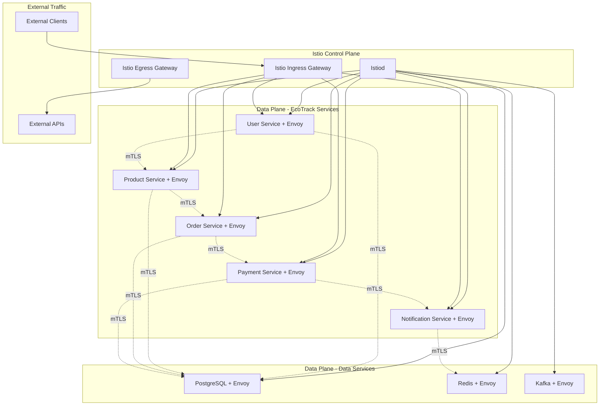

# Service Mesh Implementation Design

## Overview

This design document outlines the implementation of Workflow 6: Service Mesh for the EKS Foundation Platform. The design leverages Istio to provide comprehensive service-to-service communication security, traffic management, and observability through automatic mTLS, advanced routing capabilities, and enhanced telemetry collection.

## Architecture

### High-Level Service Mesh Architecture



### Service Mesh Components

1. **Control Plane**: Istiod for configuration management and certificate authority
2. **Data Plane**: Envoy sidecars for traffic interception and policy enforcement
3. **Gateways**: Ingress and egress gateways for external traffic management
4. **Security**: Automatic mTLS and identity-based access control
5. **Observability**: Enhanced metrics, logs, and distributed tracing

## Components and Interfaces

### 1. Istio Control Plane Deployment

#### Istiod Configuration
```yaml
Istio Installation:
  profile: production
  namespace: istio-system
  components:
    pilot:
      k8s:
        resources:
          requests:
            cpu: 500m
            memory: 2048Mi
          limits:
            cpu: 1000m
            memory: 4096Mi
        hpaSpec:
          minReplicas: 2
          maxReplicas: 5
          targetCPUUtilizationPercentage: 80
    
    proxy:
      k8s:
        resources:
          requests:
            cpu: 100m
            memory: 128Mi
          limits:
            cpu: 200m
            memory: 256Mi
  
  values:
    global:
      meshID: mesh1
      multiCluster:
        clusterName: eks-learning-lab-cluster
      network: network1
    
    pilot:
      traceSampling: 1.0  # 100% sampling in dev, 1% in prod
      env:
        EXTERNAL_ISTIOD: false
        PILOT_ENABLE_WORKLOAD_ENTRY_AUTOREGISTRATION: true
```

#### Certificate Management
```yaml
Certificate Authority:
  root_ca:
    provider: istiod
    key_size: 4096
    validity_duration: 10y
    
  intermediate_ca:
    provider: istiod
    key_size: 2048
    validity_duration: 1y
    
  workload_certificates:
    validity_duration: 24h
    rotation_threshold: 12h
    grace_period: 10m

Trust Domain Configuration:
  cluster.local: primary trust domain
  spiffe://cluster.local/ns/ecotrack/sa/user-service: user service identity
  spiffe://cluster.local/ns/ecotrack/sa/product-service: product service identity
  spiffe://cluster.local/ns/ecotrack/sa/order-service: order service identity
  spiffe://cluster.local/ns/ecotrack/sa/payment-service: payment service identity
  spiffe://cluster.local/ns/ecotrack/sa/notification-service: notification service identity
```

### 2. Automatic mTLS Configuration

#### mTLS Policy Configuration
```yaml
PeerAuthentication:
  apiVersion: security.istio.io/v1beta1
  kind: PeerAuthentication
  metadata:
    name: default
    namespace: ecotrack
  spec:
    mtls:
      mode: STRICT

Namespace-specific mTLS:
  ecotrack_namespace:
    mode: STRICT
    port_level_mtls:
      - port:
          number: 8080
        mtls:
          mode: STRICT
      - port:
          number: 8443
        mtls:
          mode: STRICT
  
  data_namespace:
    mode: STRICT
    port_level_mtls:
      - port:
          number: 5432  # PostgreSQL
        mtls:
          mode: STRICT
      - port:
          number: 6379  # Redis
        mtls:
          mode: STRICT
      - port:
          number: 9092  # Kafka
        mtls:
          mode: STRICT
```

#### Certificate Rotation and Management
```yaml
Certificate Lifecycle:
  automatic_rotation:
    enabled: true
    rotation_threshold: 50%  # Rotate at 50% of certificate lifetime
    grace_period: 600s       # 10 minutes grace period
    
  certificate_monitoring:
    metrics:
      - certificate_expiry_time
      - certificate_rotation_count
      - certificate_validation_failures
    
    alerts:
      - certificate_expiry_warning: 7 days
      - certificate_expiry_critical: 1 day
      - certificate_rotation_failure: immediate
```

### 3. Traffic Management and Load Balancing

#### Virtual Service Configuration
```yaml
VirtualService Templates:
  user_service:
    apiVersion: networking.istio.io/v1beta1
    kind: VirtualService
    metadata:
      name: user-service
      namespace: ecotrack
    spec:
      hosts:
        - user-service
      http:
        - match:
            - headers:
                canary:
                  exact: "true"
          route:
            - destination:
                host: user-service
                subset: canary
              weight: 100
          timeout: 30s
          retries:
            attempts: 3
            perTryTimeout: 10s
            retryOn: 5xx,reset,connect-failure,refused-stream
        - route:
            - destination:
                host: user-service
                subset: stable
              weight: 100
          timeout: 30s
          retries:
            attempts: 3
            perTryTimeout: 10s
            retryOn: 5xx,reset,connect-failure,refused-stream

DestinationRule Configuration:
  user_service:
    apiVersion: networking.istio.io/v1beta1
    kind: DestinationRule
    metadata:
      name: user-service
      namespace: ecotrack
    spec:
      host: user-service
      trafficPolicy:
        connectionPool:
          tcp:
            maxConnections: 100
          http:
            http1MaxPendingRequests: 50
            http2MaxRequests: 100
            maxRequestsPerConnection: 10
            maxRetries: 3
            consecutiveGatewayErrors: 5
            interval: 30s
            baseEjectionTime: 30s
            maxEjectionPercent: 50
        loadBalancer:
          simple: LEAST_CONN
      subsets:
        - name: stable
          labels:
            version: stable
        - name: canary
          labels:
            version: canary
```

#### Circuit Breaker and Fault Injection
```yaml
Circuit Breaker Configuration:
  outlier_detection:
    consecutive_5xx_errors: 5
    consecutive_gateway_errors: 5
    interval: 30s
    base_ejection_time: 30s
    max_ejection_percent: 50
    min_health_percent: 30
    split_external_local_origin_errors: false

Fault Injection:
  http_fault:
    delay:
      percentage:
        value: 0.1  # 0.1% of requests
      fixed_delay: 5s
    abort:
      percentage:
        value: 0.1  # 0.1% of requests
      http_status: 500
```

### 4. Security Policies and Authorization

#### Authorization Policy Configuration
```yaml
Service-to-Service Authorization:
  apiVersion: security.istio.io/v1beta1
  kind: AuthorizationPolicy
  metadata:
    name: ecotrack-authz
    namespace: ecotrack
  spec:
    rules:
      - from:
          - source:
              principals: ["cluster.local/ns/ecotrack/sa/order-service"]
        to:
          - operation:
              methods: ["GET", "POST"]
              paths: ["/api/users/*"]
        when:
          - key: source.labels[app]
            values: ["order-service"]

Database Access Authorization:
  apiVersion: security.istio.io/v1beta1
  kind: AuthorizationPolicy
  metadata:
    name: database-access
    namespace: data
  spec:
    selector:
      matchLabels:
        app: postgres-primary
    rules:
      - from:
          - source:
              principals: 
                - "cluster.local/ns/ecotrack/sa/user-service"
                - "cluster.local/ns/ecotrack/sa/product-service"
                - "cluster.local/ns/ecotrack/sa/order-service"
                - "cluster.local/ns/ecotrack/sa/payment-service"
        to:
          - operation:
              ports: ["5432"]

External Access Authorization:
  apiVersion: security.istio.io/v1beta1
  kind: AuthorizationPolicy
  metadata:
    name: external-access
    namespace: istio-system
  spec:
    selector:
      matchLabels:
        app: istio-proxy
    rules:
      - from:
          - source:
              notPrincipals: ["cluster.local/ns/ecotrack/sa/*"]
        to:
          - operation:
              methods: ["GET", "POST", "PUT", "DELETE"]
              paths: ["/api/*"]
        when:
          - key: source.ip
            notValues: ["10.0.0.0/8", "172.16.0.0/12", "192.168.0.0/16"]
```

#### JWT Token Validation
```yaml
RequestAuthentication:
  apiVersion: security.istio.io/v1beta1
  kind: RequestAuthentication
  metadata:
    name: jwt-auth
    namespace: ecotrack
  spec:
    selector:
      matchLabels:
        app: user-service
    jwtRules:
      - issuer: "https://sso.company.com"
        jwksUri: "https://sso.company.com/.well-known/jwks.json"
        audiences:
          - "ecotrack-api"
        forwardOriginalToken: true

AuthorizationPolicy with JWT:
  apiVersion: security.istio.io/v1beta1
  kind: AuthorizationPolicy
  metadata:
    name: jwt-authz
    namespace: ecotrack
  spec:
    selector:
      matchLabels:
        app: user-service
    rules:
      - from:
          - source:
              requestPrincipals: ["https://sso.company.com/*"]
        when:
          - key: request.auth.claims[role]
            values: ["admin", "user"]
```

### 5. Observability and Telemetry

#### Telemetry Configuration
```yaml
Telemetry:
  apiVersion: telemetry.istio.io/v1alpha1
  kind: Telemetry
  metadata:
    name: default
    namespace: istio-system
  spec:
    metrics:
      - providers:
          - name: prometheus
      - overrides:
          - match:
              metric: ALL_METRICS
            tagOverrides:
              destination_service_name:
                value: "%{destination_service_name | 'unknown'}"
              source_app:
                value: "%{source_app | 'unknown'}"
    
    tracing:
      - providers:
          - name: tempo
      - randomSamplingPercentage: 1.0  # 1% sampling in production
    
    accessLogging:
      - providers:
          - name: otel

Prometheus Metrics Configuration:
  service_metrics:
    - istio_requests_total
    - istio_request_duration_milliseconds
    - istio_request_bytes
    - istio_response_bytes
    - istio_tcp_opened_total
    - istio_tcp_closed_total
  
  custom_metrics:
    - name: ecotrack_business_transactions
      dimensions:
        service_name: source_app | "unknown"
        transaction_type: request.headers['transaction-type'] | "unknown"
        user_id: request.headers['user-id'] | "anonymous"
      value: "1"
      unit: "1"
```

#### Distributed Tracing Integration
```yaml
Tracing Configuration:
  tempo_integration:
    endpoint: http://tempo-distributor.observability.svc.cluster.local:14268/api/traces
    sampling_rate: 0.01  # 1% sampling
    
  trace_headers:
    - x-request-id
    - x-b3-traceid
    - x-b3-spanid
    - x-b3-parentspanid
    - x-b3-sampled
    - x-b3-flags
    - x-ot-span-context
    
  custom_tags:
    - http.method
    - http.status_code
    - http.url
    - user.id
    - transaction.id
    - service.version
```

### 6. Gateway Configuration

#### Ingress Gateway Setup
```yaml
Ingress Gateway:
  apiVersion: networking.istio.io/v1beta1
  kind: Gateway
  metadata:
    name: ecotrack-gateway
    namespace: ecotrack
  spec:
    selector:
      istio: ingressgateway
    servers:
      - port:
          number: 80
          name: http
          protocol: HTTP
        hosts:
          - "*.ecotrack.platform.dev"
        tls:
          httpsRedirect: true
      - port:
          number: 443
          name: https
          protocol: HTTPS
        hosts:
          - "*.ecotrack.platform.dev"
        tls:
          mode: SIMPLE
          credentialName: ecotrack-tls-secret

VirtualService for Gateway:
  apiVersion: networking.istio.io/v1beta1
  kind: VirtualService
  metadata:
    name: ecotrack-gateway-vs
    namespace: ecotrack
  spec:
    hosts:
      - "api.ecotrack.platform.dev"
    gateways:
      - ecotrack-gateway
    http:
      - match:
          - uri:
              prefix: /api/users
        route:
          - destination:
              host: user-service
              port:
                number: 8080
      - match:
          - uri:
              prefix: /api/products
        route:
          - destination:
              host: product-service
              port:
                number: 8080
      - match:
          - uri:
              prefix: /api/orders
        route:
          - destination:
              host: order-service
              port:
                number: 8080
```

#### Egress Gateway Configuration
```yaml
Egress Gateway:
  apiVersion: networking.istio.io/v1beta1
  kind: Gateway
  metadata:
    name: external-services-gateway
    namespace: istio-system
  spec:
    selector:
      istio: egressgateway
    servers:
      - port:
          number: 443
          name: tls
          protocol: TLS
        hosts:
          - api.stripe.com
          - api.paypal.com
          - api.sendgrid.com
        tls:
          mode: PASSTHROUGH

ServiceEntry for External Services:
  apiVersion: networking.istio.io/v1beta1
  kind: ServiceEntry
  metadata:
    name: external-payment-apis
    namespace: ecotrack
  spec:
    hosts:
      - api.stripe.com
      - api.paypal.com
    ports:
      - number: 443
        name: https
        protocol: HTTPS
    location: MESH_EXTERNAL
    resolution: DNS
```

## Data Models

### Service Mesh Configuration Model
```yaml
ServiceMeshConfig:
  metadata:
    name: ecotrack-mesh-config
    namespace: ecotrack
  
  spec:
    services:
      - name: user-service
        version: v1.2.0
        replicas: 3
        traffic_policy:
          load_balancer: LEAST_CONN
          connection_pool:
            max_connections: 100
            max_pending_requests: 50
          circuit_breaker:
            consecutive_errors: 5
            interval: 30s
        
        security_policy:
          mtls_mode: STRICT
          authorization_rules:
            - from: ["order-service", "api-gateway"]
              operations: ["GET /api/users/*", "POST /api/users"]
        
        observability:
          metrics_enabled: true
          tracing_enabled: true
          access_logging: true
          sampling_rate: 0.01
```

### Traffic Management Model
```yaml
TrafficManagement:
  canary_deployment:
    service: user-service
    stable_version: v1.1.0
    canary_version: v1.2.0
    traffic_split:
      stable: 90
      canary: 10
    
    success_criteria:
      error_rate_threshold: 0.5
      response_time_p95_threshold: 500
      minimum_request_count: 100
      evaluation_period: 300s
    
    rollback_criteria:
      error_rate_threshold: 2.0
      response_time_p95_threshold: 1000
      immediate_rollback: true
  
  circuit_breaker_status:
    service: payment-service
    state: CLOSED
    failure_count: 0
    success_count: 1250
    last_failure_time: null
    next_retry_time: null
```

## Error Handling

### Service Mesh Failure Scenarios
```yaml
Control Plane Failures:
  istiod_failure:
    detection: Pod readiness probe failure
    impact: New configurations cannot be pushed
    mitigation: Data plane continues with cached config
    recovery: Automatic pod restart and state recovery
    
  certificate_authority_failure:
    detection: Certificate validation failures
    impact: New workloads cannot get certificates
    mitigation: Existing certificates continue to work
    recovery: CA restoration from backup

Data Plane Failures:
  envoy_sidecar_failure:
    detection: Sidecar container restart or crash
    impact: Service becomes unreachable
    mitigation: Kubernetes restarts sidecar container
    recovery: Automatic sidecar reinjection
    
  mtls_handshake_failure:
    detection: TLS handshake errors in logs
    impact: Service-to-service communication fails
    mitigation: Circuit breaker activation
    recovery: Certificate refresh and retry
```

### Traffic Management Failures
```yaml
Load Balancer Failures:
  upstream_service_failure:
    detection: Health check failures
    response: Remove from load balancer pool
    recovery: Automatic re-addition when healthy
    
  circuit_breaker_activation:
    detection: Consecutive error threshold exceeded
    response: Fail fast for subsequent requests
    recovery: Gradual traffic restoration after timeout
    
Gateway Failures:
  ingress_gateway_failure:
    detection: Gateway pod unavailability
    response: Traffic routing to healthy gateway instances
    recovery: Automatic pod replacement
    
  certificate_expiry:
    detection: TLS certificate expiration alerts
    response: Automatic certificate renewal
    recovery: Zero-downtime certificate rotation
```

## Testing Strategy

### Service Mesh Testing Framework
```yaml
Unit Testing:
  configuration_validation:
    - Istio resource syntax validation
    - Policy rule logic testing
    - Traffic routing rule validation
    - Security policy effectiveness testing
  
  component_testing:
    - Envoy proxy configuration testing
    - Certificate generation and rotation testing
    - Load balancing algorithm testing
    - Circuit breaker behavior testing

Integration Testing:
  service_to_service_communication:
    - mTLS handshake validation
    - Authorization policy enforcement
    - Traffic routing accuracy
    - Observability data collection
  
  gateway_testing:
    - Ingress traffic routing
    - SSL termination and certificate management
    - Rate limiting and throttling
    - External service access through egress gateway

End-to-End Testing:
  application_workflow_testing:
    - Complete user journey through service mesh
    - Cross-service transaction validation
    - Performance under load with service mesh
    - Failure scenario and recovery testing
```

### Chaos Engineering
```yaml
Chaos Testing Scenarios:
  network_failures:
    - Random network partitions between services
    - Packet loss and latency injection
    - DNS resolution failures
    - Certificate validation failures
  
  service_failures:
    - Random service instance termination
    - Resource exhaustion simulation
    - Slow response time injection
    - Error rate injection
  
  infrastructure_failures:
    - Control plane component failures
    - Node failures and recovery
    - Storage failures for certificate storage
    - Load balancer failures
```

## Performance Optimization

### Service Mesh Performance Tuning
```yaml
Envoy Proxy Optimization:
  resource_allocation:
    cpu_requests: 100m
    cpu_limits: 200m
    memory_requests: 128Mi
    memory_limits: 256Mi
  
  performance_settings:
    worker_threads: 2
    connection_buffer_size: 32768
    stats_flush_interval: 5s
    drain_timeout: 45s
  
  circuit_breaker_tuning:
    max_connections: 1024
    max_pending_requests: 1024
    max_requests: 1024
    max_retries: 3

Control Plane Optimization:
  pilot_optimization:
    discovery_refresh_delay: 10s
    push_throttle: 100
    max_concurrent_pushes: 100
    enable_cross_cluster_workload_entry: false
  
  certificate_optimization:
    workload_cert_ttl: 24h
    max_workload_cert_ttl: 90d
    enable_ca_server: true
    ca_cert_ttl: 10y
```

### Traffic Management Optimization
```yaml
Load Balancing Optimization:
  algorithm_selection:
    - ROUND_ROBIN: For uniform request processing
    - LEAST_CONN: For variable request processing times
    - RANDOM: For high-throughput scenarios
    - PASSTHROUGH: For TCP traffic
  
  connection_pooling:
    tcp_max_connections: 100
    http1_max_pending_requests: 50
    http2_max_requests: 100
    max_requests_per_connection: 10
    max_retries: 3
    connect_timeout: 10s
    tcp_keepalive:
      time: 7200s
      interval: 75s
      probes: 9

Retry and Timeout Optimization:
  retry_policy:
    attempts: 3
    per_try_timeout: 10s
    retry_on: "5xx,reset,connect-failure,refused-stream"
    retry_remote_localities: false
  
  timeout_policy:
    request_timeout: 30s
    idle_timeout: 60s
    stream_idle_timeout: 300s
```

## Integration Points

### Platform Integration
```yaml
Integration Components:
  observability_integration:
    prometheus_metrics:
      - Service mesh traffic metrics
      - Control plane health metrics
      - Security policy enforcement metrics
      - Performance and latency metrics
    
    loki_logs:
      - Envoy access logs
      - Control plane logs
      - Security event logs
      - Traffic flow logs
    
    tempo_traces:
      - Distributed tracing across service mesh
      - Request flow visualization
      - Performance bottleneck identification
      - Error propagation tracking
    
    grafana_dashboards:
      - Service mesh overview dashboard
      - Service-to-service communication dashboard
      - Security posture dashboard
      - Performance monitoring dashboard

  security_integration:
    openbao_integration:
      - Certificate management for mTLS
      - Secret distribution for external services
      - Identity token management
      - Credential rotation automation
    
    opa_gatekeeper_integration:
      - Service mesh policy validation
      - Security configuration compliance
      - Traffic policy enforcement
      - Admission control integration
    
    falco_integration:
      - Runtime security monitoring
      - Anomalous traffic detection
      - Security event correlation
      - Incident response automation

  gitops_integration:
    argocd_integration:
      - Service mesh configuration as code
      - Automated policy deployment
      - Configuration drift detection
      - Rollback capabilities
    
    configuration_management:
      - Version-controlled mesh policies
      - Environment-specific configurations
      - Automated testing and validation
      - Change approval workflows
```

### External Integrations
```yaml
External Systems:
  api_gateways:
    ambassador_integration:
      - Ingress traffic routing to service mesh
      - SSL termination and certificate management
      - Rate limiting and authentication
      - API versioning and routing
  
  monitoring_systems:
    external_monitoring:
      - Service mesh metrics export
      - Alert forwarding and correlation
      - Performance data aggregation
      - Compliance reporting
  
  security_systems:
    external_security:
      - Identity provider integration
      - Certificate authority integration
      - Security information correlation
      - Threat intelligence integration
```