# Data Services Implementation Design

## Overview

This design document outlines the implementation of Workflow 7: Data Services for the EKS Foundation Platform. The design provides comprehensive data infrastructure using CloudNativePG for PostgreSQL, Redis Operator for caching, and Strimzi Kafka for event streaming, creating a robust data layer for microservices applications.

## Architecture

### High-Level Data Services Architecture

```mermaid
graph TB
    subgraph "Data Services Layer"
        subgraph "Relational Database"
            A[CloudNativePG Operator]
            B[PostgreSQL Primary]
            C[PostgreSQL Replica 1]
            D[PostgreSQL Replica 2]
            E[PostgreSQL Backup]
        end
        
        subgraph "Caching Layer"
            F[Redis Operator]
            G[Redis Sentinel 1]
            H[Redis Sentinel 2]
            I[Redis Sentinel 3]
            J[Redis Master]
            K[Redis Replica 1]
            L[Redis Replica 2]
        end
        
        subgraph "Event Streaming"
            M[Strimzi Kafka Operator]
            N[Kafka Broker 1]
            O[Kafka Broker 2]
            P[Kafka Broker 3]
            Q[Zookeeper 1]
            R[Zookeeper 2]
            S[Zookeeper 3]
        end
    end
    
    subgraph "EcoTrack Services"
        T[User Service]
        U[Product Service]
        V[Order Service]
        W[Payment Service]
        X[Notification Service]
    end
    
    subgraph "Storage Layer"
        Y[EBS Volumes]
        Z[S3 Backup Storage]
        AA[Persistent Volume Claims]
    end
    
    A --> B
    A --> C
    A --> D
    A --> E
    B --> C
    B --> D
    
    F --> G
    F --> H
    F --> I
    G --> J
    G --> K
    G --> L
    
    M --> N
    M --> O
    M --> P
    M --> Q
    M --> R
    M --> S
    
    T --> B
    U --> B
    V --> B
    W --> B
    X --> J
    
    V --> N
    W --> N
    X --> N
    
    B --> Y
    C --> Y
    D --> Y
    J --> Y
    K --> Y
    L --> Y
    N --> Y
    O --> Y
    P --> Y
    
    E --> Z
```



### Data Flow and Integration Patterns

1. **Relational Data**: PostgreSQL for transactional data with read replicas
2. **Caching Layer**: Redis for session storage and application caching
3. **Event Streaming**: Kafka for asynchronous communication and event sourcing
4. **Backup and Recovery**: Automated backups to S3 with point-in-time recovery
5. **Service Integration**: Connection pooling and service mesh integration

## Components and Interfaces

### 1. CloudNativePG PostgreSQL Deployment

#### PostgreSQL Cluster Configuration
```yaml
CloudNativePG Configuration:
  operator_namespace: cnpg-system
  cluster_namespace: data
  
  cluster_spec:
    name: postgres-cluster
    instances: 3
    primary_update_strategy: unsupervised
    
    postgresql:
      parameters:
        max_connections: "200"
        shared_buffers: "256MB"
        effective_cache_size: "1GB"
        maintenance_work_mem: "64MB"
        checkpoint_completion_target: "0.9"
        wal_buffers: "16MB"
        default_statistics_target: "100"
        random_page_cost: "1.1"
        effective_io_concurrency: "200"
        work_mem: "4MB"
        min_wal_size: "1GB"
        max_wal_size: "4GB"
    
    bootstrap:
      initdb:
        database: ecotrack
        owner: ecotrack
        secret:
          name: postgres-credentials
        options:
          - "--encoding=UTF8"
          - "--locale=en_US.UTF-8"
    
    storage:
      size: 100Gi
      storageClass: gp3
      resizeInUseVolumes: true
    
    resources:
      requests:
        memory: "1Gi"
        cpu: "500m"
      limits:
        memory: "2Gi"
        cpu: "1000m"
```

#### Backup and Recovery Configuration
```yaml
Backup Configuration:
  scheduled_backup:
    name: postgres-backup
    schedule: "0 2 * * *"  # Daily at 2 AM
    backup_retention_policy: "30d"
    
    s3_configuration:
      bucket: eks-learning-lab-postgres-backups
      path: /postgres-cluster
      region: us-east-1
      encryption: AES256
      
    compression: gzip
    immediate_checkpoint: true
    
  point_in_time_recovery:
    enabled: true
    wal_retention: "7d"
    recovery_target_time: "any point within 7 days"
    
Recovery Procedures:
  full_cluster_recovery:
    source: s3://eks-learning-lab-postgres-backups
    recovery_target: latest
    recovery_method: pg_basebackup
    
  point_in_time_recovery:
    source: s3://eks-learning-lab-postgres-backups
    recovery_target_time: "2024-01-15 10:30:00"
    recovery_method: wal_replay
```

#### Connection Pooling and Performance
```yaml
Connection Pool Configuration:
  pgbouncer:
    enabled: true
    pool_mode: transaction
    max_client_conn: 100
    default_pool_size: 25
    reserve_pool_size: 5
    
    resources:
      requests:
        memory: "64Mi"
        cpu: "50m"
      limits:
        memory: "128Mi"
        cpu: "100m"

Performance Monitoring:
  metrics:
    - pg_stat_database
    - pg_stat_user_tables
    - pg_stat_user_indexes
    - pg_stat_bgwriter
    - pg_stat_archiver
    - pg_stat_replication
  
  alerts:
    - connection_pool_exhaustion: > 90%
    - replication_lag: > 10MB
    - database_size_growth: > 80%
    - slow_queries: > 1000ms
```

### 2. Redis Operator for Caching Services

#### Redis Failover Configuration
```yaml
Redis Failover Configuration:
  operator_namespace: redis-operator
  cluster_namespace: data
  
  redis_failover:
    name: redis-cluster
    
    sentinel:
      replicas: 3
      resources:
        requests:
          memory: "128Mi"
          cpu: "50m"
        limits:
          memory: "256Mi"
          cpu: "100m"
      
      config:
        down-after-milliseconds: "5000"
        failover-timeout: "10000"
        parallel-syncs: "1"
        
    redis:
      replicas: 3
      resources:
        requests:
          memory: "256Mi"
          cpu: "100m"
        limits:
          memory: "512Mi"
          cpu: "200m"
      
      config:
        maxmemory: "400mb"
        maxmemory-policy: "allkeys-lru"
        save: "900 1 300 10 60 10000"
        appendonly: "yes"
        appendfsync: "everysec"
        
      storage:
        persistentVolumeClaim:
          metadata:
            name: redis-storage
          spec:
            accessModes:
              - ReadWriteOnce
            resources:
              requests:
                storage: 10Gi
            storageClassName: gp3
```

#### Redis Security and Authentication
```yaml
Redis Security:
  authentication:
    enabled: true
    secret_name: redis-auth
    password_key: password
    
  tls:
    enabled: true
    secret_name: redis-tls
    cert_file: tls.crt
    key_file: tls.key
    ca_file: ca.crt
    
  network_policy:
    enabled: true
    allowed_namespaces:
      - ecotrack
      - monitoring
    allowed_ports:
      - 6379  # Redis
      - 26379 # Sentinel

Performance Configuration:
  memory_optimization:
    hash-max-ziplist-entries: 512
    hash-max-ziplist-value: 64
    list-max-ziplist-size: -2
    list-compress-depth: 0
    set-max-intset-entries: 512
    zset-max-ziplist-entries: 128
    zset-max-ziplist-value: 64
    
  connection_optimization:
    tcp-keepalive: 300
    timeout: 0
    tcp-backlog: 511
    maxclients: 10000
```

### 3. Strimzi Kafka for Event Streaming

#### Kafka Cluster Configuration
```yaml
Kafka Cluster Configuration:
  operator_namespace: kafka
  cluster_namespace: data
  
  kafka_cluster:
    name: kafka-cluster
    version: 3.6.0
    replicas: 3
    
    listeners:
      - name: plain
        port: 9092
        type: internal
        tls: false
        authentication:
          type: scram-sha-512
      - name: tls
        port: 9093
        type: internal
        tls: true
        authentication:
          type: scram-sha-512
    
    config:
      offsets.topic.replication.factor: 3
      transaction.state.log.replication.factor: 3
      transaction.state.log.min.isr: 2
      default.replication.factor: 3
      min.insync.replicas: 2
      inter.broker.protocol.version: "3.6"
      log.message.format.version: "3.6"
      log.retention.hours: 168  # 7 days
      log.segment.bytes: 1073741824  # 1GB
      log.retention.check.interval.ms: 300000
      num.network.threads: 8
      num.io.threads: 8
      socket.send.buffer.bytes: 102400
      socket.receive.buffer.bytes: 102400
      socket.request.max.bytes: 104857600
      num.partitions: 3
      num.recovery.threads.per.data.dir: 1
      log.flush.interval.messages: 10000
      log.flush.interval.ms: 1000
    
    storage:
      type: persistent-claim
      size: 50Gi
      class: gp3
      deleteClaim: false
    
    resources:
      requests:
        memory: "1Gi"
        cpu: "500m"
      limits:
        memory: "2Gi"
        cpu: "1000m"

Zookeeper Configuration:
  zookeeper:
    replicas: 3
    
    config:
      tickTime: 2000
      initLimit: 5
      syncLimit: 2
      autopurge.snapRetainCount: 3
      autopurge.purgeInterval: 1
      
    storage:
      type: persistent-claim
      size: 10Gi
      class: gp3
      deleteClaim: false
    
    resources:
      requests:
        memory: "512Mi"
        cpu: "250m"
      limits:
        memory: "1Gi"
        cpu: "500m"
```

#### Kafka Topics and Security
```yaml
Kafka Topics:
  user_events:
    name: user-events
    partitions: 6
    replicas: 3
    config:
      retention.ms: 604800000  # 7 days
      segment.ms: 86400000     # 1 day
      cleanup.policy: delete
      
  order_events:
    name: order-events
    partitions: 12
    replicas: 3
    config:
      retention.ms: 2592000000  # 30 days
      segment.ms: 86400000      # 1 day
      cleanup.policy: delete
      
  payment_events:
    name: payment-events
    partitions: 6
    replicas: 3
    config:
      retention.ms: 7776000000  # 90 days
      segment.ms: 86400000      # 1 day
      cleanup.policy: delete
      
  notification_events:
    name: notification-events
    partitions: 3
    replicas: 3
    config:
      retention.ms: 259200000   # 3 days
      segment.ms: 3600000       # 1 hour
      cleanup.policy: delete

Kafka Security:
  authentication:
    type: scram-sha-512
    users:
      - name: ecotrack-producer
        password_secret: kafka-producer-credentials
      - name: ecotrack-consumer
        password_secret: kafka-consumer-credentials
      - name: ecotrack-admin
        password_secret: kafka-admin-credentials
        
  authorization:
    type: simple
    acls:
      - resource:
          type: topic
          name: user-events
        operations: [Read, Write]
        principal: User:ecotrack-producer
      - resource:
          type: topic
          name: order-events
        operations: [Read, Write]
        principal: User:ecotrack-producer
```

### 4. Database Integration Patterns for Microservices

#### Spring Boot Integration Configuration
```yaml
Database Connection Configuration:
  user_service:
    datasource:
      url: jdbc:postgresql://postgres-cluster-rw:5432/ecotrack
      username: ${DB_USERNAME}
      password: ${DB_PASSWORD}
      driver-class-name: org.postgresql.Driver
      
    hikari:
      maximum-pool-size: 10
      minimum-idle: 2
      connection-timeout: 30000
      idle-timeout: 600000
      max-lifetime: 1800000
      leak-detection-threshold: 60000
      
    jpa:
      hibernate:
        ddl-auto: validate
      show-sql: false
      properties:
        hibernate:
          dialect: org.hibernate.dialect.PostgreSQLDialect
          format_sql: true
          use_sql_comments: true
          jdbc:
            batch_size: 20
          order_inserts: true
          order_updates: true

Redis Integration:
  session_management:
    spring:
      session:
        store-type: redis
        redis:
          namespace: ecotrack:session
          flush-mode: on_save
          save-mode: on_set_attribute
          
  caching:
    spring:
      cache:
        type: redis
        redis:
          time-to-live: 600000  # 10 minutes
          cache-null-values: false
          key-prefix: "ecotrack:cache:"
          
    cache_configuration:
      user_cache:
        ttl: 300000  # 5 minutes
        max_entries: 1000
      product_cache:
        ttl: 600000  # 10 minutes
        max_entries: 5000
      order_cache:
        ttl: 180000  # 3 minutes
        max_entries: 2000
```

#### Database Migration Management
```yaml
Flyway Configuration:
  migration_strategy:
    baseline_on_migrate: true
    validate_on_migrate: true
    clean_disabled: true
    
  migration_locations:
    - classpath:db/migration/common
    - classpath:db/migration/{environment}
    
  migration_naming:
    pattern: "V{version}__{description}.sql"
    versioning: semantic
    
  rollback_strategy:
    backup_before_migration: true
    rollback_on_failure: true
    max_rollback_versions: 5

Migration Scripts Structure:
  V1_0_0__Initial_schema.sql:
    - Create users table
    - Create products table
    - Create orders table
    - Create payments table
    - Create notifications table
    
  V1_0_1__Add_indexes.sql:
    - Add performance indexes
    - Add foreign key constraints
    - Add unique constraints
    
  V1_1_0__Add_audit_tables.sql:
    - Create audit log tables
    - Add audit triggers
    - Create audit functions
```

### 5. Data Security and Access Control

#### Database Security Configuration
```yaml
PostgreSQL Security:
  encryption_at_rest:
    enabled: true
    kms_key_id: arn:aws:kms:us-east-1:ACCOUNT:key/KEY-ID
    
  encryption_in_transit:
    ssl_mode: require
    ssl_cert: /etc/ssl/certs/postgresql.crt
    ssl_key: /etc/ssl/private/postgresql.key
    ssl_ca: /etc/ssl/certs/ca.crt
    
  authentication:
    method: scram-sha-256
    password_encryption: scram-sha-256
    
  authorization:
    roles:
      - name: ecotrack_app
        permissions: [CONNECT, CREATE, USAGE]
        tables: [SELECT, INSERT, UPDATE, DELETE]
      - name: ecotrack_readonly
        permissions: [CONNECT, USAGE]
        tables: [SELECT]
      - name: ecotrack_backup
        permissions: [CONNECT, USAGE, REPLICATION]

Network Security:
  network_policies:
    postgresql_access:
      allowed_namespaces: [ecotrack, monitoring]
      allowed_ports: [5432]
      denied_external_access: true
      
    redis_access:
      allowed_namespaces: [ecotrack]
      allowed_ports: [6379, 26379]
      denied_external_access: true
      
    kafka_access:
      allowed_namespaces: [ecotrack, monitoring]
      allowed_ports: [9092, 9093]
      denied_external_access: true
```

#### Secrets Management Integration
```yaml
OpenBao Integration:
  database_credentials:
    path: database/creds/ecotrack-app
    role: ecotrack-app
    ttl: 24h
    max_ttl: 72h
    
  redis_credentials:
    path: secret/data/redis/auth
    key: password
    rotation_period: 30d
    
  kafka_credentials:
    path: secret/data/kafka/users
    keys: [producer-password, consumer-password, admin-password]
    rotation_period: 30d

ExternalSecret Configuration:
  postgres_secret:
    apiVersion: external-secrets.io/v1beta1
    kind: ExternalSecret
    metadata:
      name: postgres-app-credentials
      namespace: data
    spec:
      refreshInterval: 300s
      secretStoreRef:
        name: openbao-secret-store
        kind: SecretStore
      target:
        name: postgres-app-credentials
        creationPolicy: Owner
      data:
        - secretKey: username
          remoteRef:
            key: database/creds/ecotrack-app
            property: username
        - secretKey: password
          remoteRef:
            key: database/creds/ecotrack-app
            property: password
```

### 6. Backup and Disaster Recovery

#### Comprehensive Backup Strategy
```yaml
PostgreSQL Backup:
  full_backup:
    schedule: "0 2 * * 0"  # Weekly on Sunday
    retention: 12 weeks
    compression: gzip
    encryption: AES256
    destination: s3://eks-learning-lab-postgres-backups/full/
    
  incremental_backup:
    schedule: "0 2 * * 1-6"  # Daily except Sunday
    retention: 30 days
    compression: gzip
    encryption: AES256
    destination: s3://eks-learning-lab-postgres-backups/incremental/
    
  wal_archiving:
    enabled: true
    destination: s3://eks-learning-lab-postgres-backups/wal/
    retention: 7 days
    compression: gzip

Redis Backup:
  rdb_snapshots:
    schedule: "0 3 * * *"  # Daily at 3 AM
    retention: 7 days
    compression: gzip
    destination: s3://eks-learning-lab-redis-backups/rdb/
    
  aof_backup:
    enabled: true
    schedule: "0 */6 * * *"  # Every 6 hours
    retention: 2 days
    destination: s3://eks-learning-lab-redis-backups/aof/

Kafka Backup:
  topic_backup:
    tool: kafka-backup
    schedule: "0 4 * * *"  # Daily at 4 AM
    retention: 14 days
    compression: gzip
    destination: s3://eks-learning-lab-kafka-backups/topics/
    
  metadata_backup:
    schedule: "0 4 * * *"  # Daily at 4 AM
    retention: 30 days
    includes: [topics, acls, configs]
    destination: s3://eks-learning-lab-kafka-backups/metadata/
```

#### Disaster Recovery Procedures
```yaml
Recovery Time Objectives:
  postgresql:
    rto: 15 minutes
    rpo: 5 minutes
    recovery_method: point_in_time_recovery
    
  redis:
    rto: 5 minutes
    rpo: 1 hour
    recovery_method: rdb_snapshot_restore
    
  kafka:
    rto: 30 minutes
    rpo: 24 hours
    recovery_method: topic_restore_from_backup

Recovery Procedures:
  postgresql_recovery:
    - Restore base backup from S3
    - Apply WAL files for point-in-time recovery
    - Verify data integrity and consistency
    - Update connection strings and DNS
    - Validate application connectivity
    
  redis_recovery:
    - Deploy new Redis cluster
    - Restore RDB snapshot from S3
    - Configure replication and sentinel
    - Update application configuration
    - Validate cache functionality
    
  kafka_recovery:
    - Deploy new Kafka cluster
    - Restore topic metadata and configurations
    - Restore topic data from backups
    - Recreate ACLs and user permissions
    - Validate producer and consumer connectivity
```

## Data Models

### Database Schema Model
```yaml
EcoTrack Database Schema:
  users:
    columns:
      - id: BIGSERIAL PRIMARY KEY
      - email: VARCHAR(255) UNIQUE NOT NULL
      - password_hash: VARCHAR(255) NOT NULL
      - first_name: VARCHAR(100) NOT NULL
      - last_name: VARCHAR(100) NOT NULL
      - created_at: TIMESTAMP DEFAULT NOW()
      - updated_at: TIMESTAMP DEFAULT NOW()
    indexes:
      - email_idx: UNIQUE INDEX ON email
      - created_at_idx: INDEX ON created_at
      
  products:
    columns:
      - id: BIGSERIAL PRIMARY KEY
      - name: VARCHAR(255) NOT NULL
      - description: TEXT
      - price: DECIMAL(10,2) NOT NULL
      - category_id: BIGINT REFERENCES categories(id)
      - sustainability_score: INTEGER CHECK (sustainability_score >= 0 AND sustainability_score <= 100)
      - created_at: TIMESTAMP DEFAULT NOW()
      - updated_at: TIMESTAMP DEFAULT NOW()
    indexes:
      - category_idx: INDEX ON category_id
      - price_idx: INDEX ON price
      - sustainability_idx: INDEX ON sustainability_score
      
  orders:
    columns:
      - id: BIGSERIAL PRIMARY KEY
      - user_id: BIGINT REFERENCES users(id) NOT NULL
      - status: VARCHAR(50) NOT NULL
      - total_amount: DECIMAL(10,2) NOT NULL
      - created_at: TIMESTAMP DEFAULT NOW()
      - updated_at: TIMESTAMP DEFAULT NOW()
    indexes:
      - user_idx: INDEX ON user_id
      - status_idx: INDEX ON status
      - created_at_idx: INDEX ON created_at
      
  order_items:
    columns:
      - id: BIGSERIAL PRIMARY KEY
      - order_id: BIGINT REFERENCES orders(id) NOT NULL
      - product_id: BIGINT REFERENCES products(id) NOT NULL
      - quantity: INTEGER NOT NULL
      - unit_price: DECIMAL(10,2) NOT NULL
    indexes:
      - order_idx: INDEX ON order_id
      - product_idx: INDEX ON product_id
```

### Event Schema Model
```yaml
Kafka Event Schemas:
  user_event:
    schema_version: "1.0"
    fields:
      - event_id: string (required)
      - event_type: enum [created, updated, deleted] (required)
      - user_id: long (required)
      - timestamp: timestamp (required)
      - data: object (optional)
        - email: string
        - first_name: string
        - last_name: string
      - metadata: object (optional)
        - source: string
        - correlation_id: string
        
  order_event:
    schema_version: "1.0"
    fields:
      - event_id: string (required)
      - event_type: enum [created, updated, cancelled, completed] (required)
      - order_id: long (required)
      - user_id: long (required)
      - timestamp: timestamp (required)
      - data: object (optional)
        - status: string
        - total_amount: decimal
        - items: array
          - product_id: long
          - quantity: integer
          - unit_price: decimal
      - metadata: object (optional)
        - source: string
        - correlation_id: string
```

## Error Handling

### Database Failure Scenarios
```yaml
PostgreSQL Failures:
  primary_failure:
    detection: Health check failure + connection errors
    response: Automatic failover to replica
    recovery_time: < 30 seconds
    data_loss: None (synchronous replication)
    
  replica_failure:
    detection: Replication lag monitoring
    response: Remove from read pool, rebuild replica
    recovery_time: < 5 minutes
    impact: Reduced read capacity
    
  storage_failure:
    detection: Disk I/O errors + storage alerts
    response: Failover to healthy node
    recovery_time: < 2 minutes
    data_loss: None (replicated storage)
    
  backup_failure:
    detection: Backup job failure alerts
    response: Retry backup, alert administrators
    recovery_time: Next scheduled backup
    impact: Increased RPO risk

Redis Failures:
  master_failure:
    detection: Sentinel monitoring
    response: Automatic failover to replica
    recovery_time: < 10 seconds
    data_loss: Minimal (last few seconds)
    
  sentinel_failure:
    detection: Sentinel cluster monitoring
    response: Remaining sentinels continue operation
    recovery_time: Immediate
    impact: Reduced fault tolerance
    
  network_partition:
    detection: Split-brain detection
    response: Majority partition continues operation
    recovery_time: Automatic on partition heal
    data_loss: Possible during partition

Kafka Failures:
  broker_failure:
    detection: Broker health monitoring
    response: Partition leadership transfer
    recovery_time: < 30 seconds
    data_loss: None (replication factor 3)
    
  zookeeper_failure:
    detection: Zookeeper ensemble monitoring
    response: Remaining nodes continue operation
    recovery_time: Immediate
    impact: Reduced fault tolerance
    
  topic_corruption:
    detection: Log segment validation
    response: Restore from backup
    recovery_time: < 15 minutes
    data_loss: Up to backup interval
```

### Data Consistency and Recovery
```yaml
Consistency Models:
  postgresql:
    consistency_level: strong
    isolation_level: read_committed
    transaction_support: full_acid
    conflict_resolution: last_writer_wins
    
  redis:
    consistency_level: eventual
    persistence_model: rdb_plus_aof
    replication_model: asynchronous
    conflict_resolution: master_wins
    
  kafka:
    consistency_level: configurable
    durability_model: replicated_log
    ordering_guarantee: per_partition
    delivery_semantics: at_least_once

Recovery Validation:
  data_integrity_checks:
    - Checksum validation
    - Foreign key constraint verification
    - Data type validation
    - Business rule validation
    
  performance_validation:
    - Query performance benchmarks
    - Connection pool validation
    - Replication lag verification
    - Backup/restore time validation
```

## Testing Strategy

### Data Services Testing Framework
```yaml
Unit Testing:
  database_operations:
    - CRUD operation validation
    - Transaction rollback testing
    - Connection pool behavior
    - Query performance testing
    
  cache_operations:
    - Cache hit/miss scenarios
    - TTL expiration testing
    - Memory usage validation
    - Failover behavior testing
    
  messaging_operations:
    - Message production/consumption
    - Topic partition behavior
    - Consumer group management
    - Message ordering validation

Integration Testing:
  cross_service_transactions:
    - Distributed transaction testing
    - Data consistency validation
    - Rollback scenario testing
    - Performance under load
    
  backup_restore_testing:
    - Full backup/restore cycles
    - Point-in-time recovery testing
    - Cross-environment restore
    - Data integrity validation
    
  failover_testing:
    - Automatic failover validation
    - Data loss measurement
    - Recovery time validation
    - Application reconnection testing

Performance Testing:
  load_testing:
    - Database connection scaling
    - Query performance under load
    - Cache performance validation
    - Message throughput testing
    
  stress_testing:
    - Resource exhaustion scenarios
    - Connection pool exhaustion
    - Memory pressure testing
    - Disk I/O saturation testing
    
  endurance_testing:
    - Long-running operation stability
    - Memory leak detection
    - Connection leak detection
    - Performance degradation monitoring
```

### Chaos Engineering
```yaml
Chaos Testing Scenarios:
  infrastructure_chaos:
    - Random node termination
    - Network partition simulation
    - Disk failure simulation
    - Memory pressure injection
    
  application_chaos:
    - Connection pool exhaustion
    - Query timeout injection
    - Cache invalidation storms
    - Message processing delays
    
  data_chaos:
    - Corrupt data injection
    - Schema migration failures
    - Backup corruption simulation
    - Replication lag injection
```

## Performance Optimization

### Database Performance Tuning
```yaml
PostgreSQL Optimization:
  query_optimization:
    - Index strategy optimization
    - Query plan analysis and tuning
    - Statistics collection optimization
    - Parallel query configuration
    
  memory_optimization:
    - Shared buffer tuning
    - Work memory optimization
    - Maintenance work memory tuning
    - Effective cache size configuration
    
  storage_optimization:
    - WAL configuration tuning
    - Checkpoint optimization
    - Vacuum and analyze automation
    - Tablespace optimization
    
  connection_optimization:
    - Connection pooling tuning
    - Prepared statement optimization
    - Connection timeout configuration
    - SSL overhead minimization

Redis Optimization:
  memory_optimization:
    - Memory policy configuration
    - Data structure optimization
    - Compression settings
    - Memory fragmentation reduction
    
  performance_optimization:
    - Pipeline usage optimization
    - Lua script optimization
    - Connection pooling
    - Persistence optimization
    
  clustering_optimization:
    - Slot distribution optimization
    - Cross-slot operation minimization
    - Resharding optimization
    - Failover time minimization

Kafka Optimization:
  throughput_optimization:
    - Batch size optimization
    - Compression configuration
    - Producer/consumer tuning
    - Partition strategy optimization
    
  latency_optimization:
    - Acks configuration tuning
    - Buffer memory optimization
    - Network thread optimization
    - Replica fetch optimization
    
  storage_optimization:
    - Log segment size tuning
    - Retention policy optimization
    - Compaction strategy tuning
    - Index optimization
```

## Integration Points

### Platform Integration
```yaml
Integration Components:
  service_mesh_integration:
    - Database connection routing through Istio
    - mTLS for database connections
    - Traffic policies for data services
    - Observability for database traffic
    
  observability_integration:
    - Database metrics to Prometheus
    - Query logs to Loki
    - Distributed tracing for database operations
    - Performance dashboards in Grafana
    
  security_integration:
    - Database credentials from OpenBao
    - Network policies for data access
    - Encryption key management
    - Access audit logging
    
  gitops_integration:
    - Database schema as code
    - Configuration management through ArgoCD
    - Automated migration deployment
    - Environment promotion workflows

Microservices Integration:
  spring_boot_integration:
    - JPA/Hibernate configuration
    - Connection pool management
    - Transaction management
    - Cache integration
    
  event_driven_architecture:
    - Kafka producer/consumer configuration
    - Event schema management
    - Message routing and filtering
    - Dead letter queue handling
    
  caching_strategy:
    - Application-level caching
    - Session management
    - Cache invalidation strategies
    - Cache warming procedures
```

### External Integrations
```yaml
External Systems:
  backup_systems:
    - S3 integration for backup storage
    - Cross-region backup replication
    - Backup encryption and compression
    - Backup lifecycle management
    
  monitoring_systems:
    - External monitoring integration
    - Alert forwarding and correlation
    - Performance data export
    - Compliance reporting
    
  disaster_recovery:
    - Cross-region data replication
    - Disaster recovery automation
    - Recovery testing and validation
    - Business continuity planning
```