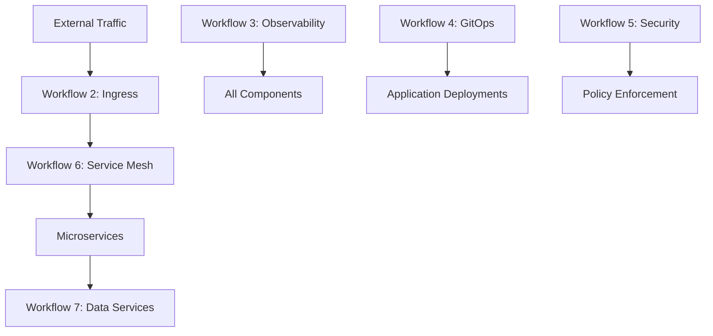

# Workflow Management

## Workflow Dependencies and Deployment Sequence

### Sequential Dependencies
The 7 workflows must be deployed in a specific order due to infrastructure dependencies:

1. **🏗️ Workflow 1: Foundation Platform** (Required first)
   - VPC Infrastructure, EKS Cluster, IAM & Security, Cilium CNI, Essential Add-ons
   - Prerequisites: None
   - Provides: EKS cluster, VPC, IAM roles, basic networking

2. **🌐 Workflow 2: Ingress + API Gateway Stack** (Required for external access)
   - Ambassador (emissary-ingress), cert-manager, external-dns + Cloudflare
   - Prerequisites: Workflow 1 (EKS cluster)
   - Provides: External access, SSL certificates, DNS management

3. **📈 Workflow 3: Observability Stack** (Recommended before advanced workflows)
   - Prometheus + Mimir, Loki, Grafana, Tempo + OpenTelemetry
   - Prerequisites: Workflow 1 (EKS cluster)
   - Provides: Monitoring, logging, tracing, alerting

### Parallel Deployment Phase (After 1-3)
Once the foundation workflows are complete, these can be deployed in parallel:

4. **🔄 Workflow 4: GitOps & Deployment Automation**
   - ArgoCD, Tekton, Git repositories
   - Prerequisites: Workflows 1, 2, 3
   - Provides: Automated deployments, application lifecycle management

5. **🔐 Workflow 5: Security Foundation**
   - OpenBao + ExternalSecret, OPA Gatekeeper, Falco
   - Prerequisites: Workflows 1, 2, 3
   - Provides: Secrets management, policy enforcement, runtime security

6. **🛡️ Workflow 6: Service Mesh**
   - Istio with mTLS and traffic management
   - Prerequisites: Workflows 1, 2, 3
   - Provides: Service-to-service security, traffic management, observability

7. **📊 Workflow 7: Data Services**
   - CloudNativePG (PostgreSQL), Redis Operator, Kafka
   - Prerequisites: Workflows 1, 2, 3
   - Provides: Database, cache, messaging services

## Resource Planning and Allocation

### Total Platform Capacity Requirements
```yaml
Cluster Configuration:
  Instance Type: t3.large (2 vCPU, 8GB RAM per node)
  Auto-scaling: 3-10 nodes
  Capacity Type: SPOT instances (cost optimization)
  Total Capacity: 6-20 CPU cores, 24-80GB RAM

Platform Resource Allocation:
  Workflow 1 (Foundation): ~1.5 CPU, ~3GB RAM
  Workflow 2 (Ingress): ~0.5 CPU, ~768MB RAM  
  Workflow 3 (Observability): ~2 CPU, ~4GB RAM
  Workflow 4 (GitOps): ~1 CPU, ~2GB RAM
  Workflow 5 (Security): ~0.8 CPU, ~1.5GB RAM
  Workflow 6 (Service Mesh): ~1 CPU, ~2GB RAM
  Workflow 7 (Data Services): ~1.5 CPU, ~3GB RAM
  
Reserved for Microservices: ~5 CPU, ~10GB RAM
  - 5 services × 3 replicas × (300m CPU, 512Mi RAM)
  - Auto-scaling headroom for traffic spikes
```

### Resource Monitoring and Scaling
- **Node Auto-scaling**: Triggered at 70% CPU/memory utilization
- **Pod Auto-scaling**: HPA configured for all microservices
- **Resource Quotas**: Namespace-level limits to prevent resource exhaustion
- **Spot Instance Management**: Mixed instance types with on-demand fallback

## Integration Points

### Cross-Workflow Integration
- **Shared VPC**: All workflows use the same VPC and subnets from Workflow 1
- **Common IAM**: IRSA roles created in Workflow 1, extended by other workflows
- **Unified Observability**: Workflow 3 monitors all components across workflows
- **Centralized Ingress**: Workflow 2 provides external access for all services
- **Service Mesh**: Workflow 6 secures communication between all services
- **GitOps Management**: Workflow 4 manages deployments for all applications

### Data Flow Integration


### Configuration Dependencies
- **DNS**: External-DNS (Workflow 2) manages records for all services
- **Certificates**: cert-manager (Workflow 2) provides TLS for all endpoints
- **Secrets**: OpenBao (Workflow 5) manages secrets for all applications
- **Policies**: OPA Gatekeeper (Workflow 5) enforces policies across all namespaces
- **Tracing**: Tempo (Workflow 3) collects traces from all services via service mesh

## Deployment Sequences

### Initial Platform Deployment
```bash
# Phase 1: Foundation (Required first)
terraform apply -target=module.vpc
terraform apply -target=module.eks
terraform apply -target=module.iam

# Phase 2: External Access (Required for management)
terraform apply -target=module.ambassador
terraform apply -target=module.cert-manager
terraform apply -target=module.external-dns

# Phase 3: Observability (Recommended before advanced features)
terraform apply -target=module.lgtm-observability

# Phase 4: Advanced Features (Can be parallel)
terraform apply -target=module.argocd
terraform apply -target=module.security-foundation
terraform apply -target=module.istio
terraform apply -target=module.data-services
```

### Microservices Deployment Sequence
1. **Database Setup**: Deploy PostgreSQL via CloudNativePG
2. **Service Deployment**: Deploy services via ArgoCD
3. **Service Mesh Integration**: Enable Istio sidecar injection
4. **Observability Integration**: Configure metrics, logs, traces
5. **Security Integration**: Apply OPA policies and secrets management

### Rollback Procedures
- **Workflow-level rollback**: Terraform state management with versioned modules
- **Application rollback**: ArgoCD automated rollback on health check failures
- **Database rollback**: PostgreSQL point-in-time recovery
- **Configuration rollback**: Git-based configuration versioning

## Environment-Specific Considerations

### Development Environment
- **Reduced replicas**: Single replica for most services
- **Relaxed resource limits**: Lower CPU/memory requests
- **Simplified security**: Basic policies for faster development
- **Local storage**: EBS gp3 volumes for cost optimization

### Staging Environment
- **Production-like**: Mirror production configuration
- **Full observability**: Complete monitoring and alerting
- **Security testing**: Full policy enforcement
- **Performance testing**: Load testing capabilities

### Production Environment
- **High availability**: Multi-AZ deployment
- **Enhanced security**: Full zero-trust implementation
- **Comprehensive monitoring**: Advanced alerting and dashboards
- **Disaster recovery**: Automated backup and recovery procedures