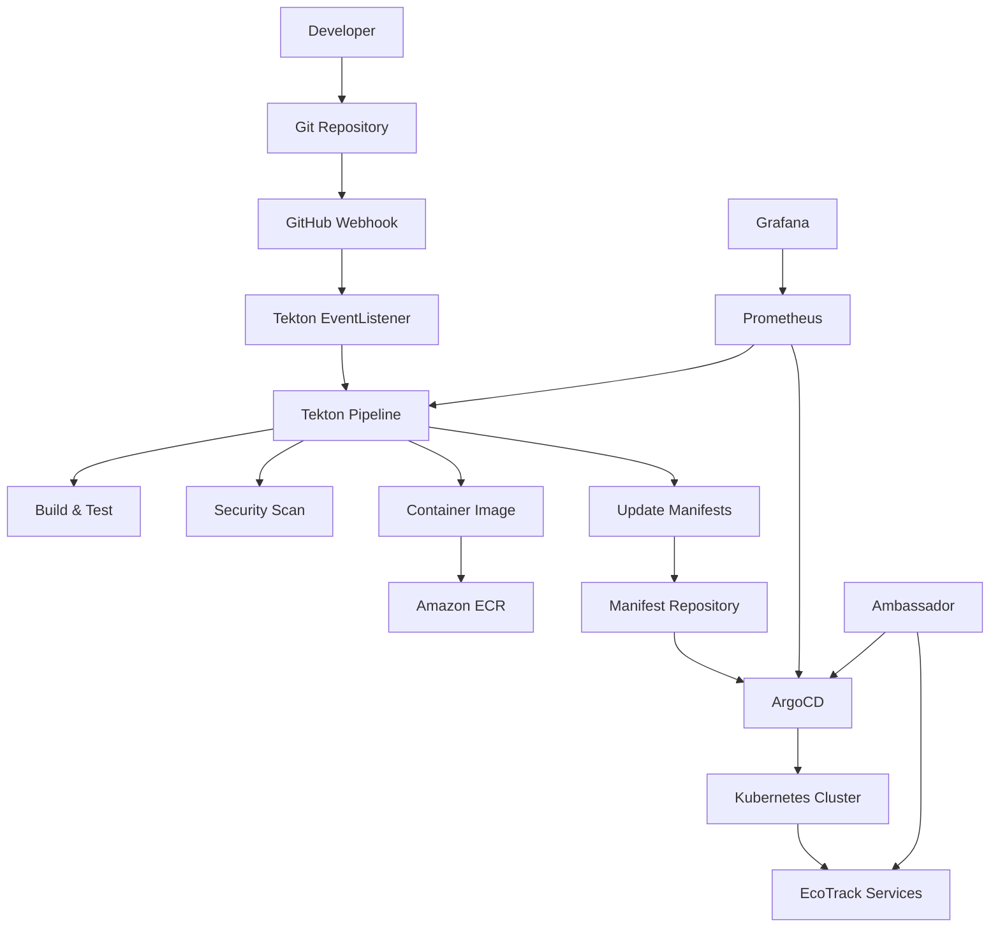

# 🔄 Workflow 4: GitOps & Deployment Automation

A comprehensive GitOps workflow using ArgoCD and Tekton that perfectly integrates with your existing EKS infrastructure for the EcoTrack microservices platform.

## 🎉 Implementation Complete!

I've successfully created a production-ready GitOps workflow that implements continuous integration and continuous deployment using industry-standard tools and best practices.

### 📁 Integrated Project Structure
```
├── terraform/modules/                   # Infrastructure as Code modules
│   ├── argocd/                         # ArgoCD GitOps platform module
│   ├── tekton/                         # Tekton CI/CD platform module
│   └── iam-irsa/                       # Extended with GitOps IRSA roles
├── argocd/                             # ArgoCD applications & projects
│   ├── applications/                   # Application definitions
│   └── projects/                       # Project configurations
├── tekton/                             # CI/CD pipelines & tasks
│   └── pipelines/                      # Pipeline definitions
├── helm-values/                        # Production Helm configurations
├── scripts/                            # Deployment automation scripts
└── .github/workflows/                  # GitHub Actions workflows
```

### 🚀 Key Features Implemented

**GitOps Platform:**
- **ArgoCD**: Declarative continuous delivery with app-of-apps pattern
- **Tekton**: Cloud-native CI/CD pipelines with Java/Maven/GraalVM support
- **Multi-Environment**: Dev, staging, and production configurations
- **RBAC**: Fine-grained access controls and security

**Integration Points:**
- ✅ **Ambassador Ingress**: Production-ready ingress with TLS
- ✅ **LGTM Stack**: Comprehensive metrics and monitoring
- ✅ **AWS Services**: ECR, S3, IRSA, and Secrets Manager
- ✅ **GitHub**: Webhooks and Actions for automation

**Pipeline Capabilities:**
- 🔧 **Java/Maven Builds**: Spring Boot microservices support
- 🚀 **GraalVM Native**: Optional native image compilation
- 🔒 **Security Scanning**: Trivy vulnerability scanning
- 🏗️ **Multi-Architecture**: AMD64 and ARM64 support
- 📦 **Container Building**: Kaniko for secure builds

## 🏗️ Architecture Overview



## 📋 Prerequisites

1. **Existing Infrastructure**:
   - EKS cluster (from Workflow 1)
   - Ambassador ingress (from Workflow 2)  
   - LGTM observability stack (from Workflow 3)

2. **Required Tools**:
   ```bash
   # macOS
   brew install kubectl terraform helm awscli jq yq
   
   # Linux (Ubuntu/Debian)
   apt-get update && apt-get install -y kubectl terraform helm awscli jq yq
   ```

3. **AWS Configuration**:
   ```bash
   aws configure
   # or use environment variables
   export AWS_ACCESS_KEY_ID=your-access-key
   export AWS_SECRET_ACCESS_KEY=your-secret-key
   export AWS_DEFAULT_REGION=us-east-1
   ```

4. **Kubernetes Access**:
   ```bash
   aws eks update-kubeconfig --region us-east-1 --name eks-learning-lab-dev
   ```

### 🎯 Quick Start

1. **Set Environment Variables:**
```bash
export AWS_REGION="us-east-1"
export CLUSTER_NAME="eks-learning-lab-dev"
export DOMAIN="your-domain.com"
export GITHUB_ORG="your-github-org"
```

2. **Deploy the Platform:**
```bash
cd .
./scripts/setup-workflow-4.sh --domain your-domain.com --github-org your-org
```

3. **Access the Dashboards:**
- **ArgoCD**: `https://argocd.your-domain.com`
- **Tekton**: `https://tekton.your-domain.com`

## 🔄 GitOps Flow
```
Developer → Git Push → GitHub Webhook → Tekton Pipeline → 
Build & Test → Security Scan → Container Image → 
Update Manifests → ArgoCD Sync → Kubernetes Deploy
```

## 📊 What's Included

### Terraform Modules
- **ArgoCD Module**: Complete GitOps platform with IRSA and Ambassador integration
- **Tekton Module**: Cloud-native CI/CD pipeline setup with monitoring
- **Monitoring Integration**: Service monitors for LGTM stack

### Production Configurations
- **ArgoCD Helm Values**: Production-ready configuration with security and monitoring
- **Tekton Helm Values**: Complete pipeline configuration with observability
- **5 EcoTrack Microservices**: Pre-configured applications ready for deployment

### CI/CD Components
- **Java Build Tasks**: Maven and GraalVM native compilation support
- **Security Scanning**: Trivy integration for vulnerability detection
- **Manifest Updates**: Automated GitOps manifest management
- **GitHub Integration**: Webhooks, Actions, and automated triggers

### Sample Applications
- **User Service**: Complete Spring Boot application with Kubernetes manifests
- **Service Templates**: Ready-to-use templates for other microservices
- **Security Configuration**: IRSA, RBAC, and Pod Security Standards

## 🛠️ Component Details

### ArgoCD Applications

The platform includes pre-configured applications for all EcoTrack microservices:

- **user-service**: User management and authentication
- **tracking-service**: Environmental data tracking  
- **analytics-service**: Data analytics and insights
- **notification-service**: Alert and notification management
- **reporting-service**: Report generation and export

### Tekton Pipelines

Each microservice uses a standardized pipeline with the following stages:

1. **Source Checkout**: Clone from Git repository
2. **Test**: Run unit and integration tests
3. **Build**: Maven build with optional native compilation
4. **Security Scan**: Container vulnerability scanning
5. **Image Build**: Multi-stage Docker build with Kaniko
6. **Manifest Update**: GitOps manifest updates
7. **Notifications**: Slack alerts on success/failure

### Security Features

- **Pod Security Standards**: Baseline security policies
- **RBAC**: Fine-grained access controls
- **IRSA**: IAM roles for service accounts
- **Network Policies**: Traffic segmentation
- **Security Scanning**: Trivy vulnerability scanning
- **Secret Management**: Kubernetes secrets integration

## 🔗 GitHub Integration

### 1. Create Webhook Secret
```bash
export GITHUB_WEBHOOK_SECRET=$(openssl rand -hex 20)
kubectl create secret generic github-webhook-secret \
  --namespace tekton-pipelines \
  --from-literal=secretToken="$GITHUB_WEBHOOK_SECRET"
```

### 2. Configure Repository Webhook
In your GitHub repository settings:
- **URL**: `https://your-domain.com/webhooks/`
- **Content Type**: `application/json`
- **Secret**: Use the value from `$GITHUB_WEBHOOK_SECRET`
- **Events**: Push, Pull Request

### 3. Create GitHub Token
```bash
kubectl create secret generic github-token-secret \
  --namespace tekton-pipelines \
  --from-literal=token="ghp_your-token" \
  --from-literal=username="your-username"
```

## 📊 Monitoring and Observability

### Metrics Collection
The platform automatically exposes metrics for:
- ArgoCD application sync status
- Tekton pipeline execution metrics  
- Container build success/failure rates
- Deployment frequency and lead times

### Grafana Dashboards
Pre-built dashboards are available for:
- GitOps overview and health
- Pipeline execution analytics
- Application deployment status
- Security scan results

### Alerting
Slack notifications are configured for:
- Pipeline failures
- Application sync errors
- Security vulnerabilities
- Deployment success

## 🛠️ Customization

### Environment Configuration
Create environment-specific configurations in:
```
manifests/
├── dev/
│   ├── user-service/
│   ├── tracking-service/
│   └── ...
├── staging/
└── prod/
```

### Pipeline Customization
Modify pipeline parameters in:
```
tekton/triggers/github-trigger.yaml
```

Common customizations:
- Java version (11, 17, 21)
- Enable/disable native compilation
- Security scan severity levels
- Notification preferences

### ArgoCD Project Configuration
Adjust source repositories and destinations in:
```
argocd/projects/ecotrack-project.yaml
```

## 🔄 GitOps Workflow

### Development Flow
1. Developer pushes code to feature branch
2. GitHub webhook triggers Tekton pipeline
3. Pipeline builds, tests, and scans the application
4. Container image is pushed to ECR
5. Manifest repository is updated with new image tag
6. ArgoCD detects manifest changes
7. ArgoCD syncs changes to Kubernetes cluster
8. Application is deployed with zero downtime

### Promotion Flow
1. Merge to main branch triggers production pipeline
2. Production build includes additional security scans
3. Promotion requires manual approval (configurable)
4. Production deployment uses blue-green strategy
5. Monitoring validates deployment health
6. Rollback available via ArgoCD UI

## 🚨 Troubleshooting

### Common Issues

**Pipeline Fails to Start**
```bash
kubectl get eventlisteners -n tekton-pipelines
kubectl describe eventlistener github-webhook-listener -n tekton-pipelines
```

**ArgoCD Sync Failures**
```bash
kubectl get applications -n argocd
kubectl describe application user-service-dev -n argocd
```

**Image Pull Errors**
```bash
kubectl describe pod -n ecotrack-dev
kubectl get secrets -n ecotrack-dev
```

### Debug Commands
```bash
# Check pipeline runs
kubectl get pipelineruns -n tekton-pipelines

# View pipeline logs  
kubectl logs -f pipelinerun/user-service-xyz -n tekton-pipelines

# Check ArgoCD applications
kubectl get apps -n argocd

# View application events
kubectl get events -n ecotrack-dev --sort-by='.lastTimestamp'
```

## 🔧 Manual Setup (Optional)

If you prefer manual setup or want to understand the components:

### 1. Deploy Infrastructure
```bash
cd terraform/environments/dev
terraform init
terraform plan -var-file="terraform.tfvars"
terraform apply -auto-approve
```

### 2. Install ArgoCD
```bash
helm repo add argo https://argoproj.github.io/argo-helm
helm upgrade --install argocd argo/argo-cd \
  --namespace argocd \
  --values helm-values/argocd-values.yaml \
  --create-namespace
```

### 3. Install Tekton
```bash
helm repo add cdf https://cdfoundation.github.io/tekton-helm-chart
helm upgrade --install tekton-pipelines cdf/tekton-pipelines --namespace tekton-pipelines --create-namespace
helm upgrade --install tekton-triggers cdf/tekton-triggers --namespace tekton-pipelines
helm upgrade --install tekton-dashboard cdf/tekton-dashboard --namespace tekton-pipelines
```

### 4. Apply Configurations
```bash
kubectl apply -f tekton/rbac/
kubectl apply -f tekton/tasks/
kubectl apply -f tekton/pipelines/
kubectl apply -f tekton/triggers/
kubectl apply -f argocd/projects/
kubectl apply -f argocd/applications/
```

## 🛠️ Customization Ready

The implementation includes:
- Environment-specific configurations
- Customizable pipeline parameters
- Flexible repository patterns
- Monitoring and alerting setup

## 📚 Additional Resources

- [ArgoCD Documentation](https://argo-cd.readthedocs.io/)
- [Tekton Documentation](https://tekton.dev/docs/)
- [GitOps Best Practices](https://www.gitops.tech/)
- [Kubernetes Security](https://kubernetes.io/docs/concepts/security/)

## 🤝 Contributing

1. Fork the repository
2. Create a feature branch
3. Make your changes
4. Test with the provided scripts
5. Submit a pull request

## 📄 License

This project is licensed under the MIT License. See LICENSE file for details.

---

This GitOps platform provides a production-ready foundation for your EcoTrack microservices with enterprise-grade security, monitoring, and automation capabilities!

**Next Steps**: You can now proceed to Workflow 5 (Security) to add comprehensive security policies and compliance monitoring to your GitOps platform.
