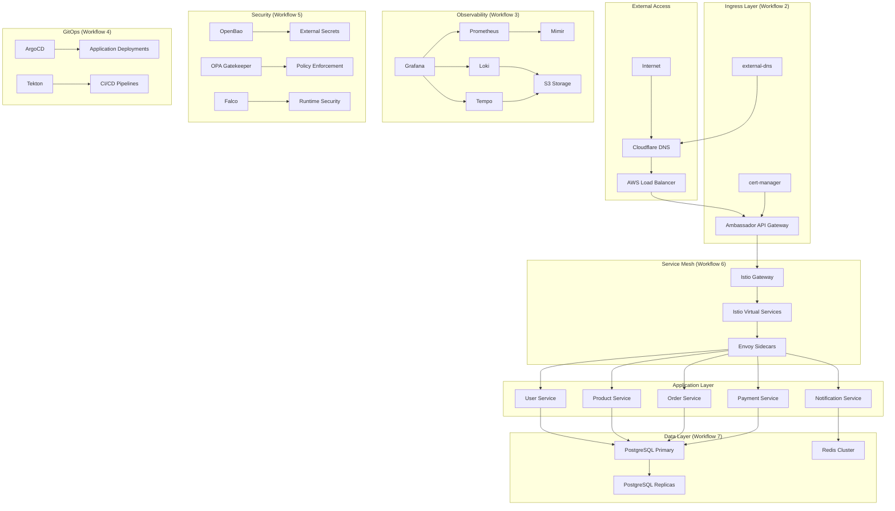
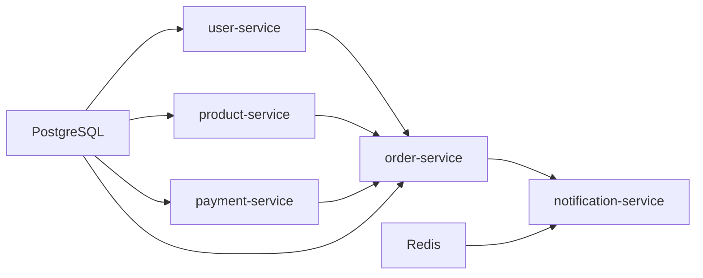

# Microservices Platform Integration Guide

## Overview

This guide provides comprehensive instructions for integrating microservices applications with the complete EKS Foundation Platform. It covers deployment patterns, observability integration, security implementation, service mesh configuration, and database integration patterns optimized for the EcoTrack application ecosystem.

## Platform Architecture Overview

The EKS Foundation Platform provides a complete infrastructure stack for microservices:



## EcoTrack Application Architecture

### Service Overview

The EcoTrack application consists of 5 microservices designed for environmental tracking and sustainability management:

| Service | Purpose | Database | Dependencies |
|---------|---------|----------|--------------|
| **user-service** | User management, authentication, profiles | PostgreSQL | OAuth providers, email services |
| **product-service** | Product catalog, sustainability metrics | PostgreSQL | Product data APIs, carbon footprint APIs |
| **order-service** | Order processing, fulfillment tracking | PostgreSQL | user-service, product-service, payment-service |
| **payment-service** | Payment processing, billing management | PostgreSQL | Payment gateways (Stripe, PayPal) |
| **notification-service** | Email, SMS, push notifications | Redis | Email providers, SMS gateways |

### Service Dependencies



## Spring Boot Integration Patterns

### Standard Application Configuration

#### Application Properties Template
```yaml
# application-kubernetes.yml
server:
  port: 8080
  shutdown: graceful

spring:
  application:
    name: ${SERVICE_NAME:user-service}
  profiles:
    active: kubernetes
  
  # Database Configuration
  datasource:
    url: jdbc:postgresql://postgres-primary.ecotrack.svc.cluster.local:5432/ecotrack
    username: ${DB_USERNAME}
    password: ${DB_PASSWORD}
    hikari:
      maximum-pool-size: 10
      minimum-idle: 2
      connection-timeout: 30000
      idle-timeout: 600000
      max-lifetime: 1800000
  
  # JPA Configuration
  jpa:
    hibernate:
      ddl-auto: validate
    show-sql: false
    properties:
      hibernate:
        format_sql: true
        dialect: org.hibernate.dialect.PostgreSQLDialect
  
  # Redis Configuration (for notification-service)
  redis:
    host: redis-cluster.ecotrack.svc.cluster.local
    port: 6379
    timeout: 2000ms
    lettuce:
      pool:
        max-active: 8
        max-idle: 8
        min-idle: 0

# Management and Actuator
management:
  endpoints:
    web:
      exposure:
        include: health,info,metrics,prometheus
  endpoint:
    health:
      show-details: always
      probes:
        enabled: true
  metrics:
    export:
      prometheus:
        enabled: true
    tags:
      service: ${spring.application.name}
      environment: ${ENVIRONMENT:dev}

# OpenTelemetry Configuration
otel:
  service:
    name: ${spring.application.name}
  resource:
    attributes: service.version=${APP_VERSION:1.0.0}
  exporter:
    otlp:
      endpoint: http://tempo-distributor.observability.svc.cluster.local:4317
  traces:
    exporter: otlp
  metrics:
    exporter: prometheus

# Logging Configuration
logging:
  level:
    com.ecotrack: INFO
    org.springframework.security: DEBUG
  pattern:
    console: "%d{yyyy-MM-dd HH:mm:ss} [%thread] %-5level [%X{traceId},%X{spanId}] %logger{36} - %msg%n"
```

#### Maven Dependencies
```xml
<!-- pom.xml dependencies for platform integration -->
<dependencies>
    <!-- Spring Boot Starters -->
    <dependency>
        <groupId>org.springframework.boot</groupId>
        <artifactId>spring-boot-starter-web</artifactId>
    </dependency>
    <dependency>
        <groupId>org.springframework.boot</groupId>
        <artifactId>spring-boot-starter-data-jpa</artifactId>
    </dependency>
    <dependency>
        <groupId>org.springframework.boot</groupId>
        <artifactId>spring-boot-starter-actuator</artifactId>
    </dependency>
    <dependency>
        <groupId>org.springframework.boot</groupId>
        <artifactId>spring-boot-starter-security</artifactId>
    </dependency>
    
    <!-- Database -->
    <dependency>
        <groupId>org.postgresql</groupId>
        <artifactId>postgresql</artifactId>
    </dependency>
    <dependency>
        <groupId>org.springframework.boot</groupId>
        <artifactId>spring-boot-starter-data-redis</artifactId>
    </dependency>
    
    <!-- Observability -->
    <dependency>
        <groupId>io.micrometer</groupId>
        <artifactId>micrometer-registry-prometheus</artifactId>
    </dependency>
    <dependency>
        <groupId>io.opentelemetry.instrumentation</groupId>
        <artifactId>opentelemetry-spring-boot-starter</artifactId>
    </dependency>
    
    <!-- Service Mesh -->
    <dependency>
        <groupId>org.springframework.cloud</groupId>
        <artifactId>spring-cloud-starter-openfeign</artifactId>
    </dependency>
    <dependency>
        <groupId>io.github.resilience4j</groupId>
        <artifactId>resilience4j-spring-boot2</artifactId>
    </dependency>
</dependencies>
```

### Service-Specific Configurations

#### User Service Configuration
```java
// UserServiceApplication.java
@SpringBootApplication
@EnableJpaRepositories
@EnableOpenApi
@EnableScheduling
public class UserServiceApplication {
    public static void main(String[] args) {
        SpringApplication.run(UserServiceApplication.class, args);
    }
    
    @Bean
    public PasswordEncoder passwordEncoder() {
        return new BCryptPasswordEncoder();
    }
    
    @Bean
    public RestTemplate restTemplate() {
        return new RestTemplate();
    }
}

// application-kubernetes.yml additions for user-service
spring:
  security:
    oauth2:
      client:
        registration:
          google:
            client-id: ${GOOGLE_CLIENT_ID}
            client-secret: ${GOOGLE_CLIENT_SECRET}
            scope: openid,profile,email
```

#### Order Service Configuration
```java
// OrderServiceApplication.java
@SpringBootApplication
@EnableJpaRepositories
@EnableFeignClients
@EnableCircuitBreaker
public class OrderServiceApplication {
    public static void main(String[] args) {
        SpringApplication.run(OrderServiceApplication.class, args);
    }
}

// Feign client for service communication
@FeignClient(name = "user-service", url = "http://user-service.ecotrack.svc.cluster.local")
public interface UserServiceClient {
    @GetMapping("/api/users/{userId}")
    UserDto getUser(@PathVariable Long userId);
}

@FeignClient(name = "product-service", url = "http://product-service.ecotrack.svc.cluster.local")
public interface ProductServiceClient {
    @GetMapping("/api/products/{productId}")
    ProductDto getProduct(@PathVariable Long productId);
}

@FeignClient(name = "payment-service", url = "http://payment-service.ecotrack.svc.cluster.local")
public interface PaymentServiceClient {
    @PostMapping("/api/payments")
    PaymentResponseDto processPayment(@RequestBody PaymentRequestDto request);
}
```

#### Notification Service Configuration
```java
// NotificationServiceApplication.java
@SpringBootApplication
@EnableRedisRepositories
@EnableAsync
public class NotificationServiceApplication {
    public static void main(String[] args) {
        SpringApplication.run(NotificationServiceApplication.class, args);
    }
    
    @Bean
    public RedisTemplate<String, Object> redisTemplate(RedisConnectionFactory connectionFactory) {
        RedisTemplate<String, Object> template = new RedisTemplate<>();
        template.setConnectionFactory(connectionFactory);
        template.setDefaultSerializer(new GenericJackson2JsonRedisSerializer());
        return template;
    }
}
```

## Kubernetes Deployment Patterns

### Standard Deployment Template

#### Deployment Configuration
```yaml
# k8s/user-service/deployment.yaml
apiVersion: apps/v1
kind: Deployment
metadata:
  name: user-service
  namespace: ecotrack
  labels:
    app: user-service
    version: v1
    component: microservice
spec:
  replicas: 3
  selector:
    matchLabels:
      app: user-service
  template:
    metadata:
      labels:
        app: user-service
        version: v1
      annotations:
        sidecar.istio.io/inject: "true"
        prometheus.io/scrape: "true"
        prometheus.io/port: "8080"
        prometheus.io/path: "/actuator/prometheus"
    spec:
      serviceAccountName: user-service-sa
      containers:
      - name: user-service
        image: user-service:1.0.0
        ports:
        - containerPort: 8080
          name: http
        resources:
          requests:
            memory: "256Mi"
            cpu: "100m"
          limits:
            memory: "512Mi"
            cpu: "300m"
        env:
        - name: SPRING_PROFILES_ACTIVE
          value: "kubernetes"
        - name: SERVICE_NAME
          value: "user-service"
        - name: ENVIRONMENT
          value: "dev"
        - name: APP_VERSION
          value: "1.0.0"
        - name: DB_USERNAME
          valueFrom:
            secretKeyRef:
              name: postgres-credentials
              key: username
        - name: DB_PASSWORD
          valueFrom:
            secretKeyRef:
              name: postgres-credentials
              key: password
        - name: GOOGLE_CLIENT_ID
          valueFrom:
            secretKeyRef:
              name: oauth-credentials
              key: google-client-id
        - name: GOOGLE_CLIENT_SECRET
          valueFrom:
            secretKeyRef:
              name: oauth-credentials
              key: google-client-secret
        livenessProbe:
          httpGet:
            path: /actuator/health/liveness
            port: 8080
          initialDelaySeconds: 60
          periodSeconds: 30
          timeoutSeconds: 5
          failureThreshold: 3
        readinessProbe:
          httpGet:
            path: /actuator/health/readiness
            port: 8080
          initialDelaySeconds: 30
          periodSeconds: 10
          timeoutSeconds: 5
          failureThreshold: 3
        startupProbe:
          httpGet:
            path: /actuator/health/liveness
            port: 8080
          initialDelaySeconds: 10
          periodSeconds: 10
          timeoutSeconds: 5
          failureThreshold: 30
```

#### Service Configuration
```yaml
# k8s/user-service/service.yaml
apiVersion: v1
kind: Service
metadata:
  name: user-service
  namespace: ecotrack
  labels:
    app: user-service
spec:
  selector:
    app: user-service
  ports:
  - port: 80
    targetPort: 8080
    name: http
  type: ClusterIP
```

#### ServiceAccount and RBAC
```yaml
# k8s/user-service/rbac.yaml
apiVersion: v1
kind: ServiceAccount
metadata:
  name: user-service-sa
  namespace: ecotrack
  annotations:
    eks.amazonaws.com/role-arn: arn:aws:iam::ACCOUNT_ID:role/user-service-role
---
apiVersion: rbac.authorization.k8s.io/v1
kind: Role
metadata:
  namespace: ecotrack
  name: user-service-role
rules:
- apiGroups: [""]
  resources: ["secrets", "configmaps"]
  verbs: ["get", "list"]
---
apiVersion: rbac.authorization.k8s.io/v1
kind: RoleBinding
metadata:
  name: user-service-binding
  namespace: ecotrack
subjects:
- kind: ServiceAccount
  name: user-service-sa
  namespace: ecotrack
roleRef:
  kind: Role
  name: user-service-role
  apiGroup: rbac.authorization.k8s.io
```

### Horizontal Pod Autoscaler
```yaml
# k8s/user-service/hpa.yaml
apiVersion: autoscaling/v2
kind: HorizontalPodAutoscaler
metadata:
  name: user-service-hpa
  namespace: ecotrack
spec:
  scaleTargetRef:
    apiVersion: apps/v1
    kind: Deployment
    name: user-service
  minReplicas: 3
  maxReplicas: 10
  metrics:
  - type: Resource
    resource:
      name: cpu
      target:
        type: Utilization
        averageUtilization: 70
  - type: Resource
    resource:
      name: memory
      target:
        type: Utilization
        averageUtilization: 80
  behavior:
    scaleUp:
      stabilizationWindowSeconds: 60
      policies:
      - type: Percent
        value: 100
        periodSeconds: 15
    scaleDown:
      stabilizationWindowSeconds: 300
      policies:
      - type: Percent
        value: 10
        periodSeconds: 60
```

## Observability Integration

### Prometheus Metrics Integration

#### Custom Metrics Configuration
```java
// MetricsConfiguration.java
@Configuration
public class MetricsConfiguration {
    
    @Bean
    public TimedAspect timedAspect(MeterRegistry registry) {
        return new TimedAspect(registry);
    }
    
    @Bean
    public CountedAspect countedAspect(MeterRegistry registry) {
        return new CountedAspect(registry);
    }
    
    @Bean
    public MeterRegistryCustomizer<MeterRegistry> metricsCommonTags() {
        return registry -> registry.config().commonTags(
            "service", "user-service",
            "environment", "dev"
        );
    }
}

// Business metrics example
@Component
public class UserMetrics {
    private final Counter userRegistrations;
    private final Timer userLoginTime;
    private final Gauge activeUsers;
    
    public UserMetrics(MeterRegistry meterRegistry) {
        this.userRegistrations = Counter.builder("user_registrations_total")
            .description("Total number of user registrations")
            .register(meterRegistry);
            
        this.userLoginTime = Timer.builder("user_login_duration_seconds")
            .description("Time taken for user login")
            .register(meterRegistry);
            
        this.activeUsers = Gauge.builder("active_users")
            .description("Number of currently active users")
            .register(meterRegistry, this, UserMetrics::getActiveUserCount);
    }
    
    public void incrementUserRegistrations() {
        userRegistrations.increment();
    }
    
    public Timer.Sample startLoginTimer() {
        return Timer.start(userLoginTime);
    }
    
    private double getActiveUserCount() {
        // Implementation to get active user count
        return 0.0;
    }
}
```

#### Service Monitor Configuration
```yaml
# k8s/user-service/servicemonitor.yaml
apiVersion: monitoring.coreos.com/v1
kind: ServiceMonitor
metadata:
  name: user-service-metrics
  namespace: ecotrack
  labels:
    app: user-service
spec:
  selector:
    matchLabels:
      app: user-service
  endpoints:
  - port: http
    path: /actuator/prometheus
    interval: 30s
    scrapeTimeout: 10s
```

### Distributed Tracing with OpenTelemetry

#### Tracing Configuration
```java
// TracingConfiguration.java
@Configuration
public class TracingConfiguration {
    
    @Bean
    public OpenTelemetry openTelemetry() {
        return OpenTelemetrySDK.builder()
            .setTracerProvider(
                SdkTracerProvider.builder()
                    .addSpanProcessor(BatchSpanProcessor.builder(
                        OtlpGrpcSpanExporter.builder()
                            .setEndpoint("http://tempo-distributor.observability.svc.cluster.local:4317")
                            .build())
                        .build())
                    .setResource(Resource.getDefault()
                        .merge(Resource.builder()
                            .put(ResourceAttributes.SERVICE_NAME, "user-service")
                            .put(ResourceAttributes.SERVICE_VERSION, "1.0.0")
                            .build()))
                    .build())
            .build();
    }
}

// Custom tracing example
@Service
public class UserService {
    private final Tracer tracer;
    
    public UserService(OpenTelemetry openTelemetry) {
        this.tracer = openTelemetry.getTracer("user-service");
    }
    
    @Timed(name = "user_creation_time", description = "Time taken to create a user")
    public User createUser(CreateUserRequest request) {
        Span span = tracer.spanBuilder("create_user")
            .setAttribute("user.email", request.getEmail())
            .startSpan();
        
        try (Scope scope = span.makeCurrent()) {
            // Business logic
            User user = new User();
            user.setEmail(request.getEmail());
            
            span.setAttribute("user.id", user.getId().toString());
            span.setStatus(StatusCode.OK);
            
            return userRepository.save(user);
        } catch (Exception e) {
            span.recordException(e);
            span.setStatus(StatusCode.ERROR, e.getMessage());
            throw e;
        } finally {
            span.end();
        }
    }
}
```

### Structured Logging with Loki

#### Logging Configuration
```xml
<!-- logback-spring.xml -->
<configuration>
    <springProfile name="kubernetes">
        <appender name="STDOUT" class="ch.qos.logback.core.ConsoleAppender">
            <encoder class="net.logstash.logback.encoder.LoggingEventCompositeJsonEncoder">
                <providers>
                    <timestamp/>
                    <logLevel/>
                    <loggerName/>
                    <mdc/>
                    <arguments/>
                    <message/>
                    <stackTrace/>
                </providers>
            </encoder>
        </appender>
        
        <logger name="com.ecotrack" level="INFO"/>
        <logger name="org.springframework.web" level="DEBUG"/>
        <logger name="org.springframework.security" level="DEBUG"/>
        
        <root level="INFO">
            <appender-ref ref="STDOUT"/>
        </root>
    </springProfile>
</configuration>
```

```java
// Structured logging example
@RestController
@Slf4j
public class UserController {
    
    @PostMapping("/api/users")
    public ResponseEntity<User> createUser(@RequestBody CreateUserRequest request) {
        MDC.put("operation", "create_user");
        MDC.put("user_email", request.getEmail());
        
        try {
            log.info("Creating new user with email: {}", request.getEmail());
            User user = userService.createUser(request);
            
            MDC.put("user_id", user.getId().toString());
            log.info("Successfully created user with ID: {}", user.getId());
            
            return ResponseEntity.ok(user);
        } catch (Exception e) {
            log.error("Failed to create user", e);
            return ResponseEntity.status(HttpStatus.INTERNAL_SERVER_ERROR).build();
        } finally {
            MDC.clear();
        }
    }
}
```

## Security Integration

### OpenBao Secrets Management

#### External Secrets Configuration
```yaml
# k8s/user-service/external-secret.yaml
apiVersion: external-secrets.io/v1beta1
kind: ExternalSecret
metadata:
  name: user-service-secrets
  namespace: ecotrack
spec:
  refreshInterval: 15s
  secretStoreRef:
    name: vault-backend
    kind: SecretStore
  target:
    name: user-service-secrets
    creationPolicy: Owner
  data:
  - secretKey: database-password
    remoteRef:
      key: secret/ecotrack/database
      property: password
  - secretKey: oauth-google-client-id
    remoteRef:
      key: secret/ecotrack/oauth/google
      property: client-id
  - secretKey: oauth-google-client-secret
    remoteRef:
      key: secret/ecotrack/oauth/google
      property: client-secret
  - secretKey: jwt-secret
    remoteRef:
      key: secret/ecotrack/jwt
      property: secret
```

#### Secret Store Configuration
```yaml
# k8s/ecotrack/secret-store.yaml
apiVersion: external-secrets.io/v1beta1
kind: SecretStore
metadata:
  name: vault-backend
  namespace: ecotrack
spec:
  provider:
    vault:
      server: "https://openbao.security.svc.cluster.local:8200"
      path: "secret"
      version: "v2"
      auth:
        kubernetes:
          mountPath: "kubernetes"
          role: "ecotrack-role"
          serviceAccountRef:
            name: "user-service-sa"
```

### OPA Gatekeeper Policies

#### Resource Requirements Policy
```yaml
# k8s/policies/resource-requirements.yaml
apiVersion: templates.gatekeeper.sh/v1beta1
kind: ConstraintTemplate
metadata:
  name: k8srequiredresources
spec:
  crd:
    spec:
      names:
        kind: K8sRequiredResources
      validation:
        properties:
          limits:
            type: array
            items:
              type: string
  targets:
  - target: admission.k8s.gatekeeper.sh
    rego: |
      package k8srequiredresources
      
      violation[{"msg": msg}] {
        container := input.review.object.spec.template.spec.containers[_]
        not container.resources.limits
        msg := sprintf("Container %v must have resource limits", [container.name])
      }
      
      violation[{"msg": msg}] {
        container := input.review.object.spec.template.spec.containers[_]
        not container.resources.requests
        msg := sprintf("Container %v must have resource requests", [container.name])
      }
---
apiVersion: constraints.gatekeeper.sh/v1beta1
kind: K8sRequiredResources
metadata:
  name: must-have-resources
spec:
  match:
    kinds:
    - apiGroups: ["apps"]
      kinds: ["Deployment"]
    namespaces: ["ecotrack"]
```

#### Security Context Policy
```yaml
# k8s/policies/security-context.yaml
apiVersion: templates.gatekeeper.sh/v1beta1
kind: ConstraintTemplate
metadata:
  name: k8srequiredsecuritycontext
spec:
  crd:
    spec:
      names:
        kind: K8sRequiredSecurityContext
  targets:
  - target: admission.k8s.gatekeeper.sh
    rego: |
      package k8srequiredsecuritycontext
      
      violation[{"msg": msg}] {
        container := input.review.object.spec.template.spec.containers[_]
        not container.securityContext.runAsNonRoot
        msg := sprintf("Container %v must run as non-root", [container.name])
      }
      
      violation[{"msg": msg}] {
        container := input.review.object.spec.template.spec.containers[_]
        not container.securityContext.readOnlyRootFilesystem
        msg := sprintf("Container %v must have read-only root filesystem", [container.name])
      }
---
apiVersion: constraints.gatekeeper.sh/v1beta1
kind: K8sRequiredSecurityContext
metadata:
  name: must-have-security-context
spec:
  match:
    kinds:
    - apiGroups: ["apps"]
      kinds: ["Deployment"]
    namespaces: ["ecotrack"]
```

### Network Policies

#### Service-to-Service Communication
```yaml
# k8s/user-service/network-policy.yaml
apiVersion: networking.k8s.io/v1
kind: NetworkPolicy
metadata:
  name: user-service-netpol
  namespace: ecotrack
spec:
  podSelector:
    matchLabels:
      app: user-service
  policyTypes:
  - Ingress
  - Egress
  ingress:
  # Allow traffic from Istio gateway
  - from:
    - namespaceSelector:
        matchLabels:
          name: istio-system
    ports:
    - protocol: TCP
      port: 8080
  # Allow traffic from other services in ecotrack namespace
  - from:
    - podSelector:
        matchLabels:
          app: order-service
    ports:
    - protocol: TCP
      port: 8080
  egress:
  # Allow DNS resolution
  - to: []
    ports:
    - protocol: UDP
      port: 53
  # Allow database access
  - to:
    - podSelector:
        matchLabels:
          app: postgres-primary
    ports:
    - protocol: TCP
      port: 5432
  # Allow external OAuth providers
  - to: []
    ports:
    - protocol: TCP
      port: 443
```

## Service Mesh Integration with Istio

### Istio Configuration

#### Gateway Configuration
```yaml
# k8s/istio/gateway.yaml
apiVersion: networking.istio.io/v1beta1
kind: Gateway
metadata:
  name: ecotrack-gateway
  namespace: ecotrack
spec:
  selector:
    istio: ingressgateway
  servers:
  - port:
      number: 80
      name: http
      protocol: HTTP
    hosts:
    - "*.ecotrack.dev"
    tls:
      httpsRedirect: true
  - port:
      number: 443
      name: https
      protocol: HTTPS
    tls:
      mode: SIMPLE
      credentialName: ecotrack-tls
    hosts:
    - "*.ecotrack.dev"
```

#### Virtual Service Configuration
```yaml
# k8s/user-service/virtual-service.yaml
apiVersion: networking.istio.io/v1beta1
kind: VirtualService
metadata:
  name: user-service
  namespace: ecotrack
spec:
  hosts:
  - user-service.ecotrack.dev
  gateways:
  - ecotrack-gateway
  http:
  - match:
    - uri:
        prefix: "/api/users"
    route:
    - destination:
        host: user-service
        port:
          number: 80
    timeout: 30s
    retries:
      attempts: 3
      perTryTimeout: 10s
      retryOn: 5xx,reset,connect-failure,refused-stream
```

#### Destination Rule Configuration
```yaml
# k8s/user-service/destination-rule.yaml
apiVersion: networking.istio.io/v1beta1
kind: DestinationRule
metadata:
  name: user-service
  namespace: ecotrack
spec:
  host: user-service
  trafficPolicy:
    connectionPool:
      tcp:
        maxConnections: 100
      http:
        http1MaxPendingRequests: 50
        maxRequestsPerConnection: 10
    outlierDetection:
      consecutiveErrors: 3
      interval: 30s
      baseEjectionTime: 30s
      maxEjectionPercent: 50
    loadBalancer:
      simple: LEAST_CONN
  subsets:
  - name: v1
    labels:
      version: v1
  - name: v2
    labels:
      version: v2
```

### mTLS Configuration

#### PeerAuthentication
```yaml
# k8s/ecotrack/peer-authentication.yaml
apiVersion: security.istio.io/v1beta1
kind: PeerAuthentication
metadata:
  name: default
  namespace: ecotrack
spec:
  mtls:
    mode: STRICT
```

#### Authorization Policy
```yaml
# k8s/ecotrack/authorization-policy.yaml
apiVersion: security.istio.io/v1beta1
kind: AuthorizationPolicy
metadata:
  name: ecotrack-authz
  namespace: ecotrack
spec:
  rules:
  # Allow traffic from istio-system (ingress gateway)
  - from:
    - source:
        namespaces: ["istio-system"]
  # Allow inter-service communication within ecotrack namespace
  - from:
    - source:
        namespaces: ["ecotrack"]
    to:
    - operation:
        methods: ["GET", "POST", "PUT", "DELETE"]
        paths: ["/api/*", "/actuator/health"]
  # Allow health checks from anywhere
  - to:
    - operation:
        methods: ["GET"]
        paths: ["/actuator/health/*"]
```

### Circuit Breaker Configuration

#### Resilience4j Integration
```java
// CircuitBreakerConfiguration.java
@Configuration
public class CircuitBreakerConfiguration {
    
    @Bean
    public CircuitBreaker userServiceCircuitBreaker() {
        return CircuitBreaker.ofDefaults("userService");
    }
    
    @Bean
    public Retry userServiceRetry() {
        return Retry.ofDefaults("userService");
    }
    
    @Bean
    public TimeLimiter userServiceTimeLimiter() {
        return TimeLimiter.ofDefaults("userService");
    }
}

// Service implementation with circuit breaker
@Service
public class OrderService {
    
    @Autowired
    private UserServiceClient userServiceClient;
    
    @CircuitBreaker(name = "userService", fallbackMethod = "fallbackGetUser")
    @Retry(name = "userService")
    @TimeLimiter(name = "userService")
    public CompletableFuture<UserDto> getUser(Long userId) {
        return CompletableFuture.supplyAsync(() -> userServiceClient.getUser(userId));
    }
    
    public CompletableFuture<UserDto> fallbackGetUser(Long userId, Exception ex) {
        log.warn("Fallback triggered for user service call", ex);
        return CompletableFuture.completedFuture(new UserDto(userId, "Unknown User"));
    }
}
```

## Database Integration Patterns

### PostgreSQL with CloudNativePG

#### Database Cluster Configuration
```yaml
# k8s/database/postgres-cluster.yaml
apiVersion: postgresql.cnpg.io/v1
kind: Cluster
metadata:
  name: postgres-cluster
  namespace: ecotrack
spec:
  instances: 3
  primaryUpdateStrategy: unsupervised
  
  postgresql:
    parameters:
      max_connections: "200"
      shared_buffers: "256MB"
      effective_cache_size: "1GB"
      maintenance_work_mem: "64MB"
      checkpoint_completion_target: "0.9"
      wal_buffers: "16MB"
      default_statistics_target: "100"
      random_page_cost: "1.1"
      effective_io_concurrency: "200"
      work_mem: "4MB"
      min_wal_size: "1GB"
      max_wal_size: "4GB"
  
  bootstrap:
    initdb:
      database: ecotrack
      owner: ecotrack
      secret:
        name: postgres-credentials
  
  storage:
    size: 100Gi
    storageClass: gp3
  
  resources:
    requests:
      memory: "1Gi"
      cpu: "500m"
    limits:
      memory: "2Gi"
      cpu: "1000m"
  
  monitoring:
    enabled: true
    podMonitorEnabled: true
  
  backup:
    retentionPolicy: "30d"
    barmanObjectStore:
      destinationPath: "s3://eks-learning-lab-dev-postgres-backup"
      s3Credentials:
        accessKeyId:
          name: postgres-backup-credentials
          key: ACCESS_KEY_ID
        secretAccessKey:
          name: postgres-backup-credentials
          key: SECRET_ACCESS_KEY
      wal:
        retention: "5d"
      data:
        retention: "30d"
```

#### Database Schema Management
```sql
-- V1__Create_user_tables.sql
CREATE TABLE users (
    id BIGSERIAL PRIMARY KEY,
    email VARCHAR(255) UNIQUE NOT NULL,
    password_hash VARCHAR(255) NOT NULL,
    first_name VARCHAR(100) NOT NULL,
    last_name VARCHAR(100) NOT NULL,
    created_at TIMESTAMP WITH TIME ZONE DEFAULT CURRENT_TIMESTAMP,
    updated_at TIMESTAMP WITH TIME ZONE DEFAULT CURRENT_TIMESTAMP
);

CREATE INDEX idx_users_email ON users(email);
CREATE INDEX idx_users_created_at ON users(created_at);

-- V2__Create_product_tables.sql
CREATE TABLE products (
    id BIGSERIAL PRIMARY KEY,
    name VARCHAR(255) NOT NULL,
    description TEXT,
    price DECIMAL(10,2) NOT NULL,
    carbon_footprint DECIMAL(8,2),
    sustainability_score INTEGER CHECK (sustainability_score >= 0 AND sustainability_score <= 100),
    created_at TIMESTAMP WITH TIME ZONE DEFAULT CURRENT_TIMESTAMP,
    updated_at TIMESTAMP WITH TIME ZONE DEFAULT CURRENT_TIMESTAMP
);

CREATE INDEX idx_products_name ON products(name);
CREATE INDEX idx_products_sustainability_score ON products(sustainability_score);

-- V3__Create_order_tables.sql
CREATE TABLE orders (
    id BIGSERIAL PRIMARY KEY,
    user_id BIGINT NOT NULL REFERENCES users(id),
    status VARCHAR(50) NOT NULL DEFAULT 'PENDING',
    total_amount DECIMAL(10,2) NOT NULL,
    created_at TIMESTAMP WITH TIME ZONE DEFAULT CURRENT_TIMESTAMP,
    updated_at TIMESTAMP WITH TIME ZONE DEFAULT CURRENT_TIMESTAMP
);

CREATE TABLE order_items (
    id BIGSERIAL PRIMARY KEY,
    order_id BIGINT NOT NULL REFERENCES orders(id),
    product_id BIGINT NOT NULL REFERENCES products(id),
    quantity INTEGER NOT NULL,
    unit_price DECIMAL(10,2) NOT NULL,
    created_at TIMESTAMP WITH TIME ZONE DEFAULT CURRENT_TIMESTAMP
);

CREATE INDEX idx_orders_user_id ON orders(user_id);
CREATE INDEX idx_orders_status ON orders(status);
CREATE INDEX idx_order_items_order_id ON order_items(order_id);
```

#### Connection Pool Optimization
```java
// DatabaseConfiguration.java
@Configuration
public class DatabaseConfiguration {
    
    @Bean
    @Primary
    @ConfigurationProperties("spring.datasource.hikari")
    public HikariConfig hikariConfig() {
        HikariConfig config = new HikariConfig();
        
        // Connection pool settings
        config.setMaximumPoolSize(10);
        config.setMinimumIdle(2);
        config.setConnectionTimeout(30000);
        config.setIdleTimeout(600000);
        config.setMaxLifetime(1800000);
        config.setLeakDetectionThreshold(60000);
        
        // Performance settings
        config.addDataSourceProperty("cachePrepStmts", "true");
        config.addDataSourceProperty("prepStmtCacheSize", "250");
        config.addDataSourceProperty("prepStmtCacheSqlLimit", "2048");
        config.addDataSourceProperty("useServerPrepStmts", "true");
        config.addDataSourceProperty("useLocalSessionState", "true");
        config.addDataSourceProperty("rewriteBatchedStatements", "true");
        config.addDataSourceProperty("cacheResultSetMetadata", "true");
        config.addDataSourceProperty("cacheServerConfiguration", "true");
        config.addDataSourceProperty("elideSetAutoCommits", "true");
        config.addDataSourceProperty("maintainTimeStats", "false");
        
        return config;
    }
    
    @Bean
    public DataSource dataSource(HikariConfig hikariConfig) {
        return new HikariDataSource(hikariConfig);
    }
}
```

### Redis Integration

#### Redis Cluster Configuration
```yaml
# k8s/database/redis-cluster.yaml
apiVersion: databases.spotahome.com/v1
kind: RedisFailover
metadata:
  name: redis-cluster
  namespace: ecotrack
spec:
  sentinel:
    replicas: 3
    resources:
      requests:
        memory: "128Mi"
        cpu: "50m"
      limits:
        memory: "256Mi"
        cpu: "100m"
    customConfig:
      - "down-after-milliseconds 5000"
      - "failover-timeout 10000"
      - "parallel-syncs 2"
  
  redis:
    replicas: 3
    resources:
      requests:
        memory: "256Mi"
        cpu: "100m"
      limits:
        memory: "512Mi"
        cpu: "200m"
    
    storage:
      persistentVolumeClaim:
        metadata:
          name: redis-storage
        spec:
          accessModes:
          - ReadWriteOnce
          resources:
            requests:
              storage: 10Gi
          storageClassName: gp3
    
    customConfig:
      - "maxmemory-policy allkeys-lru"
      - "save 900 1"
      - "save 300 10"
      - "save 60 10000"
      - "tcp-keepalive 60"
      - "tcp-backlog 511"
      - "timeout 0"
```

#### Redis Configuration in Spring Boot
```java
// RedisConfiguration.java
@Configuration
@EnableRedisRepositories
public class RedisConfiguration {
    
    @Bean
    public LettuceConnectionFactory redisConnectionFactory() {
        RedisStandaloneConfiguration config = new RedisStandaloneConfiguration();
        config.setHostName("redis-cluster.ecotrack.svc.cluster.local");
        config.setPort(6379);
        
        LettuceClientConfiguration clientConfig = LettuceClientConfiguration.builder()
            .commandTimeout(Duration.ofSeconds(2))
            .shutdownTimeout(Duration.ZERO)
            .build();
        
        return new LettuceConnectionFactory(config, clientConfig);
    }
    
    @Bean
    public RedisTemplate<String, Object> redisTemplate(LettuceConnectionFactory connectionFactory) {
        RedisTemplate<String, Object> template = new RedisTemplate<>();
        template.setConnectionFactory(connectionFactory);
        
        // Use Jackson JSON serializer
        Jackson2JsonRedisSerializer<Object> serializer = new Jackson2JsonRedisSerializer<>(Object.class);
        ObjectMapper objectMapper = new ObjectMapper();
        objectMapper.setVisibility(PropertyAccessor.ALL, JsonAutoDetect.Visibility.ANY);
        objectMapper.activateDefaultTyping(LaissezFaireSubTypeValidator.instance, ObjectMapper.DefaultTyping.NON_FINAL);
        serializer.setObjectMapper(objectMapper);
        
        template.setDefaultSerializer(serializer);
        template.setKeySerializer(new StringRedisSerializer());
        template.setHashKeySerializer(new StringRedisSerializer());
        template.setValueSerializer(serializer);
        template.setHashValueSerializer(serializer);
        
        template.afterPropertiesSet();
        return template;
    }
    
    @Bean
    public CacheManager cacheManager(RedisConnectionFactory connectionFactory) {
        RedisCacheConfiguration config = RedisCacheConfiguration.defaultCacheConfig()
            .entryTtl(Duration.ofMinutes(10))
            .serializeKeysWith(RedisSerializationContext.SerializationPair.fromSerializer(new StringRedisSerializer()))
            .serializeValuesWith(RedisSerializationContext.SerializationPair.fromSerializer(new GenericJackson2JsonRedisSerializer()));
        
        return RedisCacheManager.builder(connectionFactory)
            .cacheDefaults(config)
            .build();
    }
}
```

#### Caching Implementation
```java
// CachingService.java
@Service
public class UserService {
    
    @Autowired
    private UserRepository userRepository;
    
    @Cacheable(value = "users", key = "#userId")
    public User getUserById(Long userId) {
        return userRepository.findById(userId)
            .orElseThrow(() -> new UserNotFoundException("User not found: " + userId));
    }
    
    @CacheEvict(value = "users", key = "#user.id")
    public User updateUser(User user) {
        return userRepository.save(user);
    }
    
    @CacheEvict(value = "users", key = "#userId")
    public void deleteUser(Long userId) {
        userRepository.deleteById(userId);
    }
    
    @Cacheable(value = "user-stats", key = "#userId")
    public UserStats getUserStats(Long userId) {
        // Expensive calculation
        return calculateUserStats(userId);
    }
}
```

## Performance Optimization Guidelines

### JVM Tuning

#### JVM Configuration
```yaml
# JVM options in deployment
env:
- name: JAVA_OPTS
  value: >-
    -Xms512m
    -Xmx1024m
    -XX:+UseG1GC
    -XX:MaxGCPauseMillis=200
    -XX:+UnlockExperimentalVMOptions
    -XX:+UseCGroupMemoryLimitForHeap
    -XX:+UseContainerSupport
    -XX:MaxRAMPercentage=75.0
    -Djava.security.egd=file:/dev/./urandom
    -Dspring.profiles.active=kubernetes
```

#### GC Monitoring
```java
// GCMetricsConfiguration.java
@Configuration
public class GCMetricsConfiguration {
    
    @Bean
    public MeterBinder gcMetrics() {
        return new JvmGcMetrics();
    }
    
    @Bean
    public MeterBinder memoryMetrics() {
        return new JvmMemoryMetrics();
    }
    
    @Bean
    public MeterBinder threadMetrics() {
        return new JvmThreadMetrics();
    }
}
```

### Database Performance Optimization

#### Query Optimization
```java
// Optimized repository methods
@Repository
public interface UserRepository extends JpaRepository<User, Long> {
    
    @Query("SELECT u FROM User u WHERE u.email = :email")
    Optional<User> findByEmail(@Param("email") String email);
    
    @Query("SELECT u FROM User u JOIN FETCH u.orders WHERE u.id = :userId")
    Optional<User> findByIdWithOrders(@Param("userId") Long userId);
    
    @Query(value = "SELECT * FROM users WHERE created_at >= :startDate ORDER BY created_at DESC LIMIT :limit", 
           nativeQuery = true)
    List<User> findRecentUsers(@Param("startDate") LocalDateTime startDate, @Param("limit") int limit);
}
```

#### Connection Pool Monitoring
```java
// HikariCP metrics
@Component
public class DatabaseMetrics {
    
    @Autowired
    private HikariDataSource dataSource;
    
    @EventListener
    public void handleContextRefresh(ContextRefreshedEvent event) {
        HikariPoolMXBean poolBean = dataSource.getHikariPoolMXBean();
        
        Gauge.builder("hikaricp.connections.active")
            .description("Active connections")
            .register(Metrics.globalRegistry, poolBean, HikariPoolMXBean::getActiveConnections);
            
        Gauge.builder("hikaricp.connections.idle")
            .description("Idle connections")
            .register(Metrics.globalRegistry, poolBean, HikariPoolMXBean::getIdleConnections);
            
        Gauge.builder("hikaricp.connections.pending")
            .description("Pending connections")
            .register(Metrics.globalRegistry, poolBean, HikariPoolMXBean::getThreadsAwaitingConnection);
    }
}
```

### Application Performance Monitoring

#### Custom Health Indicators
```java
// CustomHealthIndicator.java
@Component
public class DatabaseHealthIndicator implements HealthIndicator {
    
    @Autowired
    private DataSource dataSource;
    
    @Override
    public Health health() {
        try (Connection connection = dataSource.getConnection()) {
            if (connection.isValid(1)) {
                return Health.up()
                    .withDetail("database", "PostgreSQL")
                    .withDetail("status", "UP")
                    .build();
            }
        } catch (SQLException e) {
            return Health.down()
                .withDetail("database", "PostgreSQL")
                .withDetail("error", e.getMessage())
                .build();
        }
        
        return Health.down()
            .withDetail("database", "PostgreSQL")
            .withDetail("status", "Connection validation failed")
            .build();
    }
}

@Component
public class RedisHealthIndicator implements HealthIndicator {
    
    @Autowired
    private RedisTemplate<String, Object> redisTemplate;
    
    @Override
    public Health health() {
        try {
            String result = redisTemplate.getConnectionFactory()
                .getConnection()
                .ping();
            
            if ("PONG".equals(result)) {
                return Health.up()
                    .withDetail("redis", "Available")
                    .build();
            }
        } catch (Exception e) {
            return Health.down()
                .withDetail("redis", "Unavailable")
                .withDetail("error", e.getMessage())
                .build();
        }
        
        return Health.down()
            .withDetail("redis", "Ping failed")
            .build();
    }
}
```

## Deployment Automation with GitOps

### ArgoCD Application Configuration

#### Application Manifest
```yaml
# k8s/argocd/user-service-app.yaml
apiVersion: argoproj.io/v1alpha1
kind: Application
metadata:
  name: user-service
  namespace: argocd
  finalizers:
    - resources-finalizer.argocd.argoproj.io
spec:
  project: ecotrack
  source:
    repoURL: https://github.com/company/ecotrack-k8s-manifests
    targetRevision: HEAD
    path: user-service
  destination:
    server: https://kubernetes.default.svc
    namespace: ecotrack
  syncPolicy:
    automated:
      prune: true
      selfHeal: true
      allowEmpty: false
    syncOptions:
    - CreateNamespace=true
    - PrunePropagationPolicy=foreground
    - PruneLast=true
    retry:
      limit: 5
      backoff:
        duration: 5s
        factor: 2
        maxDuration: 3m
  revisionHistoryLimit: 10
```

#### Project Configuration
```yaml
# k8s/argocd/ecotrack-project.yaml
apiVersion: argoproj.io/v1alpha1
kind: AppProject
metadata:
  name: ecotrack
  namespace: argocd
spec:
  description: EcoTrack microservices project
  
  sourceRepos:
  - 'https://github.com/company/ecotrack-k8s-manifests'
  
  destinations:
  - namespace: ecotrack
    server: https://kubernetes.default.svc
  
  clusterResourceWhitelist:
  - group: ''
    kind: Namespace
  - group: 'networking.k8s.io'
    kind: NetworkPolicy
  
  namespaceResourceWhitelist:
  - group: ''
    kind: Service
  - group: ''
    kind: ConfigMap
  - group: ''
    kind: Secret
  - group: 'apps'
    kind: Deployment
  - group: 'networking.k8s.io'
    kind: Ingress
  - group: 'autoscaling'
    kind: HorizontalPodAutoscaler
  
  roles:
  - name: ecotrack-admin
    description: Admin access to ecotrack applications
    policies:
    - p, proj:ecotrack:ecotrack-admin, applications, *, ecotrack/*, allow
    groups:
    - ecotrack-team
```

### Helm Chart Structure

#### Chart.yaml
```yaml
# helm/user-service/Chart.yaml
apiVersion: v2
name: user-service
description: EcoTrack User Service Helm Chart
type: application
version: 1.0.0
appVersion: "1.0.0"
dependencies:
- name: postgresql
  version: "11.9.13"
  repository: "https://charts.bitnami.com/bitnami"
  condition: postgresql.enabled
```

#### Values.yaml
```yaml
# helm/user-service/values.yaml
replicaCount: 3

image:
  repository: user-service
  pullPolicy: IfNotPresent
  tag: "1.0.0"

nameOverride: ""
fullnameOverride: ""

serviceAccount:
  create: true
  annotations:
    eks.amazonaws.com/role-arn: arn:aws:iam::ACCOUNT_ID:role/user-service-role
  name: ""

podAnnotations:
  sidecar.istio.io/inject: "true"
  prometheus.io/scrape: "true"
  prometheus.io/port: "8080"
  prometheus.io/path: "/actuator/prometheus"

podSecurityContext:
  fsGroup: 2000

securityContext:
  capabilities:
    drop:
    - ALL
  readOnlyRootFilesystem: true
  runAsNonRoot: true
  runAsUser: 1000

service:
  type: ClusterIP
  port: 80
  targetPort: 8080

ingress:
  enabled: true
  className: ""
  annotations:
    cert-manager.io/cluster-issuer: letsencrypt-prod
    external-dns.alpha.kubernetes.io/hostname: user-service.ecotrack.dev
  hosts:
  - host: user-service.ecotrack.dev
    paths:
    - path: /
      pathType: Prefix
  tls:
  - secretName: user-service-tls
    hosts:
    - user-service.ecotrack.dev

resources:
  limits:
    cpu: 300m
    memory: 512Mi
  requests:
    cpu: 100m
    memory: 256Mi

autoscaling:
  enabled: true
  minReplicas: 3
  maxReplicas: 10
  targetCPUUtilizationPercentage: 70
  targetMemoryUtilizationPercentage: 80

nodeSelector: {}

tolerations: []

affinity: {}

env:
  - name: SPRING_PROFILES_ACTIVE
    value: "kubernetes"
  - name: SERVICE_NAME
    value: "user-service"

postgresql:
  enabled: false
  auth:
    existingSecret: postgres-credentials
```

## Testing and Validation

### Integration Testing

#### Test Configuration
```java
// IntegrationTestConfiguration.java
@TestConfiguration
@TestPropertySource(properties = {
    "spring.datasource.url=jdbc:h2:mem:testdb",
    "spring.jpa.hibernate.ddl-auto=create-drop",
    "spring.redis.host=localhost",
    "spring.redis.port=6370"
})
public class IntegrationTestConfiguration {
    
    @Bean
    @Primary
    public RedisConnectionFactory redisConnectionFactory() {
        return new LettuceConnectionFactory(
            new RedisStandaloneConfiguration("localhost", 6370)
        );
    }
}

// Integration test example
@SpringBootTest(webEnvironment = SpringBootTest.WebEnvironment.RANDOM_PORT)
@Testcontainers
@ActiveProfiles("test")
class UserServiceIntegrationTest {
    
    @Container
    static PostgreSQLContainer<?> postgres = new PostgreSQLContainer<>("postgres:15")
        .withDatabaseName("testdb")
        .withUsername("test")
        .withPassword("test");
    
    @Container
    static GenericContainer<?> redis = new GenericContainer<>("redis:7-alpine")
        .withExposedPorts(6379);
    
    @Autowired
    private TestRestTemplate restTemplate;
    
    @Autowired
    private UserRepository userRepository;
    
    @DynamicPropertySource
    static void configureProperties(DynamicPropertyRegistry registry) {
        registry.add("spring.datasource.url", postgres::getJdbcUrl);
        registry.add("spring.datasource.username", postgres::getUsername);
        registry.add("spring.datasource.password", postgres::getPassword);
        registry.add("spring.redis.host", redis::getHost);
        registry.add("spring.redis.port", redis::getFirstMappedPort);
    }
    
    @Test
    void shouldCreateUser() {
        CreateUserRequest request = new CreateUserRequest();
        request.setEmail("test@example.com");
        request.setFirstName("Test");
        request.setLastName("User");
        request.setPassword("password123");
        
        ResponseEntity<User> response = restTemplate.postForEntity(
            "/api/users", request, User.class
        );
        
        assertThat(response.getStatusCode()).isEqualTo(HttpStatus.CREATED);
        assertThat(response.getBody().getEmail()).isEqualTo("test@example.com");
        
        Optional<User> savedUser = userRepository.findByEmail("test@example.com");
        assertThat(savedUser).isPresent();
    }
}
```

### Performance Testing

#### Load Testing with K6
```javascript
// k6/user-service-load-test.js
import http from 'k6/http';
import { check, sleep } from 'k6';

export let options = {
  stages: [
    { duration: '2m', target: 10 },
    { duration: '5m', target: 50 },
    { duration: '2m', target: 100 },
    { duration: '5m', target: 100 },
    { duration: '2m', target: 0 },
  ],
  thresholds: {
    http_req_duration: ['p(95)<500'],
    http_req_failed: ['rate<0.1'],
  },
};

export default function () {
  let response = http.get('https://user-service.ecotrack.dev/api/users/1');
  
  check(response, {
    'status is 200': (r) => r.status === 200,
    'response time < 500ms': (r) => r.timings.duration < 500,
  });
  
  sleep(1);
}
```

### Health Check Validation

#### Kubernetes Health Checks
```bash
#!/bin/bash
# health-check.sh

# Check all services are running
kubectl get pods -n ecotrack -l app=user-service
kubectl get pods -n ecotrack -l app=product-service
kubectl get pods -n ecotrack -l app=order-service
kubectl get pods -n ecotrack -l app=payment-service
kubectl get pods -n ecotrack -l app=notification-service

# Check service endpoints
for service in user product order payment notification; do
  echo "Checking ${service}-service health..."
  curl -f "https://${service}-service.ecotrack.dev/actuator/health" || echo "FAILED"
done

# Check database connectivity
kubectl exec -it postgres-primary-1 -n ecotrack -- psql -U ecotrack -d ecotrack -c "SELECT 1;"

# Check Redis connectivity
kubectl exec -it redis-0 -n ecotrack -- redis-cli ping

# Check Istio service mesh
istioctl proxy-status
istioctl analyze -n ecotrack
```

## Troubleshooting Guide

### Common Issues and Solutions

#### Pod Startup Issues
```bash
# Diagnose pod startup problems
kubectl describe pod <pod-name> -n ecotrack
kubectl logs <pod-name> -n ecotrack --previous

# Check resource constraints
kubectl top nodes
kubectl describe node <node-name>

# Check image pull issues
kubectl get events -n ecotrack --sort-by='.lastTimestamp'
```

#### Database Connection Issues
```bash
# Check PostgreSQL cluster status
kubectl get cluster postgres-cluster -n ecotrack
kubectl describe cluster postgres-cluster -n ecotrack

# Test database connectivity
kubectl exec -it postgres-primary-1 -n ecotrack -- psql -U ecotrack -d ecotrack -c "\l"

# Check connection pool metrics
curl -s https://user-service.ecotrack.dev/actuator/metrics/hikaricp.connections.active
```

#### Service Mesh Issues
```bash
# Check Istio configuration
istioctl proxy-config cluster <pod-name> -n ecotrack
istioctl proxy-config listener <pod-name> -n ecotrack

# Verify mTLS configuration
istioctl authn tls-check <pod-name>.ecotrack.svc.cluster.local

# Check authorization policies
kubectl get authorizationpolicy -n ecotrack
```

#### Performance Issues
```bash
# Check JVM metrics
curl -s https://user-service.ecotrack.dev/actuator/metrics/jvm.memory.used
curl -s https://user-service.ecotrack.dev/actuator/metrics/jvm.gc.pause

# Check HTTP metrics
curl -s https://user-service.ecotrack.dev/actuator/metrics/http.server.requests

# Check database performance
kubectl exec -it postgres-primary-1 -n ecotrack -- psql -U ecotrack -d ecotrack -c "
SELECT query, mean_exec_time, calls 
FROM pg_stat_statements 
ORDER BY mean_exec_time DESC 
LIMIT 10;"
```

## Best Practices Summary

### Development Best Practices
1. **Use structured logging** with correlation IDs for distributed tracing
2. **Implement comprehensive health checks** for liveness, readiness, and startup probes
3. **Follow 12-factor app principles** for configuration and stateless design
4. **Use circuit breakers** for external service calls
5. **Implement proper error handling** with meaningful error messages

### Deployment Best Practices
1. **Use resource requests and limits** for all containers
2. **Implement horizontal pod autoscaling** based on CPU and memory
3. **Use rolling deployments** with proper health checks
4. **Implement pod disruption budgets** for high availability
5. **Use secrets management** for sensitive configuration

### Security Best Practices
1. **Run containers as non-root** users
2. **Use read-only root filesystems** where possible
3. **Implement network policies** for micro-segmentation
4. **Use service mesh mTLS** for service-to-service communication
5. **Regularly scan images** for vulnerabilities

### Observability Best Practices
1. **Implement distributed tracing** across all services
2. **Use structured logging** with consistent format
3. **Monitor business metrics** in addition to technical metrics
4. **Set up meaningful alerts** with proper thresholds
5. **Create comprehensive dashboards** for different audiences

### Performance Best Practices
1. **Optimize JVM settings** for containerized environments
2. **Use connection pooling** for database connections
3. **Implement caching strategies** for frequently accessed data
4. **Monitor and optimize database queries**
5. **Use appropriate resource allocation** based on actual usage

This comprehensive guide provides all the necessary information to successfully integrate microservices applications with the EKS Foundation Platform, ensuring optimal performance, security, and observability.
## Per
formance Optimization Guidelines

### JVM Tuning for Kubernetes

#### JVM Configuration
```yaml
# k8s/user-service/deployment.yaml - JVM optimization
env:
- name: JAVA_OPTS
  value: >-
    -XX:+UseG1GC
    -XX:MaxGCPauseMillis=200
    -XX:+UnlockExperimentalVMOptions
    -XX:+UseCGroupMemoryLimitForHeap
    -XX:+UseContainerSupport
    -Xms256m
    -Xmx512m
    -XX:+HeapDumpOnOutOfMemoryError
    -XX:HeapDumpPath=/tmp/heapdump.hprof
    -Dspring.profiles.active=kubernetes
    -Djava.security.egd=file:/dev/./urandom
```

#### Application Performance Monitoring
```java
// PerformanceConfiguration.java
@Configuration
public class PerformanceConfiguration {
    
    @Bean
    public MeterRegistryCustomizer<MeterRegistry> configureMetrics() {
        return registry -> {
            registry.config()
                .meterFilter(MeterFilter.deny(id -> {
                    String uri = id.getTag("uri");
                    return uri != null && uri.startsWith("/actuator");
                }))
                .meterFilter(MeterFilter.maximumExpectedValue("http.server.requests", Duration.ofSeconds(10)))
                .commonTags("service", "user-service");
        };
    }
    
    @EventListener
    public void handleContextRefresh(ContextRefreshedEvent event) {
        Metrics.gauge("jvm.memory.heap.init", Runtime.getRuntime().totalMemory());
        Metrics.gauge("jvm.memory.heap.max", Runtime.getRuntime().maxMemory());
    }
}
```

### Database Performance Optimization

#### Connection Pool Monitoring
```java
// DatabaseMetrics.java
@Component
public class DatabaseMetrics {
    
    @Autowired
    private HikariDataSource dataSource;
    
    @EventListener
    public void configureHikariMetrics(ApplicationReadyEvent event) {
        dataSource.setMetricRegistry(Metrics.globalRegistry);
    }
    
    @Scheduled(fixedRate = 30000)
    public void recordConnectionPoolMetrics() {
        HikariPoolMXBean poolBean = dataSource.getHikariPoolMXBean();
        
        Metrics.gauge("hikari.connections.active", poolBean.getActiveConnections());
        Metrics.gauge("hikari.connections.idle", poolBean.getIdleConnections());
        Metrics.gauge("hikari.connections.pending", poolBean.getThreadsAwaitingConnection());
        Metrics.gauge("hikari.connections.total", poolBean.getTotalConnections());
    }
}
```

### API Performance Optimization

#### Response Compression
```java
// WebConfiguration.java
@Configuration
public class WebConfiguration implements WebMvcConfigurer {
    
    @Bean
    public FilterRegistrationBean<GzipFilter> gzipFilter() {
        FilterRegistrationBean<GzipFilter> registration = new FilterRegistrationBean<>();
        registration.setFilter(new GzipFilter());
        registration.addUrlPatterns("/api/*");
        registration.setName("gzipFilter");
        registration.setOrder(1);
        return registration;
    }
    
    @Override
    public void configureContentNegotiation(ContentNegotiationConfigurer configurer) {
        configurer
            .favorParameter(false)
            .favorPathExtension(false)
            .defaultContentType(MediaType.APPLICATION_JSON);
    }
}
```

#### Async Processing
```java
// AsyncConfiguration.java
@Configuration
@EnableAsync
public class AsyncConfiguration {
    
    @Bean(name = "taskExecutor")
    public TaskExecutor taskExecutor() {
        ThreadPoolTaskExecutor executor = new ThreadPoolTaskExecutor();
        executor.setCorePoolSize(4);
        executor.setMaxPoolSize(8);
        executor.setQueueCapacity(100);
        executor.setThreadNamePrefix("async-");
        executor.initialize();
        return executor;
    }
}

// Async service example
@Service
public class NotificationService {
    
    @Async("taskExecutor")
    public CompletableFuture<Void> sendEmailNotification(String email, String subject, String body) {
        // Email sending logic
        log.info("Sending email to: {}", email);
        return CompletableFuture.completedFuture(null);
    }
    
    @Async("taskExecutor")
    public CompletableFuture<Void> sendSmsNotification(String phoneNumber, String message) {
        // SMS sending logic
        log.info("Sending SMS to: {}", phoneNumber);
        return CompletableFuture.completedFuture(null);
    }
}
```

## Advanced Integration Patterns

### Event-Driven Architecture with Kafka

#### Kafka Producer Configuration
```java
// KafkaProducerConfiguration.java
@Configuration
@EnableKafka
public class KafkaProducerConfiguration {
    
    @Bean
    public ProducerFactory<String, Object> producerFactory() {
        Map<String, Object> configProps = new HashMap<>();
        configProps.put(ProducerConfig.BOOTSTRAP_SERVERS_CONFIG, "kafka-cluster.ecotrack.svc.cluster.local:9092");
        configProps.put(ProducerConfig.KEY_SERIALIZER_CLASS_CONFIG, StringSerializer.class);
        configProps.put(ProducerConfig.VALUE_SERIALIZER_CLASS_CONFIG, JsonSerializer.class);
        configProps.put(ProducerConfig.ACKS_CONFIG, "all");
        configProps.put(ProducerConfig.RETRIES_CONFIG, 3);
        configProps.put(ProducerConfig.ENABLE_IDEMPOTENCE_CONFIG, true);
        return new DefaultKafkaProducerFactory<>(configProps);
    }
    
    @Bean
    public KafkaTemplate<String, Object> kafkaTemplate() {
        return new KafkaTemplate<>(producerFactory());
    }
}

// Event publishing service
@Service
public class EventPublisher {
    
    @Autowired
    private KafkaTemplate<String, Object> kafkaTemplate;
    
    public void publishUserCreatedEvent(User user) {
        UserCreatedEvent event = new UserCreatedEvent(user.getId(), user.getEmail(), user.getCreatedAt());
        kafkaTemplate.send("user-events", user.getId().toString(), event);
    }
    
    public void publishOrderCreatedEvent(Order order) {
        OrderCreatedEvent event = new OrderCreatedEvent(order.getId(), order.getUserId(), order.getTotalAmount());
        kafkaTemplate.send("order-events", order.getId().toString(), event);
    }
}
```

#### Kafka Consumer Configuration
```java
// KafkaConsumerConfiguration.java
@Configuration
@EnableKafka
public class KafkaConsumerConfiguration {
    
    @Bean
    public ConsumerFactory<String, Object> consumerFactory() {
        Map<String, Object> props = new HashMap<>();
        props.put(ConsumerConfig.BOOTSTRAP_SERVERS_CONFIG, "kafka-cluster.ecotrack.svc.cluster.local:9092");
        props.put(ConsumerConfig.GROUP_ID_CONFIG, "notification-service");
        props.put(ConsumerConfig.KEY_DESERIALIZER_CLASS_CONFIG, StringDeserializer.class);
        props.put(ConsumerConfig.VALUE_DESERIALIZER_CLASS_CONFIG, JsonDeserializer.class);
        props.put(ConsumerConfig.AUTO_OFFSET_RESET_CONFIG, "earliest");
        props.put(JsonDeserializer.TRUSTED_PACKAGES, "com.ecotrack.events");
        return new DefaultKafkaConsumerFactory<>(props);
    }
    
    @Bean
    public ConcurrentKafkaListenerContainerFactory<String, Object> kafkaListenerContainerFactory() {
        ConcurrentKafkaListenerContainerFactory<String, Object> factory = new ConcurrentKafkaListenerContainerFactory<>();
        factory.setConsumerFactory(consumerFactory());
        factory.setConcurrency(3);
        return factory;
    }
}

// Event consumer service
@Service
public class EventConsumer {
    
    @KafkaListener(topics = "user-events", groupId = "notification-service")
    public void handleUserCreatedEvent(UserCreatedEvent event) {
        log.info("Received user created event: {}", event);
        // Send welcome email
        notificationService.sendWelcomeEmail(event.getEmail());
    }
    
    @KafkaListener(topics = "order-events", groupId = "notification-service")
    public void handleOrderCreatedEvent(OrderCreatedEvent event) {
        log.info("Received order created event: {}", event);
        // Send order confirmation
        notificationService.sendOrderConfirmation(event.getUserId(), event.getOrderId());
    }
}
```

### Advanced Caching Strategies

#### Multi-Level Caching
```java
// CacheConfiguration.java
@Configuration
@EnableCaching
public class CacheConfiguration {
    
    @Bean
    public CacheManager cacheManager() {
        CompositeCacheManager cacheManager = new CompositeCacheManager();
        
        // L1 Cache - Caffeine (in-memory)
        CaffeineCacheManager caffeineCacheManager = new CaffeineCacheManager();
        caffeineCacheManager.setCaffeine(Caffeine.newBuilder()
            .maximumSize(1000)
            .expireAfterWrite(Duration.ofMinutes(5))
            .recordStats());
        
        // L2 Cache - Redis (distributed)
        RedisCacheManager redisCacheManager = RedisCacheManager.builder(redisConnectionFactory())
            .cacheDefaults(RedisCacheConfiguration.defaultCacheConfig()
                .entryTtl(Duration.ofMinutes(30))
                .disableCachingNullValues())
            .build();
        
        cacheManager.setCacheManagers(Arrays.asList(caffeineCacheManager, redisCacheManager));
        cacheManager.setFallbackToNoOpCache(false);
        
        return cacheManager;
    }
}

// Cache-aside pattern implementation
@Service
public class ProductService {
    
    @Cacheable(value = "products", key = "#productId")
    public Product getProduct(Long productId) {
        return productRepository.findById(productId)
            .orElseThrow(() -> new ProductNotFoundException("Product not found: " + productId));
    }
    
    @CacheEvict(value = "products", key = "#product.id")
    public Product updateProduct(Product product) {
        return productRepository.save(product);
    }
    
    @Cacheable(value = "product-search", key = "#category + '_' + #page + '_' + #size")
    public Page<Product> searchProducts(String category, int page, int size) {
        Pageable pageable = PageRequest.of(page, size);
        return productRepository.findByCategory(category, pageable);
    }
}
```

### Advanced Security Patterns

#### JWT Token Management
```java
// JwtTokenProvider.java
@Component
public class JwtTokenProvider {
    
    @Value("${jwt.secret}")
    private String jwtSecret;
    
    @Value("${jwt.expiration}")
    private int jwtExpirationInMs;
    
    public String generateToken(UserPrincipal userPrincipal) {
        Date expiryDate = new Date(System.currentTimeMillis() + jwtExpirationInMs);
        
        return Jwts.builder()
            .setSubject(Long.toString(userPrincipal.getId()))
            .setIssuedAt(new Date())
            .setExpiration(expiryDate)
            .signWith(SignatureAlgorithm.HS512, jwtSecret)
            .compact();
    }
    
    public Long getUserIdFromJWT(String token) {
        Claims claims = Jwts.parser()
            .setSigningKey(jwtSecret)
            .parseClaimsJws(token)
            .getBody();
        
        return Long.parseLong(claims.getSubject());
    }
    
    public boolean validateToken(String authToken) {
        try {
            Jwts.parser().setSigningKey(jwtSecret).parseClaimsJws(authToken);
            return true;
        } catch (SignatureException ex) {
            log.error("Invalid JWT signature");
        } catch (MalformedJwtException ex) {
            log.error("Invalid JWT token");
        } catch (ExpiredJwtException ex) {
            log.error("Expired JWT token");
        } catch (UnsupportedJwtException ex) {
            log.error("Unsupported JWT token");
        } catch (IllegalArgumentException ex) {
            log.error("JWT claims string is empty");
        }
        return false;
    }
}
```

#### OAuth2 Resource Server Configuration
```java
// SecurityConfiguration.java
@Configuration
@EnableWebSecurity
@EnableGlobalMethodSecurity(prePostEnabled = true)
public class SecurityConfiguration {
    
    @Bean
    public SecurityFilterChain filterChain(HttpSecurity http) throws Exception {
        http.cors().and().csrf().disable()
            .sessionManagement().sessionCreationPolicy(SessionCreationPolicy.STATELESS)
            .and()
            .authorizeHttpRequests(authz -> authz
                .requestMatchers("/api/auth/**").permitAll()
                .requestMatchers("/actuator/health/**").permitAll()
                .requestMatchers("/actuator/prometheus").permitAll()
                .requestMatchers(HttpMethod.GET, "/api/products/**").permitAll()
                .anyRequest().authenticated()
            )
            .oauth2ResourceServer(oauth2 -> oauth2
                .jwt(jwt -> jwt
                    .decoder(jwtDecoder())
                    .jwtAuthenticationConverter(jwtAuthenticationConverter())
                )
            );
        
        return http.build();
    }
    
    @Bean
    public JwtDecoder jwtDecoder() {
        return NimbusJwtDecoder.withJwkSetUri("https://your-auth-server/.well-known/jwks.json").build();
    }
    
    @Bean
    public JwtAuthenticationConverter jwtAuthenticationConverter() {
        JwtGrantedAuthoritiesConverter authoritiesConverter = new JwtGrantedAuthoritiesConverter();
        authoritiesConverter.setAuthorityPrefix("ROLE_");
        authoritiesConverter.setAuthoritiesClaimName("roles");
        
        JwtAuthenticationConverter converter = new JwtAuthenticationConverter();
        converter.setJwtGrantedAuthoritiesConverter(authoritiesConverter);
        return converter;
    }
}
```

## Deployment Best Practices Summary

### Container Optimization
1. **Use multi-stage Docker builds** to minimize image size
2. **Run containers as non-root user** for security
3. **Use specific base image tags** instead of latest
4. **Implement proper health checks** in Dockerfile
5. **Optimize layer caching** for faster builds

### Kubernetes Resource Management
1. **Set appropriate resource requests and limits** based on profiling
2. **Use horizontal pod autoscaling** with custom metrics
3. **Implement pod disruption budgets** for high availability
4. **Use node affinity and anti-affinity** for optimal placement
5. **Configure proper liveness and readiness probes**

### Service Mesh Best Practices
1. **Enable mTLS** for all service-to-service communication
2. **Implement circuit breakers** with appropriate thresholds
3. **Use traffic splitting** for canary deployments
4. **Configure retry policies** with exponential backoff
5. **Monitor service mesh metrics** for performance optimization

### Database Integration Best Practices
1. **Use connection pooling** with optimized settings
2. **Implement database migrations** with Flyway or Liquibase
3. **Use read replicas** for read-heavy workloads
4. **Implement proper indexing** strategies
5. **Monitor database performance** metrics continuously

This comprehensive guide provides all the necessary patterns, configurations, and best practices for successfully integrating microservices with the complete EKS Foundation Platform, ensuring optimal performance, security, observability, and maintainability.