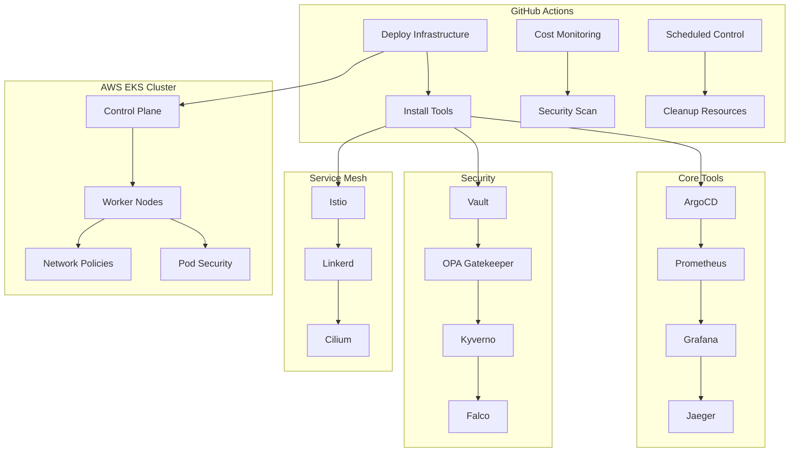

# 🚀 EKS Learning Lab

A comprehensive, cost-optimized AWS EKS learning environment with production-grade tools and automated GitHub Actions workflows.

[](https://github.com/your-repo/eks-learning-lab/actions/workflows/deploy-infrastructure.yml)
[](https://github.com/your-repo/eks-learning-lab/actions/workflows/cost-monitoring.yml)
[](https://github.com/your-repo/eks-learning-lab/actions/workflows/security-scan.yml)

## 🎯 Overview

This learning lab provides a complete EKS environment optimized for learning Kubernetes, DevOps practices, and cloud-native technologies while keeping costs ultra-low (~$45-50/month).

### 🌟 Key Features

- **💰 Cost-Optimized**: Spot instances, scheduled shutdowns, smart resource sizing
- **🔒 Security-First**: Vault, OPA Gatekeeper, Kyverno, Falco, Pod Security Standards
- **🛠️ Production Tools**: 15+ industry-standard tools for hands-on learning
- **🚀 GitOps Ready**: ArgoCD, Tekton, Argo Workflows, Flux
- **📊 Full Observability**: Prometheus, Grafana, Jaeger, ELK stack
- **🕸️ Service Mesh**: Istio, Linkerd with learning configurations
- **⚡ One-Click Deploy**: Enhanced GitHub Actions workflows
- **📚 Learning Focused**: Comprehensive guides and exercises

## 🏗️ Architecture



## 🚀 Quick Start

### Prerequisites

1. **AWS Account** with appropriate permissions
2. **GitHub Repository** for the lab
3. **GitHub Secrets** configured (see [Setup Guide](docs/DEPLOYMENT.md))

### Required GitHub Secrets

```bash
AWS_REGION=us-east-1
AWS_ROLE_ARN=arn:aws:iam::011921741593:role/GitHubActions-EKS-Deploy
AWS_ACCOUNT_ID=011921741593
```

### 1. Deploy Infrastructure

Navigate to **Actions** → **🚀 EKS Infrastructure Management**

Choose your deployment option:
- **Plan**: Review infrastructure changes
- **Apply**: Deploy the cluster  
- **Destroy**: Clean up resources

### 2. Install Tools

After successful deployment, tools are automatically installed:
- ✅ Core tools (Load Balancer, Autoscaler, Metrics Server)
- ✅ GitOps tools (ArgoCD, Tekton, Argo Workflows)
- ✅ Service Mesh (Istio, Linkerd)
- ✅ Security tools (Vault, OPA, Kyverno, Falco)
- ✅ Observability (Prometheus, Grafana, Jaeger, ELK)

### 3. Access Your Lab

```bash
# Get cluster access
aws eks update-kubeconfig --region us-east-1 --name eks-learning-lab-dev

# Access Grafana dashboard
kubectl port-forward svc/prometheus-grafana -n monitoring 3000:80

# Access ArgoCD UI
kubectl port-forward svc/argocd-server -n argocd 8080:443

# Get ArgoCD admin password
kubectl -n argocd get secret argocd-initial-admin-secret -o jsonpath="{.data.password}" | base64 -d
```

## 📊 Cost Management

### Monthly Cost Breakdown

| Service | Cost | Optimization |
|---------|------|--------------|
| EKS Control Plane | $72.00 | Fixed cost |
| EC2 Instances (Spot) | $7.30 | 70% savings vs On-Demand |
| EBS Storage (20GB) | $2.00 | GP3 volumes |
| Data Transfer | $3.00 | Minimal cross-AZ |
| **Total** | **~$84.30** | **$23.70 savings/month** |

### Additional Savings

- **Scheduled Shutdown**: 50-65% compute savings
- **Weekend Shutdown**: ~$7.80 savings per weekend
- **No NAT Gateway**: $45/month savings in dev environment

### Cost Monitoring

- 📈 Daily cost reports via GitHub Actions
- 💰 Budget alerts at 80% threshold
- 📊 Real-time cost dashboard in Grafana
- 🔍 Resource cleanup automation

## 🛠️ Installed Tools

### Core Infrastructure
- **AWS Load Balancer Controller** - ALB/NLB management
- **Cluster Autoscaler** - Dynamic node scaling
- **Metrics Server** - Resource metrics collection
- **EBS CSI Driver** - Persistent storage

### GitOps & CI/CD
- **ArgoCD** - Declarative GitOps CD
- **Argo Workflows** - Workflow orchestration
- **Tekton Pipelines** - Cloud-native CI/CD
- **Flux** - GitOps toolkit
- **Sealed Secrets** - Encrypted secrets for GitOps

### Service Mesh
- **Istio** - Complete service mesh solution
- **Linkerd** - Ultralight service mesh
- **Cilium/Hubble** - eBPF-based networking
- **Open Service Mesh** - SMI-compliant mesh

### Security
- **HashiCorp Vault** - Secret management
- **OPA Gatekeeper** - Policy enforcement
- **Kyverno** - Kubernetes-native policies
- **Falco** - Runtime security monitoring
- **Trivy Operator** - Vulnerability scanning
- **Pod Security Standards** - Built-in security

### Observability
- **Prometheus** - Metrics collection
- **Grafana** - Visualization and dashboards
- **Jaeger** - Distributed tracing
- **OpenTelemetry** - Observability data collection
- **Elasticsearch** - Log storage and search
- **Kibana** - Log analysis and visualization
- **Filebeat** - Log shipping

### Development Tools
- **Kubernetes Dashboard** - Web-based UI
- **K9s** - Terminal-based cluster management
- **Stern** - Multi-pod log streaming

## 📚 Learning Paths

### Week 1: Kubernetes Fundamentals
- [ ] Deploy sample applications
- [ ] Explore pods, services, deployments
- [ ] Practice kubectl commands
- [ ] Understand namespaces and RBAC

### Week 2: GitOps & CI/CD
- [ ] Create ArgoCD applications
- [ ] Build Tekton pipelines
- [ ] Practice GitOps workflows
- [ ] Learn about sealed secrets

### Week 3: Service Mesh
- [ ] Configure Istio traffic management
- [ ] Explore Linkerd observability
- [ ] Practice canary deployments
- [ ] Implement security policies

### Week 4: Security & Compliance
- [ ] Manage secrets with Vault
- [ ] Create OPA Gatekeeper policies
- [ ] Monitor runtime security with Falco
- [ ] Implement network policies

### Week 5: Observability
- [ ] Create custom Grafana dashboards
- [ ] Set up monitoring alerts
- [ ] Trace applications with Jaeger
- [ ] Analyze logs with ELK stack

### Week 6: Advanced Topics
- [ ] Custom resource definitions (CRDs)
- [ ] Operators and controllers
- [ ] Multi-cluster management
- [ ] Disaster recovery

## 🔧 Workflows

### Enhanced Main Workflow

The `deploy-infrastructure.yml` workflow provides complete infrastructure lifecycle management:

```yaml
# Example workflow dispatch
name: Deploy EKS Cluster
on:
  workflow_dispatch:
    inputs:
      action: [plan, apply, destroy]
      environment: [dev, staging, prod]
      auto_approve: [true, false]
```

**Features:**
- ✅ Input validation and safety checks
- ✅ Cost estimation before deployment
- ✅ Security scanning with TFSec/Checkov
- ✅ Automated tool installation
- ✅ Slack/Teams notifications
- ✅ State locking and backup

### Automated Cost Control

- 🌙 **Nightly Shutdown**: 10 PM UTC (weekdays)
- 🌅 **Morning Startup**: 6 AM UTC (weekdays)  
- 🎉 **Weekend Shutdown**: Friday 6 PM UTC
- 🔄 **Monday Startup**: Monday 8 AM UTC

## 🔐 Security Features

### Authentication & Authorization
- AWS OIDC integration (no long-lived credentials)
- Kubernetes RBAC with least privilege
- Service mesh mutual TLS
- Pod Security Standards enforcement

### Secret Management
- HashiCorp Vault for secrets
- Encrypted Terraform state
- Sealed secrets for GitOps
- Automatic secret rotation

### Network Security
- VPC with private subnets
- Security groups with minimal access
- Network policies for pod isolation
- Service mesh security policies

### Compliance & Monitoring
- Policy enforcement with OPA/Kyverno
- Runtime security monitoring with Falco
- Vulnerability scanning with Trivy
- Audit logging for all operations

## 📖 Documentation

- [📋 Deployment Guide](docs/DEPLOYMENT.md) - Complete setup instructions
- [💰 Cost Optimization](docs/COST-OPTIMIZATION.md) - Maximize savings strategies
- [🔒 Security Guide](docs/SECURITY.md) - Security best practices
- [🎓 Learning Roadmap](docs/LEARNING-ROADMAP.md) - Week-by-week progression
- [🚨 Troubleshooting](docs/TROUBLESHOOTING.md) - Common issues and solutions

## 🤝 Contributing

1. Fork the repository
2. Create a feature branch
3. Make your changes
4. Add tests and documentation
5. Submit a pull request

## 📜 License

This project is licensed under the MIT License - see the [LICENSE](LICENSE) file for details.

## 🙏 Acknowledgments

- AWS EKS team for the managed Kubernetes service
- All the amazing open-source projects included in this lab
- The Kubernetes and CNCF communities

## 📞 Support

- 📖 [Documentation](docs/)
- 🐛 [Issues](https://github.com/your-repo/eks-learning-lab/issues)
- 💬 [Discussions](https://github.com/your-repo/eks-learning-lab/discussions)

---

**⭐ Star this repository if you find it helpful for your Kubernetes learning journey!**

Made with ❤️ for the Kubernetes community