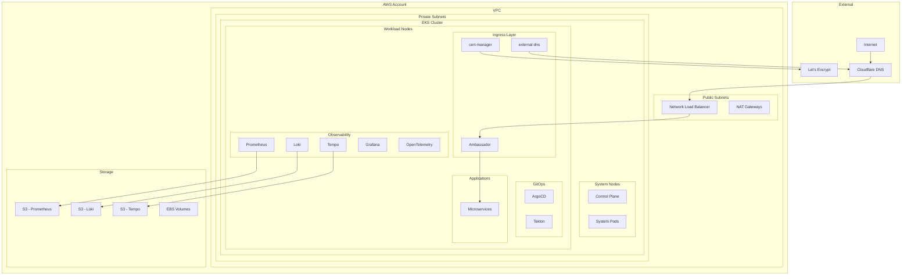
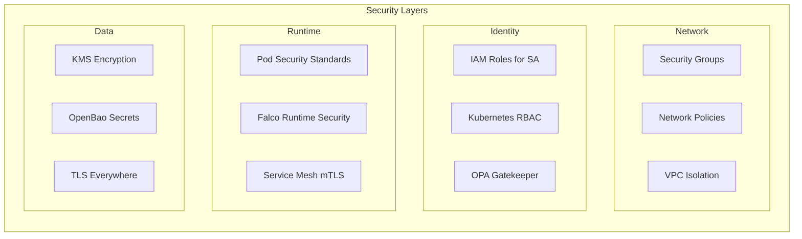
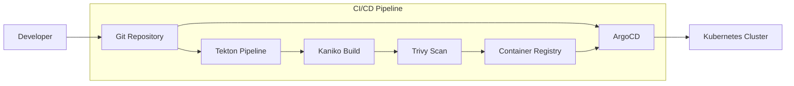
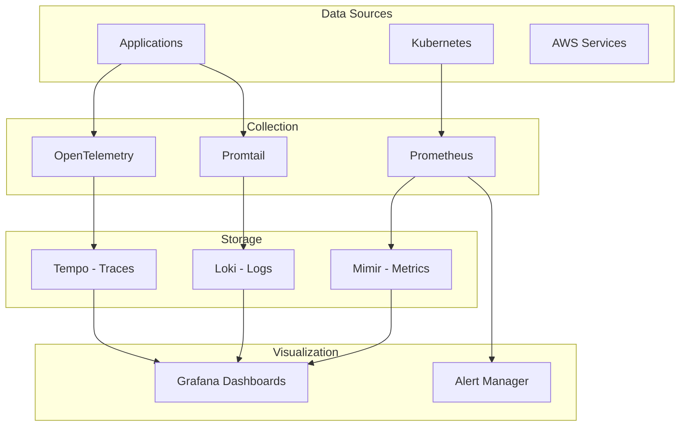

# 🏗️ EKS Platform Architecture

## Overview

This platform implements a comprehensive, production-ready Kubernetes infrastructure on AWS EKS following cloud-native best practices and the 7-workflow deployment pattern.

## 🎯 Architecture Principles

- **Security First**: Zero-trust networking, IRSA, mTLS, policy enforcement
- **Observability Native**: Complete LGTM stack with OpenTelemetry
- **GitOps Ready**: Declarative configuration management
- **Cost Optimized**: Spot instances, lifecycle policies, right-sizing
- **Highly Available**: Multi-AZ deployment with auto-scaling

## 🏗️ High-Level Architecture



## 🔄 Workflow Architecture

### Workflow 1: Foundation Platform
**Purpose**: Core infrastructure and EKS cluster

**Components**:
- **VPC**: Multi-AZ with public/private subnets
- **EKS Cluster**: Managed control plane (v1.28)
- **Node Groups**: System (on-demand) + Workload (spot)
- **IAM**: IRSA roles for all components
- **Add-ons**: VPC-CNI, EBS CSI, CoreDNS, kube-proxy

**Key Features**:
- Spot instances for 60-70% cost savings
- Cluster autoscaler for dynamic scaling
- KMS encryption for secrets
- CloudWatch logging

### Workflow 2: Ingress + API Gateway
**Purpose**: External access and SSL termination

**Components**:
- **Ambassador**: API Gateway with advanced routing
- **cert-manager**: Automatic SSL certificate management
- **external-dns**: DNS record automation via Cloudflare
- **Network Load Balancer**: L4 load balancing

**Key Features**:
- Automatic SSL certificate provisioning
- DNS automation with Cloudflare
- Rate limiting and circuit breakers
- Developer portal integration

### Workflow 3: LGTM Observability Stack
**Purpose**: Complete observability with OpenTelemetry

**Components**:
- **Prometheus**: Metrics collection and alerting
- **Mimir**: Long-term metrics storage (S3)
- **Loki**: Log aggregation and querying (S3)
- **Tempo**: Distributed tracing (S3)
- **Grafana**: Unified visualization
- **OpenTelemetry**: Auto-instrumentation

**Key Features**:
- S3 lifecycle policies for cost optimization
- OpenTelemetry auto-instrumentation for Java
- Unified dashboards and alerting
- Long-term storage with compression

### Workflow 4: GitOps & CI/CD
**Purpose**: Automated deployment and pipeline management

**Components**:
- **ArgoCD**: GitOps application deployment
- **Tekton**: Cloud-native CI/CD pipelines
- **Kaniko**: Container image builds
- **Trivy**: Security vulnerability scanning

**Key Features**:
- Application of Applications pattern
- Automated security scanning
- Container image optimization
- GitHub webhook integration

## 🔐 Security Architecture

### Network Security


### Security Controls
- **Zero Trust**: All communication encrypted with mTLS
- **Least Privilege**: IRSA with minimal required permissions
- **Policy Enforcement**: OPA Gatekeeper for compliance
- **Runtime Security**: Falco for anomaly detection
- **Secrets Management**: External secrets with OpenBao

## 📊 Data Flow Architecture

### Metrics Flow
```
Applications → OpenTelemetry Collector → Prometheus → Mimir (S3)
                                      ↓
                                   Grafana Dashboards
```

### Logs Flow
```
Applications → Promtail → Loki → S3 Storage
                        ↓
                   Grafana Queries
```

### Traces Flow
```
Applications → OpenTelemetry Collector → Tempo → S3 Storage
                                              ↓
                                         Grafana Tracing
```

## 🚀 Deployment Architecture

### GitOps Flow


### Application Deployment Pattern
1. **Code Push**: Developer pushes to Git
2. **CI Pipeline**: Tekton builds and scans
3. **Image Push**: Secure container registry
4. **GitOps Sync**: ArgoCD deploys to cluster
5. **Health Check**: Automated verification
6. **Observability**: Automatic instrumentation

## 💰 Cost Architecture

### Cost Optimization Strategies
- **Compute**: 80% spot instances, cluster autoscaler
- **Storage**: S3 lifecycle policies, intelligent tiering
- **Network**: Single NAT gateway (dev), VPC endpoints
- **Observability**: Data compression, retention policies

### Resource Allocation
```yaml
Total Cluster Capacity: 6-20 CPU cores, 24-80GB RAM

Resource Distribution:
  System Overhead: 15% (Kubernetes system pods)
  Platform Services: 45% (Observability, ingress, GitOps)
  Applications: 35% (Microservices workloads)
  Scaling Buffer: 5% (Auto-scaling headroom)
```

## 🔄 Scaling Architecture

### Horizontal Scaling
- **Cluster Autoscaler**: Automatic node scaling
- **HPA**: Pod-level auto-scaling
- **VPA**: Vertical resource optimization
- **Application Scaling**: Load-based scaling

### Vertical Scaling
- **Node Instance Types**: t3.large → t3.xlarge → m5.large
- **Storage Scaling**: EBS volume expansion
- **Network Scaling**: Multiple AZ distribution

## 🌐 Multi-Environment Architecture

### Environment Progression
```
Development → Staging → Production
    ↓           ↓          ↓
  Relaxed   Production-  Maximum
  Security    like      Security
```

### Environment Differences
- **Dev**: Single NAT, relaxed policies, debug logging
- **Staging**: Production-like, testing capabilities
- **Prod**: Multi-AZ, strict security, audit logging

## 🔍 Monitoring Architecture

### Observability Stack Integration


## 🛡️ Disaster Recovery Architecture

### Backup Strategy
- **Cluster State**: Regular etcd backups
- **Application Data**: Database backups to S3
- **Configuration**: GitOps repository versioning
- **Observability Data**: S3 cross-region replication

### Recovery Procedures
1. **Infrastructure**: Terraform state restoration
2. **Applications**: GitOps repository sync
3. **Data**: S3 backup restoration
4. **Verification**: Automated health checks

This architecture provides a robust, scalable, and cost-effective platform for running modern cloud-native applications with enterprise-grade observability, security, and operational capabilities.