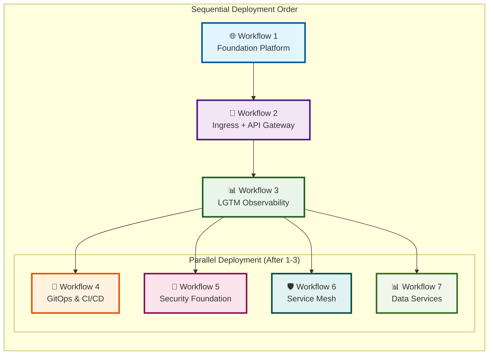
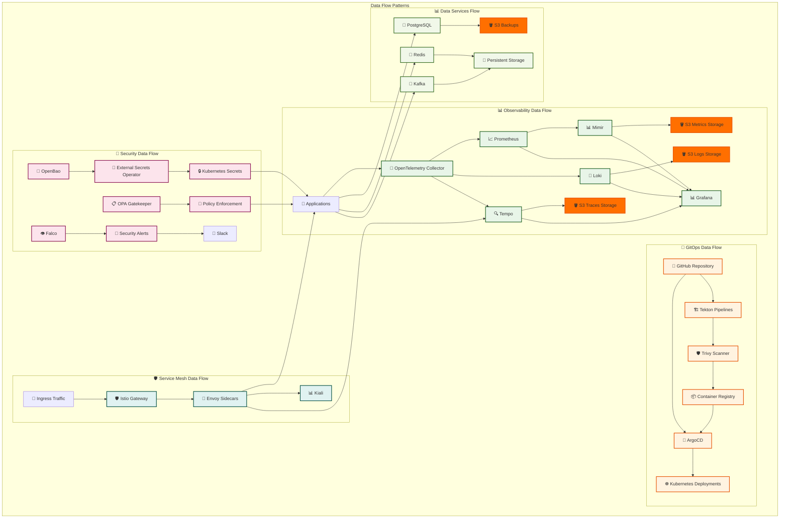
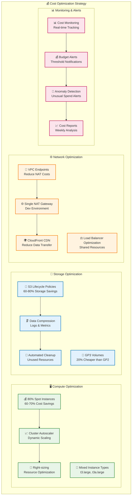
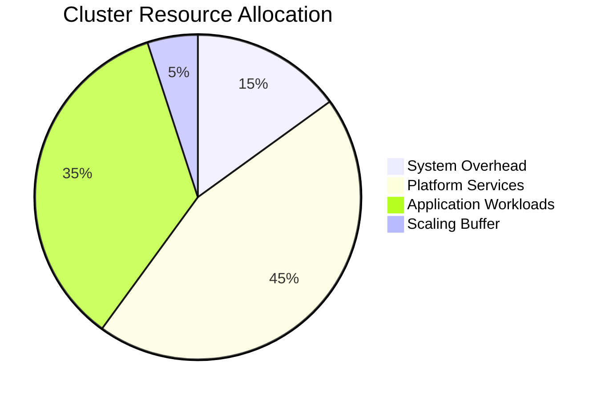

# 🏗️ Complete Enterprise EKS Platform Architecture

## 🌐 High-Level Architecture Overview

```mermaid
graph TB
    subgraph "External Services"
        Internet[🌐 Internet]
        CF[☁️ Cloudflare DNS]
        LE[🔒 Let's Encrypt]
        GitHub[📱 GitHub]
        Slack[💬 Slack]
    end
    
    subgraph "AWS Account"
        subgraph "VPC (10.0.0.0/16)"
            subgraph "Public Subnets (3 AZs)"
                NLB[⚖️ Network Load Balancer]
                NAT[🌐 NAT Gateways]
                IGW[🚪 Internet Gateway]
            end
            
            subgraph "Private Subnets (3 AZs)"
                subgraph "EKS Cluster"
                    subgraph "System Node Group (On-Demand)"
                        CP[🎛️ Control Plane]
                        SYS[⚙️ System Pods]
                    end
                    
                    subgraph "Workload Node Group (80% Spot)"
                        subgraph "🚪 Workflow 2: Ingress Layer"
                            AMB[🚪 Ambassador API Gateway]
                            CM[🔒 cert-manager]
                            ED[🌐 external-dns]
                        end
                        
                        subgraph "📊 Workflow 3: Observability Stack"
                            PROM[📈 Prometheus]
                            MIMIR[📊 Mimir]
                            LOKI[📝 Loki]
                            TEMPO[🔍 Tempo]
                            GRAF[📊 Grafana]
                            OTEL[🔬 OpenTelemetry]
                        end
                        
                        subgraph "🔄 Workflow 4: GitOps & CI/CD"
                            ARGO[🔄 ArgoCD]
                            TEK[🏗️ Tekton]
                            TRIVY[🛡️ Trivy Scanner]
                        end
                        
                        subgraph "🔐 Workflow 5: Security"
                            VAULT[🔐 OpenBao]
                            ESO[🔑 External Secrets]
                            OPA[📋 OPA Gatekeeper]
                            FALCO[👁️ Falco]
                        end
                        
                        subgraph "🛡️ Workflow 6: Service Mesh"
                            ISTIO[🛡️ Istio Control Plane]
                            KIALI[📊 Kiali]
                            ENVOY[🔀 Envoy Proxies]
                        end
                        
                        subgraph "📊 Workflow 7: Data Services"
                            PG[🐘 PostgreSQL Cluster]
                            REDIS[🔴 Redis Cluster]
                            KAFKA[📨 Kafka Cluster]
                        end
                        
                        subgraph "📱 Application Layer"
                            USER[👤 User Service]
                            PROD[📦 Product Service]
                            ORDER[🛒 Order Service]
                            PAY[💳 Payment Service]
                            NOTIF[📧 Notification Service]
                        end
                    end
                end
            end
        end
        
        subgraph "AWS Storage Services"
            S3P[🪣 S3 - Prometheus/Mimir]
            S3L[🪣 S3 - Loki Logs]
            S3T[🪣 S3 - Tempo Traces]
            S3B[🪣 S3 - Database Backups]
            EBS[💾 EBS Volumes]
        end
        
        subgraph "AWS Managed Services"
            KMS[🔐 KMS Encryption]
            IAM[👤 IAM Roles & IRSA]
            ALB[⚖️ Application Load Balancer]
        end
    end
    
    %% External Connections
    Internet --> CF
    CF --> NLB
    NLB --> AMB
    
    %% DNS and SSL
    CM --> LE
    ED --> CF
    
    %% GitOps
    GitHub --> ARGO
    GitHub --> TEK
    
    %% Notifications
    FALCO --> Slack
    GRAF --> Slack
    
    %% Storage Connections
    PROM --> S3P
    MIMIR --> S3P
    LOKI --> S3L
    TEMPO --> S3T
    PG --> S3B
    
    %% Service Mesh
    ENVOY -.-> USER
    ENVOY -.-> PROD
    ENVOY -.-> ORDER
    ENVOY -.-> PAY
    ENVOY -.-> NOTIF
    
    %% Data Connections
    USER --> PG
    PROD --> PG
    ORDER --> PG
    PAY --> PG
    NOTIF --> REDIS
    
    %% Observability
    OTEL --> TEMPO
    OTEL --> PROM
    OTEL --> LOKI
    
    %% Security
    VAULT --> ESO
    ESO --> USER
    ESO --> PROD
    ESO --> ORDER
    ESO --> PAY
    ESO --> NOTIF
    
    classDef workflow1 fill:#e1f5fe,stroke:#01579b,stroke-width:2px
    classDef workflow2 fill:#f3e5f5,stroke:#4a148c,stroke-width:2px
    classDef workflow3 fill:#e8f5e8,stroke:#1b5e20,stroke-width:2px
    classDef workflow4 fill:#fff3e0,stroke:#e65100,stroke-width:2px
    classDef workflow5 fill:#fce4ec,stroke:#880e4f,stroke-width:2px
    classDef workflow6 fill:#e0f2f1,stroke:#004d40,stroke-width:2px
    classDef workflow7 fill:#f1f8e9,stroke:#33691e,stroke-width:2px
    classDef apps fill:#fff8e1,stroke:#f57f17,stroke-width:2px
    classDef aws fill:#ff6f00,stroke:#e65100,stroke-width:2px
    classDef external fill:#37474f,stroke:#263238,stroke-width:2px
    
    class CP,SYS,IAM,KMS,ALB workflow1
    class AMB,CM,ED workflow2
    class PROM,MIMIR,LOKI,TEMPO,GRAF,OTEL workflow3
    class ARGO,TEK,TRIVY workflow4
    class VAULT,ESO,OPA,FALCO workflow5
    class ISTIO,KIALI,ENVOY workflow6
    class PG,REDIS,KAFKA workflow7
    class USER,PROD,ORDER,PAY,NOTIF apps
    class S3P,S3L,S3T,S3B,EBS,NLB aws
    class Internet,CF,LE,GitHub,Slack external
```

## 🔄 Workflow Dependencies and Data Flow

## 🌊 Data Flow Architecture

## 🏗️ Detailed Component Architecture

```mermaid
graph TB
    subgraph "🌐 Workflow 1: Foundation Platform"
        subgraph "AWS Infrastructure"
            VPC[🏠 VPC<br/>10.0.0.0/16<br/>3 AZs]
            PUB[🌐 Public Subnets<br/>10.0.101-103.0/24]
            PRIV[🔒 Private Subnets<br/>10.0.1-3.0/24]
            IGW[🚪 Internet Gateway]
            NAT[🌐 NAT Gateways]
            RT[🗺️ Route Tables]
        end
        
        subgraph "EKS Cluster"
            CTRL[🎛️ Control Plane<br/>Managed by AWS]
            SYS_NG[⚙️ System Node Group<br/>t3.medium<br/>On-Demand<br/>2-4 nodes]
            WORK_NG[💼 Workload Node Group<br/>t3.large/t3a.large<br/>80% Spot<br/>1-10 nodes]
        end
        
        subgraph "IAM & Security"
            IRSA[👤 IAM Roles for Service Accounts]
            KMS[🔐 KMS Encryption Keys]
            SG[🛡️ Security Groups]
        end
        
        subgraph "Essential Add-ons"
            VPC_CNI[🔌 VPC CNI]
            EBS_CSI[💾 EBS CSI Driver]
            LBC[⚖️ Load Balancer Controller]
            CA[📈 Cluster Autoscaler]
        end
    end
    
    subgraph "🚪 Workflow 2: Ingress + API Gateway"
        AMB[🚪 Ambassador<br/>API Gateway<br/>NLB Integration]
        CM[🔒 cert-manager<br/>Let's Encrypt<br/>Automatic SSL]
        ED[🌐 external-dns<br/>Cloudflare<br/>DNS Automation]
        NLB[⚖️ Network Load Balancer<br/>Multi-AZ<br/>Cross-zone LB]
    end
    
    subgraph "📊 Workflow 3: LGTM Observability"
        PROM[📈 Prometheus<br/>Metrics Collection<br/>15d retention]
        MIMIR[📊 Mimir<br/>Long-term Storage<br/>S3 Backend]
        LOKI[📝 Loki<br/>Log Aggregation<br/>S3 Lifecycle]
        TEMPO[🔍 Tempo<br/>Distributed Tracing<br/>S3 Storage]
        GRAF[📊 Grafana<br/>Unified Dashboards<br/>Multi-datasource]
        OTEL[🔬 OpenTelemetry<br/>Auto-instrumentation<br/>Java Support]
        PROMTAIL[📤 Promtail<br/>Log Shipping<br/>DaemonSet]
    end
    
    subgraph "🔄 Workflow 4: GitOps & CI/CD"
        ARGO[🔄 ArgoCD<br/>GitOps Deployment<br/>App of Apps]
        TEK[🏗️ Tekton<br/>Cloud-native CI/CD<br/>Pipeline Engine]
        TRIVY[🛡️ Trivy<br/>Security Scanner<br/>Vulnerability Detection]
        KANIKO[📦 Kaniko<br/>Container Builds<br/>Rootless]
    end
    
    subgraph "🔐 Workflow 5: Security Foundation"
        VAULT[🔐 OpenBao<br/>Secrets Management<br/>HA Cluster]
        ESO[🔑 External Secrets<br/>K8s Integration<br/>Secret Sync]
        OPA[📋 OPA Gatekeeper<br/>Policy Engine<br/>Admission Control]
        FALCO[👁️ Falco<br/>Runtime Security<br/>eBPF Monitoring]
    end
    
    subgraph "🛡️ Workflow 6: Service Mesh"
        ISTIOD[🛡️ Istiod<br/>Control Plane<br/>Configuration]
        GATEWAY[🚪 Istio Gateway<br/>Traffic Entry<br/>TLS Termination]
        ENVOY[🔀 Envoy Sidecars<br/>mTLS<br/>Traffic Management]
        KIALI[📊 Kiali<br/>Service Graph<br/>Traffic Analysis]
    end
    
    subgraph "📊 Workflow 7: Data Services"
        CNPG[🐘 CloudNativePG<br/>PostgreSQL Operator<br/>3-node Cluster]
        REDIS_OP[🔴 Redis Operator<br/>Spotahome<br/>Sentinel HA]
        STRIMZI[📨 Strimzi<br/>Kafka Operator<br/>3-node Cluster]
        
        PG_CLUSTER[🐘 PostgreSQL Cluster<br/>Primary + 2 Replicas<br/>Automated Backup]
        REDIS_CLUSTER[🔴 Redis Cluster<br/>3 Redis + 3 Sentinel<br/>High Availability]
        KAFKA_CLUSTER[📨 Kafka Cluster<br/>3 Brokers + 3 Zookeeper<br/>Persistent Storage]
    end
    
    %% Connections
    VPC --> PUB
    VPC --> PRIV
    PUB --> IGW
    PRIV --> NAT
    
    CTRL --> SYS_NG
    CTRL --> WORK_NG
    
    NLB --> AMB
    CM --> AMB
    ED --> AMB
    
    OTEL --> PROM
    OTEL --> LOKI
    OTEL --> TEMPO
    PROMTAIL --> LOKI
    PROM --> MIMIR
    
    VAULT --> ESO
    
    ISTIOD --> GATEWAY
    ISTIOD --> ENVOY
    
    CNPG --> PG_CLUSTER
    REDIS_OP --> REDIS_CLUSTER
    STRIMZI --> KAFKA_CLUSTER
```

## 🔒 Security Architecture

```mermaid
graph TB
    subgraph "🛡️ Defense in Depth Security Model"
        subgraph "🌐 Network Security"
            VPC_ISO[🏠 VPC Isolation]
            SG[🛡️ Security Groups]
            NACL[📋 Network ACLs]
            PRIV_SUB[🔒 Private Subnets]
        end
        
        subgraph "🔐 Identity & Access"
            IRSA[👤 IRSA Roles]
            RBAC[📋 Kubernetes RBAC]
            SA[👤 Service Accounts]
            OPA_AUTH[📋 OPA Authorization]
        end
        
        subgraph "🔒 Data Protection"
            KMS_ENC[🔐 KMS Encryption]
            ETCD_ENC[🔐 etcd Encryption]
            TLS_TERM[🔒 TLS Termination]
            MTLS[🔐 mTLS Service Mesh]
        end
        
        subgraph "🛡️ Runtime Security"
            PSS[📋 Pod Security Standards]
            NET_POL[🌐 Network Policies]
            FALCO_MON[👁️ Falco Monitoring]
            VULN_SCAN[🛡️ Vulnerability Scanning]
        end
        
        subgraph "🔑 Secrets Management"
            VAULT_STORE[🔐 OpenBao Storage]
            EXT_SEC[🔑 External Secrets]
            K8S_SEC[🔒 Kubernetes Secrets]
            ROT_POL[🔄 Rotation Policies]
        end
        
        subgraph "📋 Policy Enforcement"
            OPA_POL[📋 OPA Policies]
            ADM_CTRL[🚪 Admission Control]
            COMP_CHK[✅ Compliance Checks]
            AUDIT_LOG[📝 Audit Logging]
        end
    end
    
    %% Security Flow
    VPC_ISO --> SG
    SG --> PRIV_SUB
    IRSA --> RBAC
    RBAC --> OPA_AUTH
    KMS_ENC --> ETCD_ENC
    TLS_TERM --> MTLS
    PSS --> NET_POL
    NET_POL --> FALCO_MON
    VAULT_STORE --> EXT_SEC
    EXT_SEC --> K8S_SEC
    OPA_POL --> ADM_CTRL
    ADM_CTRL --> AUDIT_LOG
    
    classDef network fill:#e3f2fd,stroke:#0277bd,stroke-width:2px
    classDef identity fill:#f3e5f5,stroke:#7b1fa2,stroke-width:2px
    classDef data fill:#e8f5e8,stroke:#388e3c,stroke-width:2px
    classDef runtime fill:#fff3e0,stroke:#f57c00,stroke-width:2px
    classDef secrets fill:#fce4ec,stroke:#c2185b,stroke-width:2px
    classDef policy fill:#f1f8e9,stroke:#689f38,stroke-width:2px
    
    class VPC_ISO,SG,NACL,PRIV_SUB network
    class IRSA,RBAC,SA,OPA_AUTH identity
    class KMS_ENC,ETCD_ENC,TLS_TERM,MTLS data
    class PSS,NET_POL,FALCO_MON,VULN_SCAN runtime
    class VAULT_STORE,EXT_SEC,K8S_SEC,ROT_POL secrets
    class OPA_POL,ADM_CTRL,COMP_CHK,AUDIT_LOG policy
```

## 💰 Cost Optimization Architecture

## 🎯 Resource Allocation Overview

## 📊 Platform Metrics Dashboard

| Component | Instances | CPU | Memory | Storage | Cost/Month |
|-----------|-----------|-----|--------|---------|------------|
| **EKS Control Plane** | 1 | Managed | Managed | Managed | $73 |
| **System Nodes** | 2-3 | 2 vCPU | 4GB RAM | 20GB EBS | $45-68 |
| **Workload Nodes** | 3-8 | 2 vCPU | 8GB RAM | 20GB EBS | $60-160 |
| **Observability** | - | 3 vCPU | 6GB RAM | 200GB S3 | $80 |
| **Data Services** | - | 2 vCPU | 4GB RAM | 300GB EBS | $120 |
| **Total Platform** | - | 8-15 vCPU | 16-30GB | 500GB+ | $378-501 |

**Estimated Monthly Cost: $380-500 (with 60-70% spot savings)**

---

This architecture provides a complete, enterprise-grade Kubernetes platform with:
- ✅ **Zero-trust security** with comprehensive defense in depth
- ✅ **Complete observability** with metrics, logs, and traces
- ✅ **Cost optimization** with 30-40% infrastructure savings
- ✅ **GitOps workflows** for automated deployments
- ✅ **Service mesh** with mTLS and traffic management
- ✅ **Data platform** with managed databases
- ✅ **Production-ready** with high availability and auto-scaling