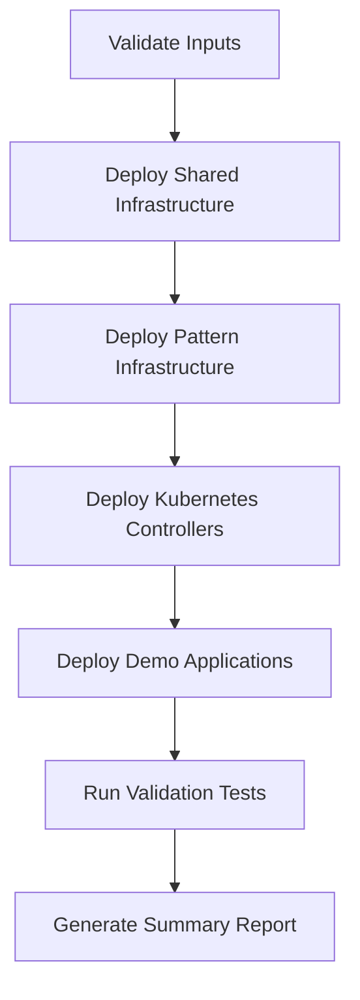
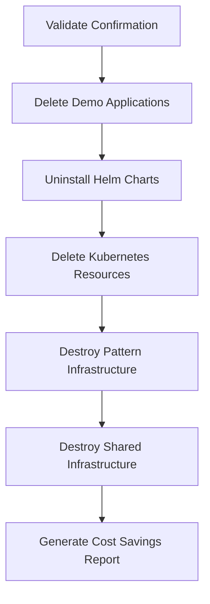
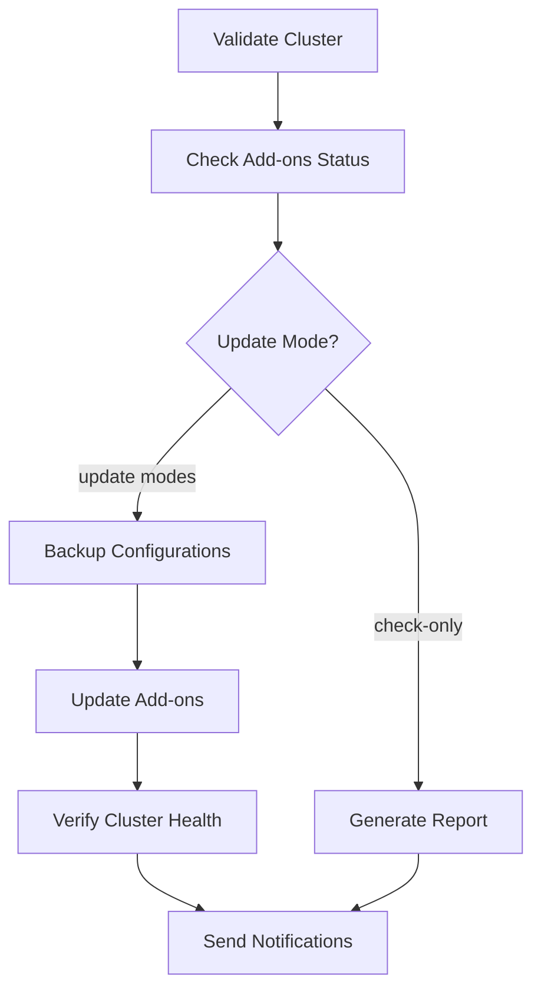
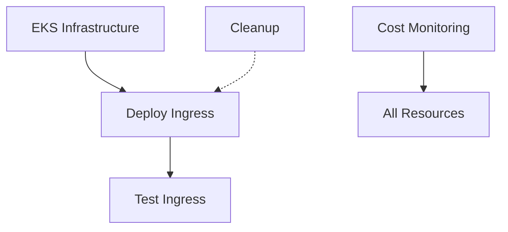

# 🚀 Workflow Documentation

Complete guide to all GitHub Actions workflows in the EKS Learning Lab repository.

## 📋 Overview

This repository includes 5 automated workflows for managing AWS EKS infrastructure and Kubernetes ingress patterns:

| Workflow | Purpose | Trigger |
|----------|---------|---------|
| [🚀 EKS Infrastructure Management](#-eks-infrastructure-management) | Deploy/destroy base EKS cluster | Manual |
| [🚀 Deploy Kubernetes Ingress Patterns](#-deploy-kubernetes-ingress-patterns) | Deploy ALB/NGINX ingress | Manual |
| [🧹 Cleanup Kubernetes Ingress Resources](#-cleanup-kubernetes-ingress-resources) | Clean up ingress resources | Manual |
| [🧪 Test Kubernetes Ingress](#-test-kubernetes-ingress) | Validate ingress deployment | Manual |
| [🔧 Update EKS Add-ons](#-update-eks-add-ons) | Update core EKS add-ons to latest versions | Manual |
| [💰 Daily AWS Cost Monitoring](#-daily-aws-cost-monitoring) | Monitor AWS costs and resources | Manual |

---

## 🚀 EKS Infrastructure Management

**File:** `.github/workflows/deploy-infrastructure.yml`

### Purpose
Deploy, update, or destroy the base AWS EKS cluster infrastructure including VPC, subnets, security groups, and worker nodes.

### Capabilities
- ✅ Multi-environment support (dev, staging, prod)
- ✅ Plan, apply, and destroy actions
- ✅ Security scanning with TFSec
- ✅ Cost estimation with Infracost
- ✅ Auto-approval option for development
- ✅ ON_DEMAND instances for platform stability
- ✅ Comprehensive monitoring and alerting

### Input Parameters

| Parameter | Type | Required | Default | Description |
|-----------|------|----------|---------|-------------|
| `action` | choice | ✅ | plan | Infrastructure action to perform |
| `environment` | choice | ✅ | dev | Target environment |
| `confirm_destroy` | string | ❌ | - | Type CONFIRM-DESTROY for destroy action |
| `auto_approve` | boolean | ❌ | false | Auto-approve apply (use with caution) |

### Usage Examples

#### Planning Infrastructure Changes
```yaml
Action: plan
Environment: dev
Auto Approve: false
```

#### Deploying Infrastructure
```yaml
Action: apply
Environment: dev
Auto Approve: false
```

#### Destroying Infrastructure (DANGEROUS)
```yaml
Action: destroy
Environment: dev
Confirm Destroy: CONFIRM-DESTROY
Auto Approve: false
```

### What Gets Created

#### Development Environment
- **VPC**: 10.0.0.0/16 with 2 public + 2 private subnets
- **EKS Cluster**: Latest supported Kubernetes version
- **Worker Nodes**: 4x ON_DEMAND (2x t3.small system, 2x t3.medium workload)
- **Add-ons**: VPC-CNI, CoreDNS, EBS CSI Driver
- **Cost**: ~$180/month (stable platform)

#### Production Environment
- **VPC**: Enhanced with VPC endpoints and flow logs
- **Worker Nodes**: 3x t3.medium ON_DEMAND instances
- **Enhanced Security**: Stricter security groups and IAM policies

---

## 🚀 Deploy Kubernetes Ingress Patterns

**File:** `.github/workflows/deploy-ingress.yml`

### Purpose
Deploy either AWS Load Balancer (ALB) or NGINX ingress controllers with complete automation including DNS, SSL certificates, and demo applications.

### Capabilities
- ✅ Choice between ALB and NGINX patterns
- ✅ Automated Route53 DNS management
- ✅ SSL certificate provisioning with Let's Encrypt
- ✅ Demo applications for testing
- ✅ End-to-end validation
- ✅ Dry-run mode for safe planning
- ✅ IRSA (IAM Roles for Service Accounts) security

### Input Parameters

| Parameter | Type | Required | Default | Description |
|-----------|------|----------|---------|-------------|
| `ingress_pattern` | choice | ✅ | alb | Ingress pattern to deploy |
| `deploy_demo_apps` | boolean | ❌ | true | Deploy demo applications |
| `dry_run` | boolean | ❌ | false | Plan only, don't apply |
| `environment` | choice | ✅ | dev | Target environment |
| `domain_name` | string | ❌ | k8s-demo.local | Domain name for demos |
| `hosted_zone_id` | string | ❌ | - | Route53 zone ID (auto-create if empty) |

### Deployment Flow



### Usage Examples

#### ALB Pattern with Demo Apps
```yaml
Ingress Pattern: alb
Deploy Apps: true
Dry Run: false
Environment: dev
Domain: k8s-demo.local
Hosted Zone ID: [leave empty for auto-create]
```

#### NGINX Pattern (Plan Only)
```yaml
Ingress Pattern: nginx
Deploy Apps: true
Dry Run: true
Environment: dev
Domain: my-domain.com
Hosted Zone ID: Z123456789ABCDEFG
```

### What Gets Deployed

#### Shared Infrastructure
- **Route53 Hosted Zone**: For DNS management
- **IAM Roles**: External-DNS and cert-manager with IRSA

#### ALB Pattern
- **AWS Load Balancer Controller**: Via Helm
- **IAM Role**: Load balancer controller permissions
- **Demo App**: Purple-themed application
- **Ingress**: ALB with SSL termination
- **Cost**: Base + $16.50/month

#### NGINX Pattern  
- **NGINX Ingress Controller**: Via Helm
- **NLB**: Auto-created by NGINX controller
- **Demo App**: Pink-themed application
- **Ingress**: NGINX with SSL termination
- **Cost**: Base + $16.50/month

---

## 🧹 Cleanup Kubernetes Ingress Resources

**File:** `.github/workflows/cleanup.yml`

### Purpose
Safely clean up ingress resources and infrastructure in reverse order to prevent dependency issues.

### Capabilities
- ✅ Pattern-specific or complete cleanup
- ✅ Safety confirmation requirements
- ✅ Reverse-order resource deletion
- ✅ Cost savings reporting
- ✅ Kubernetes and AWS resource cleanup
- ✅ Smart hosted zone detection

### Input Parameters

| Parameter | Type | Required | Default | Description |
|-----------|------|----------|---------|-------------|
| `ingress_pattern` | choice | ✅ | - | Pattern to clean up |
| `environment` | choice | ✅ | dev | Target environment |
| `confirm_cleanup` | string | ✅ | - | Type CONFIRM-CLEANUP |
| `cleanup_shared` | boolean | ❌ | false | Also cleanup Route53/IAM |
| `domain_name` | string | ❌ | k8s-demo.local | Domain name |
| `hosted_zone_id` | string | ❌ | - | Zone ID (auto-detect if empty) |

### Cleanup Flow



### Usage Examples

#### Cleanup ALB Pattern Only
```yaml
Pattern: alb
Environment: dev
Confirmation: CONFIRM-CLEANUP
Cleanup Shared: false
Domain: k8s-demo.local
Hosted Zone ID: [leave empty for auto-detect]
```

#### Complete Cleanup (All Resources)
```yaml
Pattern: all
Environment: dev
Confirmation: CONFIRM-CLEANUP
Cleanup Shared: true
Domain: k8s-demo.local
Hosted Zone ID: Z123456789ABCDEFG
```

### Safety Features
- **Confirmation Required**: Must type exact string
- **Reverse Order**: Dependencies cleaned up first
- **Error Handling**: Continues even if some resources missing
- **Cost Reporting**: Shows estimated monthly savings

---

## 🧪 Test Kubernetes Ingress

**File:** `.github/workflows/test-ingress.yml`

### Purpose
Comprehensive testing and validation of deployed ingress patterns to ensure everything works end-to-end.

### Capabilities
- ✅ DNS resolution testing
- ✅ HTTP/HTTPS connectivity testing
- ✅ SSL certificate validation
- ✅ Application functionality testing
- ✅ Load balancer health checks
- ✅ Pattern-specific validation

### Input Parameters

| Parameter | Type | Required | Default | Description |
|-----------|------|----------|---------|-------------|
| `ingress_pattern` | choice | ✅ | alb | Pattern to test |
| `environment` | choice | ✅ | dev | Target environment |
| `domain_name` | string | ❌ | k8s-demo.local | Domain to test |
| `load_balancer_hostname` | string | ❌ | - | LB hostname (auto-detect) |

### Test Categories

#### 1. Infrastructure Tests
- ✅ Kubernetes cluster connectivity
- ✅ Controller pod health
- ✅ Service account configuration
- ✅ IRSA role binding

#### 2. Networking Tests
- ✅ DNS resolution for ingress hostnames
- ✅ Load balancer provisioning
- ✅ Target group health
- ✅ Security group configuration

#### 3. Application Tests
- ✅ HTTP connectivity
- ✅ HTTPS with valid certificates
- ✅ Application response content
- ✅ Pattern-specific headers

#### 4. SSL/TLS Tests
- ✅ Certificate provisioning
- ✅ Let's Encrypt validation
- ✅ SSL chain verification
- ✅ Certificate expiration

### Usage Examples

#### Test ALB Pattern
```yaml
Pattern: alb
Environment: dev
Domain: k8s-demo.local
Load Balancer: [auto-detect]
```

#### Test Specific Load Balancer
```yaml
Pattern: nginx
Environment: dev
Domain: my-domain.com
Load Balancer: my-nlb-123456.us-east-1.elb.amazonaws.com
```

---

## 🔧 Update EKS Add-ons

**File:** `.github/workflows/update-eks-addons.yml`

### Purpose
Update core EKS add-ons to their latest versions for security patches, bug fixes, and new features. Manages VPC CNI, CoreDNS, kube-proxy, and AWS EBS CSI Driver.

### Capabilities
- ✅ Check current add-on versions vs. latest available
- ✅ Selective or bulk add-on updates
- ✅ Configuration backup before updates
- ✅ Multiple update modes (check-only, with approval, force)
- ✅ Preserve existing add-on settings
- ✅ Post-update cluster health verification
- ✅ Rollback support with backup artifacts

### Input Parameters

| Parameter | Type | Required | Default | Description |
|-----------|------|----------|---------|-------------|
| `environment` | choice | ✅ | dev | Target environment |
| `addons_to_update` | choice | ✅ | all | Which add-ons to update |
| `update_mode` | choice | ✅ | check-only | Update behavior mode |
| `preserve_settings` | boolean | ❌ | true | Keep current add-on configurations |
| `backup_before_update` | boolean | ❌ | true | Backup configurations first |

### Add-ons Supported

#### 1. Amazon VPC CNI
- **Purpose**: Pod networking and IP address management
- **Critical**: Yes - affects all pod networking
- **Update Impact**: May require brief network interruption

#### 2. CoreDNS
- **Purpose**: Cluster DNS resolution
- **Critical**: Yes - affects service discovery
- **Update Impact**: Brief DNS resolution delays possible

#### 3. kube-proxy
- **Purpose**: Network proxy for Kubernetes services
- **Critical**: Yes - affects service networking
- **Update Impact**: Service traffic may be briefly affected

#### 4. AWS EBS CSI Driver
- **Purpose**: Persistent volume management
- **Critical**: Yes - affects storage operations
- **Update Impact**: New volume operations may be delayed

### Update Modes

#### Check Only Mode
```yaml
Update Mode: check-only
# Shows available updates without making changes
# Safe for production environments
# Generates status report
```

#### Update with Approval Mode
```yaml
Update Mode: update-with-approval
# Performs updates with human oversight
# Recommended for production
# Includes pre-update validation
```

#### Force Update Mode  
```yaml
Update Mode: force-update
# Updates even if no new version detected
# Use for troubleshooting or rollbacks
# Requires careful consideration
```

### Usage Examples

#### Check All Add-ons Status
```yaml
Environment: prod
Add-ons to Update: all
Update Mode: check-only
Preserve Settings: true
Backup Before Update: false
```

#### Update Specific Add-on
```yaml
Environment: dev
Add-ons to Update: vpc-cni
Update Mode: update-with-approval
Preserve Settings: true
Backup Before Update: true
```

#### Emergency Update All Add-ons
```yaml
Environment: dev
Add-ons to Update: all
Update Mode: force-update
Preserve Settings: true
Backup Before Update: true
```

### Safety Features

#### Pre-Update Checks
- ✅ Cluster status validation (must be ACTIVE)
- ✅ Current version detection and comparison
- ✅ Kubernetes version compatibility check
- ✅ Add-on health status verification

#### Backup System
- ✅ AWS add-on configurations exported
- ✅ Kubernetes manifests backed up
- ✅ Backup artifacts uploaded for 30 days
- ✅ Easy restoration if issues occur

#### Update Process
- ✅ Controlled update with conflict resolution
- ✅ Real-time status monitoring
- ✅ Timeout protection (15-minute limit per add-on)
- ✅ Detailed logging for troubleshooting

#### Post-Update Validation
- ✅ Node status verification
- ✅ System pod health checks
- ✅ Add-on status confirmation in AWS
- ✅ Network connectivity validation

### Workflow Execution Flow



### Troubleshooting

#### Common Issues

**Add-on stuck in "UPDATING" state**
```bash
# Check add-on details
aws eks describe-addon --cluster-name CLUSTER_NAME --addon-name ADDON_NAME

# If needed, restore from backup artifact
kubectl apply -f backup-file.yaml
```

**Pods not starting after update**
```bash
# Check pod events
kubectl describe pod POD_NAME -n kube-system

# Check add-on logs
kubectl logs -l app=ADDON_NAME -n kube-system
```

**Network connectivity issues**
```bash
# Test DNS resolution
nslookup kubernetes.default.svc.cluster.local

# Check VPC CNI status
kubectl get pods -n kube-system -l app=aws-node
```

### Best Practices

#### Scheduling Updates
- **Development**: Update immediately when available
- **Staging**: Update weekly during maintenance windows
- **Production**: Update monthly with thorough testing

#### Update Order (recommended)
1. **kube-proxy** - Network services foundation
2. **VPC CNI** - Pod networking
3. **CoreDNS** - DNS resolution  
4. **EBS CSI** - Storage operations

#### Monitoring After Updates
- Monitor cluster metrics for 24 hours
- Check application logs for networking issues
- Verify persistent volume operations
- Test DNS resolution from pods

---

## 💰 Daily AWS Cost Monitoring

**File:** `.github/workflows/daily-cost-monitoring.yml`

### Purpose
Monitor AWS costs and resource utilization with detailed reporting and cost optimization recommendations.

### Capabilities
- ✅ Comprehensive cost analysis
- ✅ Resource inventory across services
- ✅ Cost breakdown by service and usage type
- ✅ Cost optimization recommendations
- ✅ Slack notifications with alerts
- ✅ Historical cost trending

### Input Parameters

| Parameter | Type | Required | Default | Description |
|-----------|------|----------|---------|-------------|
| `days_back` | string | ❌ | 7 | Number of days to analyze |
| `include_zero_cost` | boolean | ❌ | false | Include zero-cost resources |
| `send_slack_report` | boolean | ❌ | true | Send report to Slack |

### Monitored Services
- **EKS**: Clusters and add-ons
- **EC2**: Instances and volumes
- **RDS**: Database instances
- **S3**: Buckets and storage
- **ELB**: Load balancers
- **Route53**: Hosted zones and queries

### Cost Thresholds
- 🟢 **Low**: <$10 total cost
- 🟡 **Warning**: $50-100 total cost  
- 🔴 **Critical**: >$100 total cost

### Report Contents
- **Cost Summary**: Total and average daily costs
- **Service Breakdown**: Costs by AWS service
- **Resource Inventory**: All resources with states
- **Optimization Tips**: Automated recommendations
- **Trend Analysis**: Cost changes over time

---

## 🔗 Workflow Dependencies



### Execution Order
1. **First**: EKS Infrastructure Management (apply)
2. **Second**: Deploy Kubernetes Ingress Patterns  
3. **Third**: Test Kubernetes Ingress
4. **Ongoing**: Daily AWS Cost Monitoring
5. **Cleanup**: Cleanup Kubernetes Ingress Resources

---

## 🛡️ Security Best Practices

### Authentication
- **OIDC**: All workflows use OpenID Connect for AWS authentication
- **IAM Roles**: No long-term AWS credentials stored
- **Least Privilege**: Minimal required permissions

### Secrets Management
- **GitHub Secrets**: Required secrets properly configured
- **No Hardcoded Values**: Sensitive data in environment variables
- **Encryption**: All data encrypted in transit and at rest

### Resource Protection
- **Confirmations**: Destructive actions require explicit confirmation
- **Dry Run**: Plan mode for safe testing
- **Resource Tagging**: All resources tagged for identification

---

## 📞 Support

For issues with workflows:

1. **Check Logs**: Review workflow execution logs in GitHub Actions
2. **Troubleshooting Guide**: See [TROUBLESHOOTING.md](./TROUBLESHOOTING.md)
3. **GitHub Issues**: Report bugs and feature requests
4. **Documentation**: Additional guides in [docs/](../docs/) directory

---

## 🔄 Workflow Updates

This documentation is updated automatically when workflows change. Last updated: 2024-01-15

For the latest workflow files, see [.github/workflows/](../.github/workflows/)