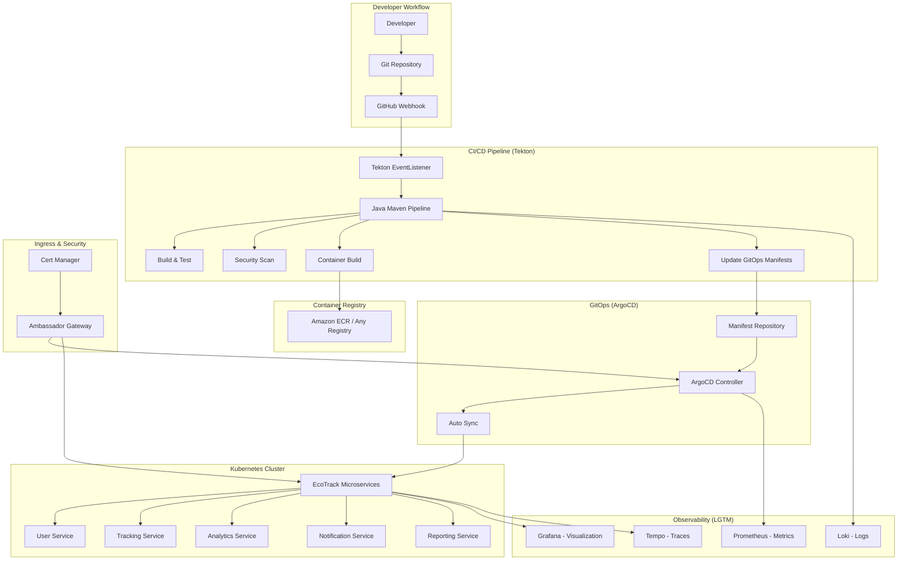

# Workflow 4: GitOps & Deployment Automation

This workflow implements a production-ready GitOps platform using ArgoCD and Tekton for continuous deployment and integration of Java microservices. It's designed to be cloud-agnostic and integrates seamlessly with your existing EKS infrastructure.

## 🏗️ Architecture Overview



## 🚀 Features

### GitOps Capabilities
- **ArgoCD**: Declarative GitOps continuous delivery
- **Two-Repository Pattern**: Separate app code and manifest repositories
- **Multi-Environment Support**: Dev, staging, and production environments
- **Application of Applications Pattern**: Centralized application management
- **Automated Sync**: Self-healing deployments with configurable policies
- **RBAC Integration**: Fine-grained access control

### CI/CD Pipeline Features
- **Tekton Pipelines**: Cloud-native CI/CD built for Kubernetes
- **Java/Maven Support**: Optimized for Spring Boot microservices
- **GraalVM Native Images**: Optional native compilation for faster startup
- **Multi-Architecture Builds**: Support for AMD64 and ARM64
- **Security Scanning**: Integrated vulnerability scanning with Trivy
- **Quality Gates**: Automated testing and security validation

### Cloud-Agnostic Design
- **Standard Kubernetes APIs**: Works on any Kubernetes distribution
- **Configurable Container Registry**: ECR, Docker Hub, Harbor, etc.
- **Flexible Storage**: PVC-based workspaces for any storage class
- **IRSA/Workload Identity**: Cloud provider IAM integration when available
- **External Secrets**: Integration with various secret management systems

### Integration Features
- **Ambassador Integration**: Optional HTTPS access to ArgoCD/Tekton UIs
- **LGTM Observability**: Full integration with existing monitoring stack
- **GitHub Webhooks**: Automated pipeline triggers
- **Slack Notifications**: Real-time deployment and pipeline updates
- **Security Scanning**: Trivy integration for container vulnerability scanning

## 📋 Prerequisites

### Infrastructure Requirements
1. **Kubernetes Cluster**: Any Kubernetes 1.24+ cluster
2. **Existing Workflows**:
   - Workflow 1: Foundation Platform (networking, RBAC)
   - Workflow 2: Ambassador Ingress (optional for UI access)
   - Workflow 3: LGTM Observability Stack (monitoring integration)

### Required Tools
```bash
# Install required CLI tools
brew install helm kubectl tektoncd-cli argocd

# Or using package managers on Linux
apt-get install -y helm kubectl
# Install Tekton CLI: https://tekton.dev/docs/cli/
# Install ArgoCD CLI: https://argo-cd.readthedocs.io/en/stable/cli_installation/
```

### Access Requirements
- Kubernetes cluster admin access
- Container registry with push permissions
- GitHub repository with webhook permissions
- DNS management (for custom domains)

## 🎯 Quick Start

### 1. Configure Environment
```bash
# Set required environment variables
export CLUSTER_NAME="your-cluster-name"
export CONTAINER_REGISTRY="your-registry-url"  # e.g., 123456789.dkr.ecr.us-east-1.amazonaws.com
export GITHUB_ORG="your-github-org"
export GITHUB_TOKEN="ghp_your_token"

# Optional: Custom domain and Slack integration
export DOMAIN="your-domain.com"  # Optional for HTTPS access
export SLACK_WEBHOOK_URL="https://hooks.slack.com/services/..."  # Optional
```

### 2. Deploy GitOps Platform
```bash
cd 04-gitops-deployment-automation
chmod +x scripts/deploy-gitops-platform.sh
./scripts/deploy-gitops-platform.sh
```

### 3. Access the Dashboards
After deployment:

**ArgoCD UI**:
```bash
# Get admin password
kubectl -n argocd get secret argocd-initial-admin-secret -o jsonpath="{.data.password}" | base64 -d

# Port forward (if no custom domain)
kubectl port-forward svc/argocd-server -n argocd 8080:443

# Access: https://localhost:8080
# Username: admin
# Password: (from command above)
```

**Tekton Dashboard**:
```bash
# Port forward
kubectl port-forward svc/tekton-dashboard -n tekton-pipelines 9097:9097

# Access: http://localhost:9097
```

## 🔧 Configuration

### Container Registry Setup

**AWS ECR**:
```bash
# Create repositories for your microservices
aws ecr create-repository --repository-name ecotrack/user-service
aws ecr create-repository --repository-name ecotrack/tracking-service
aws ecr create-repository --repository-name ecotrack/analytics-service
aws ecr create-repository --repository-name ecotrack/notification-service
aws ecr create-repository --repository-name ecotrack/reporting-service
```

**Docker Hub / Harbor**:
```bash
# Update container registry configuration in helm-values/tekton-values.yaml
# Set registry URL and credentials as needed
```

### GitHub Integration

1. **Create Webhook**:
   - Go to your repository settings
   - Add webhook: `https://your-domain.com/tekton-webhooks/`
   - Content type: `application/json`
   - Events: Push, Pull Request

2. **Set up Repository Secrets**:
```bash
# Create GitHub token secret
kubectl create secret generic github-credentials \
  --namespace tekton-pipelines \
  --from-literal=token="${GITHUB_TOKEN}" \
  --from-literal=username="${GITHUB_USERNAME}"

# Create webhook secret
kubectl create secret generic github-webhook-secret \
  --namespace tekton-pipelines \
  --from-literal=secretToken="$(openssl rand -hex 20)"
```

### EcoTrack Microservices Setup

The platform is pre-configured for five Java microservices:

1. **user-service**: User management and authentication
2. **tracking-service**: Environmental data tracking
3. **analytics-service**: Data analytics and insights
4. **notification-service**: Alert and notification management
5. **reporting-service**: Report generation and export

Each service gets:
- Dedicated ArgoCD application
- Tekton pipeline configuration
- Kubernetes manifests in GitOps repository
- Observability integration

## 📊 Pipeline Configuration

### Java Maven Pipeline Features

The Tekton pipeline supports:

```yaml
# Pipeline parameters (configurable per service)
- JAVA_VERSION: "17"           # Java 11, 17, or 21
- MAVEN_GOALS: "clean package" # Maven build goals
- ENABLE_NATIVE: "false"       # GraalVM native compilation
- SECURITY_SCAN: "true"        # Trivy security scanning
- RUN_TESTS: "true"           # Unit and integration tests
- DEPLOY_ENVIRONMENT: "dev"    # Target environment
```

### Pipeline Stages

1. **Source Checkout**: Clone source repository
2. **Test Execution**: Maven test with coverage reports
3. **Build Application**: Maven package with optional native compilation
4. **Security Scanning**: Trivy vulnerability scanning
5. **Container Build**: Multi-stage Docker build with BuildKit
6. **Image Push**: Push to configured container registry
7. **Manifest Update**: Update GitOps manifests with new image tags
8. **Notifications**: Slack/email notifications on success/failure

## 🔒 Security Features

### RBAC Configuration
- **ArgoCD RBAC**: Role-based access with developer/admin roles
- **Tekton RBAC**: Pipeline execution permissions
- **Kubernetes RBAC**: Namespace isolation and least privilege

### Security Scanning
- **Container Scanning**: Trivy integration for vulnerability detection
- **Quality Gates**: Configurable security thresholds
- **Compliance Reports**: Security scan results in observability stack

### Secret Management
- **Kubernetes Secrets**: Secure credential storage
- **IRSA Integration**: AWS IAM roles for service accounts
- **External Secrets**: Support for external secret management systems

## 📈 Observability Integration

### Metrics Collection
- **ArgoCD Metrics**: Application sync status and health
- **Tekton Metrics**: Pipeline execution metrics
- **Application Metrics**: Microservice performance data

### Logging
- **Pipeline Logs**: Centralized build and deployment logs
- **Application Logs**: Microservice logs via Loki
- **Audit Logs**: GitOps operation tracking

### Dashboards
Pre-configured Grafana dashboards for:
- GitOps deployment overview
- Pipeline execution analytics
- Application performance monitoring
- Security compliance metrics

## 🔄 GitOps Workflow

### Development Process
1. Developer pushes code to feature branch
2. GitHub webhook triggers Tekton pipeline
3. Pipeline builds, tests, and scans application
4. Container image pushed to registry
5. GitOps manifests updated with new image tag
6. ArgoCD detects changes and syncs to cluster
7. Application deployed with zero downtime

### Promotion Process
1. Merge to main branch triggers production pipeline
2. Enhanced security scanning for production
3. Manual approval gates (configurable)
4. Blue-green deployment strategy
5. Automated rollback on health check failures

## 🛠️ Customization

### Adding New Microservices

1. **Create ArgoCD Application**:
```bash
# Copy template and modify for new service
cp argocd/applications/user-service.yaml argocd/applications/new-service.yaml
# Update service name, repository, and paths
```

2. **Set up Pipeline Trigger**:
```bash
# Add new service to Tekton triggers
# Update tekton/triggers/github-eventlistener.yaml
```

3. **Create Kubernetes Manifests**:
```bash
# Create manifest directory
mkdir -p manifests/new-service
# Add deployment, service, configmap files
```

### Environment Configuration

**Development**:
- Automatic sync enabled
- Fast feedback loops
- Debug logging enabled

**Staging**:
- Manual sync for controlled testing
- Production-like configuration
- Extended monitoring

**Production**:
- Manual sync with approval
- Blue-green deployments
- Enhanced security scanning
- Comprehensive monitoring

## 🚨 Troubleshooting

### Common Issues

**Pipeline Fails to Start**:
```bash
# Check EventListener
kubectl get eventlistener -n tekton-pipelines
kubectl describe eventlistener github-listener -n tekton-pipelines

# Check webhook configuration
kubectl logs -l eventlistener=github-listener -n tekton-pipelines
```

**ArgoCD Sync Issues**:
```bash
# Check application status
kubectl get applications -n argocd
kubectl describe application user-service -n argocd

# Force refresh
argocd app sync user-service
```

**Container Registry Authentication**:
```bash
# Check image pull secrets
kubectl get secrets -n ecotrack-dev
kubectl describe secret container-registry-credentials -n ecotrack-dev

# Test registry access
docker login your-registry-url
```

### Debug Commands

```bash
# Monitor pipeline runs
tkn pipelinerun list -n tekton-pipelines
tkn pipelinerun logs -f -n tekton-pipelines

# Check ArgoCD applications
argocd app list
argocd app get user-service

# View resource events
kubectl get events --sort-by='.lastTimestamp' -n ecotrack-dev
```

## 📚 Additional Resources

- [ArgoCD Documentation](https://argo-cd.readthedocs.io/)
- [Tekton Documentation](https://tekton.dev/docs/)
- [GitOps Best Practices](https://www.gitops.tech/)
- [Kubernetes Security](https://kubernetes.io/docs/concepts/security/)

## 🔗 Integration with Other Workflows

This workflow builds upon and integrates with:
- **Workflow 1**: Uses foundation networking and RBAC
- **Workflow 2**: Integrates with Ambassador for UI access
- **Workflow 3**: Sends metrics to LGTM observability stack

## 🚀 Next Steps

After deploying Workflow 4:
1. Set up your five EcoTrack microservices repositories
2. Configure GitHub webhooks for each repository
3. Create GitOps manifest repository structure
4. Test the complete CI/CD pipeline
5. Set up monitoring dashboards and alerts

---

**Production Ready**: This workflow is designed for production use with proper security, monitoring, and operational practices.